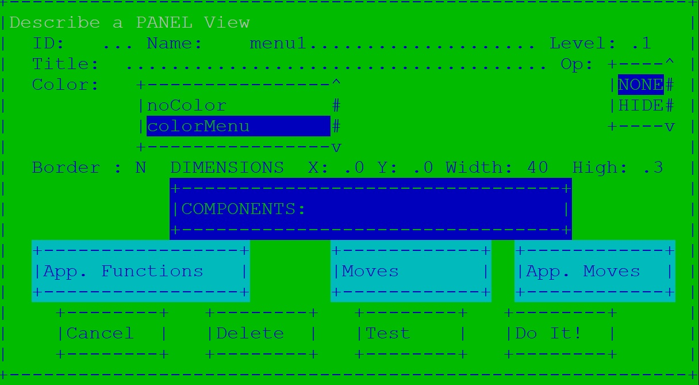
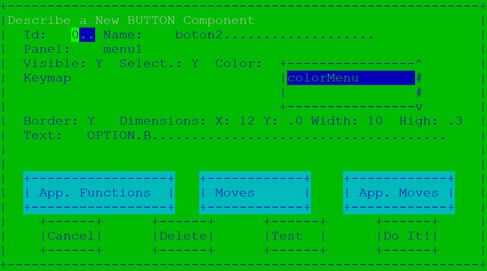
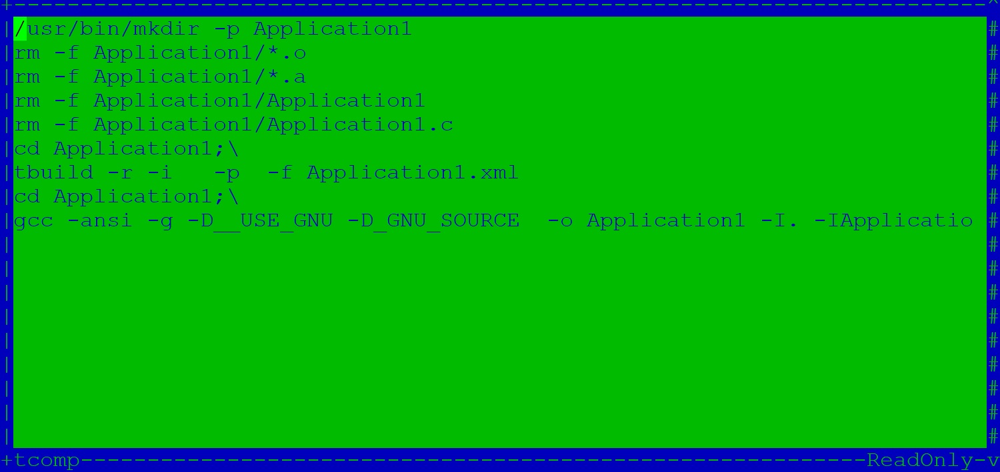
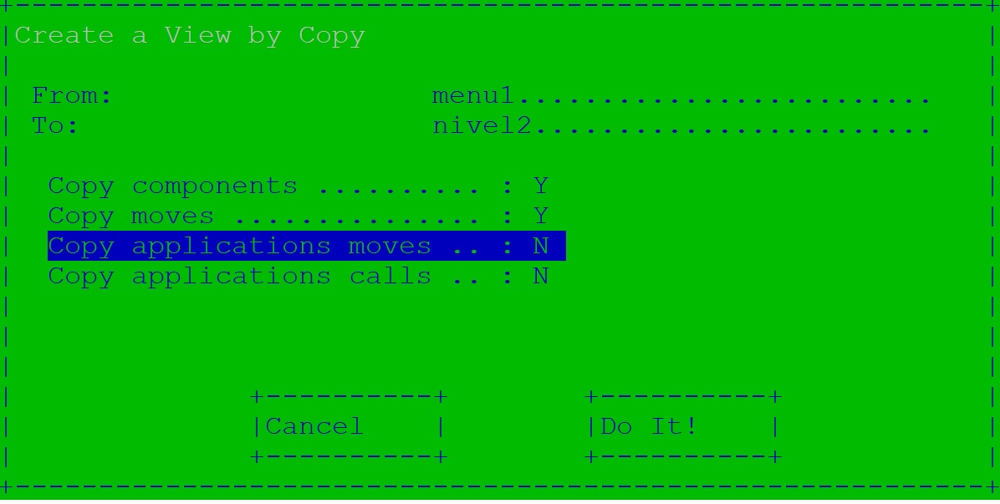
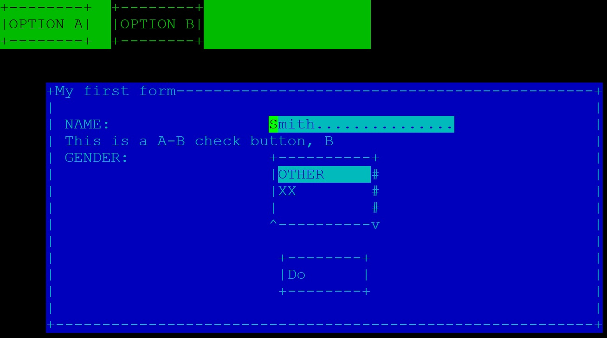
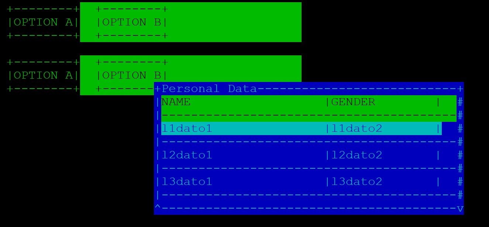
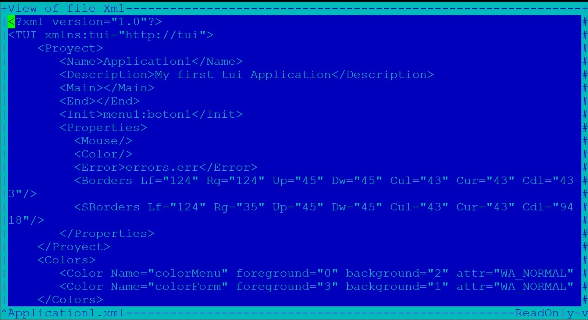

---

---

<h1 id="introducción">Introducción</h1>

La proyecto TUI consiste en tres elementos mediante los cuales se puede crear un interfaz de usuario para terminal potente de una forma rápida y sin necesidad de tener ningún conocimiento de la librería ncurses sobre la que se apoya.

<ul>
<li>

El primer elemento del proyecto es la librería <em><strong>libtui</strong></em> que proporciona un recubrimiento del API de ncurses que permite la creación del interfaz mediante la descripción de elementos habituales a cualquier interfaz: paneles, botones … e implementa un motor para gestionar la actuación de los mismos.

</li>
<li>

El segundo elemento es un compilador (<em><strong>tbuild</strong></em>) que traduce la descripción de un interfaz de usuario descrito en formato xml en los fuentes necesarios para conjuntamente con la  librería libtui  construir  la aplicación.

</li>
<li>

Y el último elemento es una aplicación gráfica (<em><strong>tUI</strong></em>) realizada utilizando la librería libtui y mediante la cual podremos construir el interfaz de nuestro proyecto de forma visual y que además sirve como demostrador.

</li>
</ul>
<h1 id="modelo">Modelo</h1>

El proyecto se basa en un modelo de vistas,. 
Actualmente se pueden manejar tres tipos de vistas:

<ul>
<li class="task-list-item">

<input type="checkbox" class="task-list-item-checkbox" disabled=""> Vista <strong>panel</strong>,  que consiste básicamente en un lienzo sobre el  que se podrán representar los siguientes componentes o elementos:

<ul>
<li>Elemento <strong>etiqueta</strong>,  para los textos fijos de nuestro interfaz.</li>
<li>Elemento <strong>botón</strong>, para los botones de la aplicación.</li>
<li>Elemento <strong>check-button,</strong> para los botones de marcado.</li>
<li>Elemento <strong>list-button</strong>, para las listas de selección.</li>
<li>Elemento <strong>field</strong>, para aquellos campos que deba rellenar el usuario.</li>
</ul>
</li>
<li class="task-list-item">

<input type="checkbox" class="task-list-item-checkbox" disabled=""> Vista <strong>table</strong>, que permite la representación de datos mediante   listas tabuladas.

</li>
<li class="task-list-item">

<input type="checkbox" class="task-list-item-checkbox" disabled=""> Vista <strong>edit</strong>, que consiste en un editor simple mediante el cual  manejar ficheros o textos sin formato.

</li>
</ul>
<h2 id="ciclo-de-vida">Ciclo de Vida</h2>

Las vistas tendrán los siguiente estados:

<ul>
<li><strong>Creación</strong>, las vistas se crearán al comienzo de la aplicación de   acuerdo a sus propiedades iniciales, tamaño, color, … 
Conjuntamente con la vista se crearán los elementos asociados si los   hubiera.</li>
<li><strong>Mostrado</strong>, las vistas se mostrarán en el momento asociado a los eventos de teclado (o ratón) indicados en la descripción del 
proyecto.</li>
<li><strong>Activación</strong>, esto aplica a la vista completa o a un elemento dentro de ella si hay varios y significará que este elemento pasa a controlar   los eventos de usuario. El elemento activo se muestra en video   inverso para que el usuario comprenda que esta activo.</li>
<li><strong>Des-activación</strong>, cuando se navegue de un elemento a otro se  desactivara el elemento activo previamente a la activación del  siguiente.</li>
<li><strong>Ocultación</strong>, al pasar a activar una nueva vista  las vistas actualmente visibles se ocultarán de acuerdo a una gestión de niveles  de forma tal que cualquier vista con un nivel superior a la que se va a activar será ocultada.</li>
<li><strong>Destrucción</strong>, en el caso de destrucción además de ocultarse se  borrarán todos los datos introducidos que de otra forma permanecerían si volviera a mostrase la vista.</li>
</ul>

El ciclo de vida por tanto será

<pre><code>creación-&gt;mostrado-&gt;activación-&gt;desactivacion-&gt;hide/destroy
        -&gt; mostrado-&gt;..........................
</code></pre>
<h2 id="eventos">Eventos</h2>

El elemento activo gestionará los eventos de entrada que se produzcan.

Se consideran los siguiente posibles eventos asociados a la entrada de teclado:

<ul>
<li>Enter, o entrar. (Intro)</li>
<li>Out, o salir.  (Esc)</li>
<li>Up, ir  arriba. (up arrow)</li>
<li>Down, ir abajo. (down arrow)</li>
<li>Left, ir a la izquierda. (left arrow)</li>
<li>Right, ir a la derecha. (right arrow)</li>
<li>Next, o siguiente en la lista. (TAB)</li>
<li>Previous, o anterior en la lista. ( SHIFT-TAB)</li>
<li>Fn, o tecla de Función. (F1-F12)</li>
</ul>

Cuando corresponda se trataran internamente (no son configurables) los siguientes eventos:

<ul>
<li>

PgUp, pagina arriba.

</li>
<li>

PgDw, pagina abajo.

</li>
<li>

Init, ir al inicio.

</li>
<li>

End, ir al final.

</li>
<li>

Ins, cambio de modo entre insert y replace.

</li>
<li>

Backspace, borrar atrás.

</li>
<li>

Del, borrar adelante.

Adicionalmente si permitimos el uso del ratón:

</li>
<li>

El botón izquierdo se traducirá

<ul>
<li>En caso de pulsación sobre el elemento activo, si este es un componente de un panel  en un evento “enter” sobre el mismo, si la vista es una tabla en la selección del registro y si es una vista edit en el posicionamiento del cursor en esa posición.</li>
<li>En el caso de  pulsar sobre otra vista y/o elemento de las que se   muestran en la navegación hasta la misma es decir la activación de   esa vista/elemento.</li>
</ul>
</li>
<li>

La pulsación del botón derecho resultará en un evento out  de forma   general.

</li>
<li>

El botón central se traducirá como Up/Dw en las vistas de tabla y  edición.

</li>
</ul>
<h1 id="aspectos-generales">Aspectos Generales</h1>

A continuación se describirá algunas características iniciales que hay que  considerar antes de comenzar a realizar una aplicación utilizando tUI. 
La forma mas sencilla es  explicar  los puntos descritos en el aparatado General del  interfaz gráfico de usuario tui para lo cual arrancamos el mismo con el comando tUI.

y creamos un nuevo proyecto con Proyect-&gt;new rellenamos el formulario y pulsamos sobre “Do it!”. 
Si a continuación salvamos el proyecto (Proyect-&gt;save) veremos que se ha generado un fichero con el nombre del proyecto y extensión xml. 
El contenido será algo así como:

<pre><code>&lt;?xml version="1.0"?&gt;
    &lt;TUI xmlns:tui="http://tui"&gt;
            &lt;Proyect&gt;
                    &lt;Name&gt;firstProyect&lt;/Name&gt;
                    &lt;Description&gt;First Proyect with tUI&lt;/Description&gt;
            &lt;/Proyect&gt;
    &lt;/TUI&gt;
</code></pre>
<h2 id="propiedades">Propiedades</h2>

El primer paso es hablar de la configuración o parametrización que permite el proyecto. (General-&gt;Properties)

<h3 id="color">Color</h3>

La aplicación permite el uso de color por parte de las aplicaciones, pero no todos los terminales admiten o permiten colores. 
Para los casos “normales” esto no tiene importancia simplemente nuestra aplicación se vera en blanco y negro independientemente de los colores que se hayan utilizado. 
En el fichero xml se indicará la etiqueta

<pre><code> &lt;Color/&gt;
</code></pre>

para indicar que se admite el uso de colores

Con la  herramienta visual tUI marcaremos “<strong>Use Color</strong>” en el apartado General-&gt;properties.

<h3 id="ratón">Ratón</h3>

La aplicación permite la inter-actuación mediante el ratón pero esto puede ser contraproducente en determinados casos.

De forma similar al color la etiqueta Mouse en el xml indicará que se acepta el ratón y su ausencia que no se admite.

<pre><code>&lt;Mouse/&gt;
</code></pre>

Con la  herramienta visual tUI marcaremos “<strong>Use Mouse</strong>” en el apartado General-&gt;properties.

<h3 id="errores">Errores</h3>

El proyecto hace uso del modulo “<strong>error.c</strong>” para gestionar los errores que se detecten. 
Este modulo se inicializa mediante la llamada:

<pre><code>void ERR_printError(int print,char * file)
</code></pre>

En la que indicamos si hay que imprimir los errores y en caso afirmativo el fichero donde escribir.

Si optamos por no imprimir los errores el programador puede usar los métodos:

<pre><code>int ERR_isError()
int ERR_lastError()
</code></pre>
<blockquote>

En el caso de indicar que se desea imprimir los errores pero no se 
indica fichero (NULL) se utilizará el stdout.

</blockquote>

En el fichero xml de nuestro proyecto esto se indicará con la etiqueta:

<pre><code>&lt;Error&gt;errores.txt&lt;/Error&gt;
</code></pre>

que incluye el fichero donde escribir los errores.

Con la  herramienta visual tUI marcaremos “<strong>Print Errors</strong>” e indicaremos el fichero  en el apartado General-&gt;properties.

<h3 id="check-buttón">Check buttón</h3>

Los check buttón funcionan mediante tres caracteres:

El carácter dentro de un texto que indicara la/s posición/es de marcado. 
El carácter a mostrar cuando el elemento no esta marcado. 
El carácter a mostrar cuando el elemento este marcado.

Aunque como veremos esto puede cambiarse en cada check-button, esta parametrización permite cambiar los valores por defecto ?,X,_ por por ejemplo ?,Y,N de forma general y que no haya que indicarlo en cada check-button.

En el xml lo mismo se logrará con la etiqueta:

<pre><code>&lt;Check chCheck="63" chIsCheck="89" chNoCheck="78" /&gt;
or
&lt;Check chCheck="?" chIsCheck="Y" chNoCheck="N" /&gt;
</code></pre>

Con la  herramienta visual tUI indicaremos los caracteres adecuados Ch. Check , Ch is Check, Ch is not Check " en el apartado General-&gt;properties.

<h3 id="enmarcado">Enmarcado</h3>

Las vistas se muestran sobre un marco de acuerdo a las dimensiones dadas, estos marcos pueden estar enmarcados mediante un borde. 
Los enmarcados se definen como caracteres de borde arriba, abajo, izquierda, derecha y las cuatro esquinas, típicamente guiones, barras y el símbolo +. 
Para las  vistas de tablas y editor  ( otras en un futuro) donde pueda realizarse scroll se utilizara la descripción de enmarco de scroll definido por los caracteres de SBorder en lugar de los de Border. 
Los caracteres que configuran estos bordes son parametrizables en la aplicación:

En el xml es posible personalizar estos enmarcados mediante las etiquetas:

<pre><code>&lt;Borders Up="45" Dw="45" Lf="124" Rg="124" Cul="43" Cur="43" Cdl="43" Cdr="43"/&gt;
&lt;SBorders Up="45" Dw="45" Lf="124" Rg="35" Cul="43" Cur="43" Cdl="94" Cdr="118"/&gt;
</code></pre>

Donde indicaremos los caracteres que lo definen como carácter o como código de carácter. 
Con la  herramienta visual tUI indicaremos los caracteres adecuados Border y SBorder en el apartado General-&gt;properties.

<h3 id="user-main">User Main</h3>

Para las inicializaciones necesarias asociadas a nuestra aplicación es posible declarar una función de usuario “main” que se invocará como primera instrucción de programa. 
Esta función de manera análoga al main habitual recibirá como parámetros el argc y argv con los que haya invocado el programa. 
Si el retorno obtenido es distinto de 0 se procederá a realizar un exit del programa usando este valor como salida. 
Esto se declara en el apartado General-&gt;properties y resultará en la siguiente entrada en el xml:

<pre><code>   &lt;Main&gt;userMain&lt;/Main&gt;
</code></pre>
<h3 id="user-end">User End</h3>

Como última instrucción del programa se invocara, caso de existir, la función user-end declarada. 
No tiene parámetros de entrada y el resultado de salida se utilizará en el return del main. 
Esto se declara en el apartado General-&gt;properties y resultará en la siguiente entrada en el xml:

<pre><code>    &lt;End&gt;userEnd&lt;/End&gt;
</code></pre>
<h3 id="init-view">Init View</h3>

Como init-view se debe indicar la vista a activar en el arranque de la aplicación. 
El formato será:

<pre><code>   nombreVista:[nombreElemento]
</code></pre>

Esto se declara en el apartado General-&gt;properties y resultará en la siguiente entrada en el xml:

<pre><code>   &lt;Init&gt;firstView:firstElement&lt;/Init&gt;
</code></pre>
<h3 id="resumen">Resumen</h3>

El siguiente fichero Xml muestra el resultado de haber fijado las características iniciales de nuestro proyecto:

<pre><code>&lt;?xml version="1.0"?&gt;
&lt;TUI xmlns:tui="http://tui"&gt;
        &lt;Proyect&gt;
                &lt;Name&gt;firstProyect&lt;/Name&gt;
                &lt;Description&gt;First Proyect with tUI&lt;/Description&gt;
                &lt;Main&gt;userMain&lt;/Main&gt;
                &lt;End&gt;userEnd&lt;/End&gt;
                &lt;Init&gt;firstView:firstElement&lt;/Init&gt;
                &lt;Properties&gt;
                        &lt;Color/&gt;
                        &lt;Mouse/&gt;
                        &lt;Error&gt;errors.err&lt;/Error&gt;
                        &lt;Check chCheck="63" chIsCheck="89" chNoCheck="78" /&gt;
                        &lt;Borders Up="45" Dw="45" Lf="124" Rg="124" Cul="43" Cur="43" Cdl="43" Cdr="43"/&gt;
                        &lt;SBorders Up="45" Dw="45" Lf="124" Rg="35" Cul="43" Cur="43" Cdl="94" Cdr="118"/&gt;
                &lt;/Properties&gt;
        &lt;/Proyect&gt;
&lt;/TUI&gt;
</code></pre>
<h2 id="keymap">Keymap</h2>

Un punto primordial de cualquier aplicación de terminal es el manejo del teclado y mas concretamente el mapeo de las teclas a los eventos.

De forma más clara que código/s de teclado traducimos en un evento Enter por ejemplo.

Tradicionalmente esto es una fuente de problemas cuando realizamos una aplicación basada en “ncurses” ya que con alta probabilidad y dependiendo del terminal o la emulación del mismo el termcap o terminfo asociado no este configurado de acuerdo a nuestras necesidades y haya teclas que no funcionen o funcionen de formas distintas según el terminal utilizado.

La aproximación que realizamos en la librería tUI es describir mapas de teclados en los que se puede asociar hasta tres códigos de teclado a un evento.

Estos mapas de teclado residen el el hdr: “mapKey.h” y están pensados para lo que consideramos el caso mas habitual es decir un teclado tipo PC sobre una emulación de xterm.

Sin embargo puede que esto no sea lo más correcto en todos los casos por lo que es posible describir un mapa de teclado propio e indicar su utilización luego en los elementos que gestionan eventos en lugar de los mapa de teclas definidos en la aplicación.

En el fichero Xml indicaremos nuestros mapas de teclas personalizados de la siguiente  manera:

<pre><code>&lt;Keymaps&gt;
        &lt;Keymap Name="myKeymap"&gt;
        &lt;Enter ch1="10" ch2="343" ch3="0"/&gt;
        &lt;Out ch1="27" ch2="0" ch3="0"/&gt;
        &lt;Next ch1="9" ch2="0" ch3="0"/&gt;
        &lt;Previous ch1="353" ch2="0" ch3="0"/&gt;
        &lt;Up ch1="259" ch2="578" ch3="0"/&gt;
        &lt;Down ch1="258" ch2="581" ch3="0"/&gt;
        &lt;Left ch1="260" ch2="579" ch3="0"/&gt;
        &lt;Right ch1="261" ch2="580" ch3="0"/&gt;
        &lt;Fn/&gt;
        &lt;/Keymap&gt;
&lt;/Keymaps&gt;
</code></pre>
<blockquote>

El código 0 indicara no necesario.

</blockquote>

Y en el interfaz gráfico haremos uso del menú: General-&gt;Keymap-&gt;new y seguiremos las instrucciones asociadas.

<blockquote>

En el caso de la etiqueta Fn lo que indicamos es que se introduzcan las entradas propias a la definición de F0 a F11 de la librería ncurses.

</blockquote>
<h2 id="ed-functions">Ed Functions</h2>

A los elementos tipo “<strong>fields</strong>”  de entrada de texto se les debe asociar una función de validación o transformación: 
La aplicación tiene por defecto las siguientes funciones de validación:

<ul>
<li><strong>numeric</strong>, acepta cualquier carácter entre el 48 y el 57 es decir entre 0 y 9.</li>
<li><strong>alfnumeric</strong>, acepta caracteres entre 48 y 57, 65-90 y 97-122 es decir 
0-9,a-z y A-Z.</li>
<li><strong>alpha</strong>, acepta caracteres entre 65-90 y 97-122 es decir a-z y A-Z.</li>
<li><strong>7ascii</strong>, acepta caracteres entre 32 y 126. tabla ascii 7bits.</li>
</ul>

y las siguientes funciones de trasformación:

<ul>
<li><strong>upper</strong>: es un toupper del carácter.</li>
<li><strong>lower</strong>,: es un tolower del carácter.</li>
</ul>

Adicionalmente estas funciones tienen asociada dos características:

<ul>
<li><strong>Alineación</strong>, derecha para la función numérica, izquierda para el resto.</li>
<li><strong>Modo</strong>, inserción/remplazo, en las funciones por defecto siempre es remplazo.</li>
</ul>

Si necesitamos una función personal especifica para un determinado campo se puede definir una de la siguiente manera en el fichero Xml:

En el fichero Xml escribimos:

<pre><code>&lt;checksEdit&gt;
     &lt;checkEdit Name="OneTo9" Align="right" Mode="replace" /&gt;
&lt;/checksEdit&gt;
</code></pre>

Donde el valor del Name se corresponderá con una función de usuario de la forma:

<pre><code> int OneTo9(int * caracter)
</code></pre>

Que:

<ul>
<li>Recibirá el carácter introducido como parámetro de entrada.</li>
<li>Retornara 0 si es valido el carácter 1 en caso contrario.</li>
<li>Modificara el carácter recibido en caso de que se requiera.</li>
</ul>

Esta función de usuario será invocada por el motor en los fields que se indique su uso.

<blockquote>

En el caso de que retorne valor no valido se emite un beep.

</blockquote>

En la interfaz gráfica lo mismo se hará mediante el uso del menú: General-&gt;Ed.Function. 

<h2 id="colors">Colors</h2>

Todos los elementos de la aplicación pueden tener asociado un color, estos colores se definen como tres parámetros.

<ul>
<li>Color del fondo</li>
<li>Color del texto</li>
<li>Fuente de letra a usar</li>
</ul>

Los colores que se pueden manejar son los colores básicos que manejan las ncurses:

<ol>
<li>BLACK</li>
<li>BLUE</li>
<li>GREEN</li>
<li>CYAN</li>
<li>RED</li>
<li>MAGENTA</li>
<li>YELLOW</li>
<li>WHITE</li>
</ol>

Asimismo los fuentes posibles son los aceptados por las ncurses:

<ol>
<li>WA_NORMAL</li>
<li>WA_STANDOUT</li>
<li>WA_UNDERLINE</li>
<li>WA_REVERSE</li>
<li>WA_BLINK</li>
<li>WA_DIM</li>
<li>WA_BOLD</li>
<li>WA_ALTCHARSET</li>
<li>WA_INVIS</li>
<li>WA_PROTECT</li>
<li>WA_HORIZONTAL</li>
<li>WA_LEFT</li>
<li>WA_LOW</li>
<li>WA_RIGHT</li>
<li>WA_TOP</li>
<li>WA_VERTICAL</li>
<li>WA_ITALIC</li>
</ol>

Estos colores o estilos se definirán en el fichero XML:

<pre><code>  &lt;Colors&gt;
    &lt;Color Name="miColor1" foreground="1" background="2" attr="WA_NORMAL"/&gt;
 &lt;/Colors&gt;
</code></pre>

Y mediante la aplicación gráfica utilizaremos el formulario de General-&gt;Colors-&gt;New 

Para su posterior uso  en la creación de los elementos.

<blockquote>

Es posible definir más una propiedad adicional al font de forma manual en el xml mediante el atributo attr2, por ejemplo:

</blockquote>
<pre><code>  &lt;Color Name="miColor1" foreground="1" background="2" attr="WA_BOLD" attr2="WA_UNDERLINE/&gt;
</code></pre>
<blockquote>

Algunos tipos de font como ITALIC probablemente no tengan ningún efecto ya que dependen del terminal y otros como WA_INVIS pueden tener efecto en el color para más detalle consultar documentación de ncurses.

</blockquote>
<h2 id="msgs">MSGS</h2>

La aplicación contempla la posibilidad de ventanas emergentes de tres tipos:

<ul>
<li>Información</li>
<li>Aviso</li>
<li>Error</li>
</ul>

Estas ventanas las abrirá el usuario según convenga en cada circunstancia de forma programática y consistirán en una vista panel con titulo  centrada en la pantalla o en marco de  la vista activa en la que se mostrará el texto proporcionado, en un estilo o color determinado y de 0 a 2 botones también determinados.

La aplicación permite parametrizar estas ventanas de aviso, para ello podemos mediante el Xml:

<pre><code>&lt;Colors&gt;
        &lt;Color Name="colorInfo" foreground="2" background="1" attr="WA_NORMAL"/&gt;
&lt;/Colors&gt;
&lt;Msgs&gt;
&lt;Msg type="info" nroButtons="1"&gt;
        &lt;Title&gt;Information&lt;/Title&gt;
        &lt;Color&gt;colorInfo&lt;/Color&gt;
        &lt;Buttons&gt;
                &lt;Button1&gt;OK&lt;/Button1&gt;
        &lt;/Buttons&gt;
&lt;/Msg&gt;
&lt;/Msgs&gt;
</code></pre>

De esa forma cambiamos la ventana de mensajes de tipo información  de una ventana de  0 botonos (defecto) a 1, le ponemos un titulo “Information” ,el color de noColor por defecto a colorInfo, y como texto del botón ponemos OK.

Con la aplicación gráfica completaremos el formulario de General-&gt;Msgs-&gt;Info 

<blockquote>

En el caso de que la ventana de mensaje no tenga asociado ningún botón se cerrara la misma al cabo de 5 sg (valor modificable con MSG_setSegInfo) o mediante cualquier pulsación o click de ratón.

Las ventanas de mensaje quedarán como las únicas activas bloqueando la aplicación hasta su cierre.

</blockquote>
<h1 id="primera-aplicación">PRIMERA APLICACIÓN</h1>

Ya estamos en condiciones de crear nuestra primera aplicación, en este apartado crearemos varias aplicaciones típicas paso a paso como forma visual de documentar el proyecto.

<h2 id="menu">Menu</h2>

Como primera aplicación vamos a crear un menú simple con 2 opciones OPCION A y OPCION B.

<h3 id="creación-del-proyecto">Creación del Proyecto</h3>

Abrimos el interfaz gráfico y en Proyect-&gt;New creamos un proyecto nuevo, application1 por ejemplo: 

<h3 id="terminal-de-test">Terminal de Test</h3>

A continuación abrimos otro terminal con la maquina que utilicemos y obtenemos el tty asociado, este dato lo utilizaremos en la opción Proyect-&gt;T.TEST  conjuntamente con el tipo de terminal emulado: 

A partir de este momento podremos utilizar este terminal para realizar un test de lo que estamos haciendo.

<blockquote>

Es conveniente que el terminal que usemos no acepte entrada para evitar colusión entre sesiones para lo cual lo más fácil es indicar un sleep 9999999 en el mismo

</blockquote>
<h3 id="color-1">color</h3>

Como primer paso vamos a elegir un color para el menú, para lo cual rellenamos el formulario General-&gt;color y probamos combinaciones por ejemplo azul y negro, verde y rojo, con subrayado,… 
Utilizando el botón de Test podremos visualizar el resultado en el terminal que hemos definido de Test y probar distintas combinaciones hasta que demos con la que nos satisfaga.

<blockquote>

Al indicar Test aparecerá un aviso en el pantalla de Clean, al pulsar OK se limpiará la pantalla de prueba si indicamos Cancel el test continuará visible y permitirá de esa forma comparar distintas combinaciones.

</blockquote>

Finalmente nos decantamos por un baground verde y un foreground negro y tipo letra normal al que damos el nombre de colorMenu.

<h3 id="panel">panel</h3>

Vamos a crear el panel que soportará nuestro menú de dos botones: 
View-&gt;Panel NEW 
y aquí indicamos: 
Como ID: nada, ya que es una forma alternativa en la que el usuario puede referirse a la vista. 
Como Name: menu1, esto es obligatorio y debe ser único ya que toda la mecánica interna de la aplicación se hace referenciando a este nombre (el id alternativo no es utilizado por la libreria). 
Como Level: 1, valdría cualquiera ya que solo tenemos un nivel. 
Como Title: nada, ya que no deseamos ninguno.

<blockquote>

El titulo aparece en el enmarcado del panel por lo que será necesario indicar border si queremos dar un titulo al panel.

</blockquote>

Como OP: none, este es el panel principal y no necesitamos ocultar o destruir. 
Como Color: indicaremos el colorMenu,  (navegar con las flechas y pulsar enter para seleccionar). 
Como Border: N, indicamos que no queremos borde. 
Como Dimensiones: Indicamos por ejemplo 0,0 y 40,3.

<blockquote>

Las posiciones y tamaños serán relativos a la pantalla con origen 0,0

</blockquote>

 
Pulsamos sobre DoIt!. Se mostrará el mensaje Done! y  en la lista de paneles de la izquierda aparecerá el nuevo panel menu1. 
A continuación pulsamos sobre TEST y si todo esta bien observaremos el panel que hemos descrito en el terminal de prueba.

Es el momento de que juegues un poco, cambia a border Y por ejemplo , salva y prueba. ( en este caso conviene limpiar el terminal de test después de cada prueba para evitar que se solapen distintas pruebas).

<blockquote>

Es conveniente que <strong>periódicamente salves el proyecto</strong> (Proyect-&gt;save) ya que el TEST se ejecuta efectivamente con la librería y determinados errores (típicamente dimensiones erróneas) pueden provocar un fallo catastrófico y cerrar la aplicación con lo que se perderán los cambios.

</blockquote>
<h3 id="botones">botones</h3>

Vamos a añadir los botones de nuestro menu: 
Pulsamos sobre el botón COMPONENTS del formulario de panel, se abrirá un nuevo panel en el que seleccionaremos new button lo que nos llevará al formulario asociado, sobre el que procederemos a crear el botón.

Id: none 
Name: boton1 
Visible: Y, indica que el elemento será visible.

<blockquote>

Los componentes o elementos de un panel puede ser ocultos podemos cambiar esta característica mediante programación.

</blockquote>

Select: Y , indica que el elemento es seleccionable es decir que puede navegarse hasta el mismo bien mediante ratón, bien mediante teclado. 
Color: seleccionamos colorMenu. 
Border: Y 
Dimensiones: 0,0 10,3

<blockquote>

Las coordenadas son relativas al panel no a la pantalla, 
Al indicar que queremos borde hemos de tener en cuanta que se requieren  2 líneas y 2 columnas para acomodar el borde.

</blockquote>

Text: OPTION A

Salvamos mediante Do It! y comprobamos el resultado mediante el botón TEST.

Sin necesidad de salir modificamos el formulario: 
Name: boton2 
Dimension 12,0 10,3 
Text: OPTION B 
 
Salvamos y comprobamos

<h3 id="moves">Moves</h3>

Vamos a gestionar ahora la dinámica del menú. 
Volvemos atrás (ESC) y nuevamente atrás (ESC) ya que la lista de componentes no se actualiza automáticamente y volvemos a pulsar  sobre COMPONENTS y seleccionamos el boton1 
En el formulario del botón pulsamos sobre ** <strong>Moves</strong>** 
Se nos abre una pantalla con los eventos posibles y sobre la que podremos indicar los movimientos (vista:elemento) que deseamos para estos eventos. 
En este caso vamos a indicar que tanto flecha derecha como izquierda y siguiente opción (Next), como previa (Previous) nos dirijan al boton2. 

<blockquote>

Obsérvese que utilizamos  referenciado relativo. Cuando no indicamos la parte de vista nos referimos a la vista activa. 
Es decir la notación :boton1 es equivalente a menu1:boton1 pero como veremos luego es mejor usar la relativa y no solo por ahorro.

</blockquote>

Salvamos el formulario y volvemos a salvar sobre el formulario del elemento para que se guarden los cambios del componente. 
Volvemos a atrás (ESC) y seleccionamos el botón 2 para  indicar indicar los “moves” del botón que en este caso tendrán como destino boton1 para los eventos Next, Previous, left y right.

Lamentablemente no es posible comprobar la dinámica de la aplicación sin generarla pero antes vamos a ver otros puntos.

<h3 id="exit">Exit</h3>

Para indicar la salida del programa vamos a utilizar la definición de movimientos del panel para lo cual utilizaremos el botón <strong>Moves</strong> del formulario de panel y por ejemplo sobre el evento Out: indicaremos como vista exit:.

<blockquote>

Cuando el evento no esta capturado por el componente activo la aplicación comprobará si el evento esta capturado por la vista activa y de ser así procederá a ejecutar lo que indica la vista. 
La vista con nombre clave exit indica finalizar aplicación.

</blockquote>
<blockquote>

Recordar salvar la modificación en el panel no solo en el formulario de Move.

</blockquote>
<h3 id="check-la-aplicación">Check la aplicación</h3>

Vamos a proceder a chequear la aplicación construida, para ello pulsamos el botón: 
Make-&gt;Check 
Si todo es correcto nos indicará el error de que no tenemos una vista inicial definida. 
Vamos a General-&gt;properties e indicamos como vista inicial: menu1:boton1. 
Si repetimos el check todo debe estar bien ahora.

<h3 id="edit">Edit</h3>

Antes de continuar echemos un vistazo al xml que se genera al salvar el proyecto, para ello pulsamos sobre Edit-&gt;Open

<pre><code>&lt;?xml version="1.0"?&gt;
&lt;TUI xmlns:tui="http://tui"&gt;
        &lt;Proyect&gt;
                &lt;Name&gt;Application1&lt;/Name&gt;
                &lt;Description&gt;my first tUI application&lt;/Description&gt;
                &lt;Main&gt;&lt;/Main&gt;
                &lt;End&gt;&lt;/End&gt;
                &lt;Init&gt;menu1:boton1&lt;/Init&gt;
                &lt;Properties&gt;
                        &lt;Mouse/&gt;
                        &lt;Color/&gt;
                        &lt;Error&gt;errors.err&lt;/Error&gt;
                        &lt;Borders Up="45" Dw="45" Lf="124" Rg="124" Cul="43" Cur="43" Cdl="43" Cdr="43"/&gt;
                        &lt;SBorders Up="45" Dw="45" Lf="124" Rg="35" Cul="43" Cur="43" Cdl="94" Cdr="118"/&gt;
                &lt;/Properties&gt;
        &lt;/Proyect&gt;
        &lt;Colors&gt;
                &lt;Color Name="colorMenu" foreground="0" background="2" attr="WA_NORMAL"/&gt;
        &lt;/Colors&gt;
        &lt;Msgs&gt;
        &lt;/Msgs&gt;
        &lt;Panels&gt;
                &lt;Panel Id="0" Name="menu1" opToMade="none" Level="1"&gt;
                        &lt;Color&gt;colorMenu&lt;/Color&gt;
                        &lt;Dimension border="0" x="0" y="0" high="3" width="40"/&gt;
                        &lt;FPanel /&gt;
                        &lt;Move  out="exit:" /&gt;
                        &lt;FAction /&gt;
                &lt;Components&gt;
                &lt;Component Id="0" Name="boton1" Type="button" &gt;
                        &lt;Color&gt;colorMenu&lt;/Color&gt;
                        &lt;Dimension border="1" x="0" y="0" high="3" width="10"/&gt;
                        &lt;Text&gt;OPCION A&lt;/Text&gt;
                        &lt;Move  next=":boton2"  previous=":boton2"  left=":boton2"  right=":boton2" /&gt;
                        &lt;FAction /&gt;
                        &lt;FComponent /&gt;
                &lt;/Component&gt;
                &lt;Component Id="0" Name="boton2" Type="button" &gt;
                        &lt;Color&gt;colorMenu&lt;/Color&gt;
                        &lt;Dimension border="1" x="12" y="0" high="3" width="10"/&gt;
                        &lt;Text&gt;OPCION B&lt;/Text&gt;
                        &lt;Move  next=":boton1"  previous=":boton1"  left=":boton1"  right=":boton1" /&gt;
                        &lt;FAction /&gt;
                        &lt;FComponent /&gt;
                &lt;/Component&gt;
                &lt;/Components&gt;
                &lt;/Panel&gt;
        &lt;/Panels&gt;
&lt;/TUI&gt;
</code></pre>

Este Xml se corresponde con nuestro proyecto application1.

<h3 id="compile-y-run">compile y run</h3>

Partiendo del Xml se generá la aplicación por lo que como paso previo procede a salvar el proyecto (Proyect-&gt;save) 
A partir de este Xml y mediante la herramienta <strong>tbuild</strong> se genera:

<ul>
<li>nombreProyecto.c que constituye el main de la aplicación construida.</li>
<li>nombreProyecto_func.h, con los prototipos de las funciones de callback que hayamos definido.</li>
<li>nombreProyecto_func.c, con el esqueleto de las funciones de callback a implementar por el usuario.</li>
</ul>
<blockquote>

La herramienta tbuild tiene opciones que permiten evitar  la re-escritura de los prototipos o funciones de callback

</blockquote>

Compilando los ficheros *. c conjuntamente con la librería tui y la librería ncurses obtendremos nuestra aplicación.

O podemos utilizar el interfaz gráfico suministrado, al menos para estos proyectos tan sencillos.

<ul>
<li>Copia al directorio de trabajo el fichero makefile_tui que se localiza en /usr/include/tui.</li>
<li>Ejecuta Make-&gt;compile y responde OK a Rewrite Functions File ya que no hemos generado anteriormente.</li>
<li>Se procede a crear un directorio con el nombre del proyecto y a compilar el mismo mediante este makefile  (makefile_tui ) el cual  ejecuta el tbuild, la compilación y el montaje. 
</li>
</ul>
<blockquote>

La compilación y ejecución de los proyectos desde la herramienta gráfica se realiza utilizando este makefile (makefile_tui). 
Dependiendo de la instalación que hayas realizado es posible que debas ajustar algún dato del mismo como la ubicación de la herramienta  tbuild o la localización de   librerias y headers.

</blockquote>

En este punto podemos ir al directorio creado y ejecutar la aplicación manualmente o pulsar sobre el botón Make-&gt;Execute. 
Si hacemos esto (Make-Execute) tu  aplicación se ejecutara sobre el terminal de prueba y el control será cedido al mismo es decir será  plenamente operativa pudiendo comprobarse los movimientos. 
Termina la aplicación de prueba provocando el evento Out (ESC) y de esta forma conseguir el retorno del control a la aplicación gráfica para seguir trabajando.

<h2 id="menú-2-niveles">Menú 2 niveles</h2>

Para crear un menú de dos niveles procederemos creando dos paneles de forma similar a como lo hemos hecho en el caso anterior uno que contendrá las opciones del nivel 1 y otro con las opciones del nivel 2. 
Para ello vamos a utilizar una facilidad de la aplicación gráfica. 
Vamos a View-&gt;Copy y seleccionamos el menu1 nos abrirá un formulario en el que indicaremos: 
To: nivel2 
Copy componentes: Y, la nueva vista “nivel2” tendrá dos botones también boton1 y boton2.

<blockquote>

Los nombres de los componentes no chocaran entre ellos si las primeras 4 letras del panel difieren.

</blockquote>

Copy moves: Y, posteriormente deberemos ajustarlo especialmente si hemos utilizado referencias absolutas vista:componente y no relativas. 
Copy applications move: N 
Copy applications calls: N 
 
Ahora vamos a hacer algunas modificaciones: 
Vamos a views-&gt;panels  y seleccionamos el panel nivel2 cambiamos: 
Nivel: a nivel 2. (es decir es un submenú del menú principal). 
OP: a HIDE para que se oculte cuando volvamos al nivel principal menu1. 
Dimensión: a 0,4 40,3 para que se muestre justo debajo del anterior.

Cambiamos también los Moves del panel nivel2 de forma que Out ya no sea exit: sino menu1:boton1, de esta forma conseguimos que pulsando ESC en cualquier componente de este nivel retornemos al menú principal.

Y salvamos y comprobamos

<blockquote>

Para ver como se verían ambos paneles indicar no a "make clean " y ejecutar los test de cada uno de ellos.

</blockquote>

El ultimo ajuste que vamos a hacer es indicar que el acceso al submenú se realiza mediante pulsación en el boton1 del menú.  En el formulario de este botón (menu1-boton1) pulsando sobre Moves indicamos para el evento Enter nivel2:boton1.

<blockquote>

Aquí es obligado utilizar referencia absoluta ya que no hablamos de la vista activa.

</blockquote>

Si compilamos y ejecutamos la aplicación el resultado será un menú de dos niveles el segundo de los cuales se abre al seleccionar la Opcion A del primer nivel y en el que el segundo nivel se oculta  al pulsar “ESC”.

<blockquote>

Ejercicio: mejora la vistosidad del ejemplo, comprueba el uso del ratón.

</blockquote>

De forma análoga a esta podemos definir menús de cualquier nivel de profundidad y complejidad.

<h2 id="formulario">Formulario</h2>

A continuación vamos a realizar un formulario típico en el que pondremos un elemento de cada tipo.

<h2 id="panel-1">panel</h2>

Comenzamos como siempre creando un panel, con los siguientes datos por ejemplo:

Name: form1 
Title: My first form 
Level: 2

<blockquote>

En este caso vamos a dejar visible el menú principal al abrir el formulario ya que solo se ocultaran las vistas con niveles superiores a 2.

</blockquote>

OP: DELE

<blockquote>

Si usamos HIDE los datos introducidos persistirán entre aperturas del formulario, con DELE se borrarán al ocultar el mismo

</blockquote>

. 
Color: colorForm, color que deberemos haber creado previamente a nuestro gusto. 
Border:S . en este caso vamos a poner marco al panel y además como le hemos puesto titulo es necesario para mostrar el mismo. 
Dimension: 5,5 y 60,15

Lo creamos y testeamos para ver si el lienzo nos convence.

<h2 id="label">label</h2>

Vamos a poner una etiqueta dentro del mismo,  para lo cual pulsamos sobre el botón COMPONENTS y seleccionamos NEW LABEL, aparecerá el formulario correspondiente en donde introduciremos los siguientes datos:

ID:  none 
Name: ename 
Visible: Y, ya deseamos que se muestre. 
Select: N, las etiquetas no son seleccionables.

<blockquote>

se puede observar que este campo esta descrito el mismo como “no selecteable” es decir no podemos acceder al mismo cambiar el valor.

</blockquote>

Color: colorForm, puede usarse cualquier otro color creado pero el resultado será un poco raro. 
Border: N no queremos marco en la etiqueta. 
Dimension: 2,2 20,1 
Text: NAME:

Salvamos y probamos.

<h2 id="field">field</h2>

A continuación vamos a definir el campo nombre editable. 
Para lo cual retrocedemos y seleccionamos NEW FIELD e introducimos los datos:

ID: 1 , vamos a usar la referencia alternativa. 
Name: name 
Visible Y 
Select Y, 
Color, colorForm 
Auto Enter Y, el auto enter fuerza un evento enter en el momento que se rellena el tamaño máximo del campo. 
Secret N, los campos que se marcan como secret muestran * en lugar del echo normal. 
Keymap, si pulsamos sobre este botón nos permite seleccionar entre los keymap de usuario que hayamos definido. En nuestro caso no hacemos nada ya que usaremos el de defecto. 
Ch. Ed: . es el  carácter a mostrar en las posiciones no rellenas del campo, por defecto son ‘.’ que indican el tamaño del campo. 
Edit Functions: vamos a pulsar sobre este texto y seleccionar apha como validación.

<blockquote>

Este es un ejemplo list button con display OPEN

</blockquote>

Border, N 
Dimension, 24,2 (a continuación de la etiqueta) y 20,1 (campo de 20 caracteres) 
Texto: no indicamos nada ya que no queremos un valor por defecto.

Salvamos y probamos.

<h2 id="check-button">Check Button</h2>

Vamos a definir una opción de check a continuación, para ello retrocedemos y seleccionamos NEW CK. BUTTON y rellenamos:

ID: 2 
Name: check 
Visible Y 
Select Y 
Color, colorForm 
Border N 
Dimension:  2,3 (debajo del campo anterior) y dimensión 40, 1 
Text: This is a A-B check Button ? 
Check, N indica si por defecto estará marcado. 
Ch. Check,  (vacio) es el carácter a sustituir dependiendo de si esta marcado o no usaremos el de defecto (?). 
Ch. is Check, A cuando marquemos se mostrará A. 
Ch is no Check, B cuando desmarquemos se mostrará B.

Salvamos y comprobamos el resultado.

<h2 id="list-button">List Button</h2>

Continuemos con el list button, primero le ponemos una etiqueta al list button: 
Seleccionamos NEW LABEL y rellenamos;

ID:  none 
Name: elist 
Visible: Y, ya deseamos que se muestre. 
Select: N, las etiquetas no son seleccionables. 
Color: colorForm, puede usarse cualquier otro color creado pero el resultado será un poco raro. 
Border: N no queremos marco en la etiqueta. 
Dimension: 2,4 20,1 
Text: GENDER:

Salvamos, comprobamos y salimos para definir el list button. 
Seleccionamos NEW LIST BUTTON

ID: 3 
Name: gender 
Display:  NORMAL,

<blockquote>

Este es un list button de alto 1,  activando el mismo y pulsando  las 
flechas arriba/abajo podremos seleccionar entre las siguientes 
opciones: 
NORMAL, visible y seleccionable. 
HIDDEN oculto. 
NOT SELECTABLE, no seleccionable. 
OPEN se comporta como un list desplegable, las opciones solo se visualizan y se pueden seleccionar al pulsar sobre el botón, requiere programación por el usuario para una vez seleccionado un valor mostrarlo en pantalla.

</blockquote>

Color: colorForm 
Keymap: defecto 
Border Y 
Dimension: 24,4 y 12,5 
Text: Añadimos los textos MALE, FEMALE y OTHER mediante el botón Add.

<blockquote>

Para eliminar seleccionamos de la lista de textos añadidos o lo escribimos direntamente y pulsamos sobre Del

</blockquote>

Salvamos y procedemos a verificar el resultado.

<h2 id="button">button</h2>

Y ya solo nos queda un elemento que es el botón que ya hemos visto con los menús así que añadiremos simplemente un botón del tipo:

Id:4 
Name: done 
Color: colorMenu 
Border:Y 
Dimension: 25,10 y 10,3 
Text: MADE

Salvamos y procedemos a verificar el resultado.

<h2 id="moves-1">Moves</h2>

Vamos a definir los movimientos del formulario: 
En el panel: Form1 aplicamos el movimiento "-1: " al evento Out (Formulario de Panel -&gt; Moves). Esto provocará que la tecla ESC en cualquier lugar del formulario retorne a la vista anterior.

<blockquote>

Los movimientos tipo -n, indica a la aplicación hacer “n” retrocesos en el camino de vistas  que ha terminado en esta vista. 
De esta forma una vista puede ser invocada desde distintos puntos y retornar de forma natural a los mismos.

</blockquote>

En la vista menu1 / boton2 vamos a aplicar en  Moves form1:name para el evento Enter, de forma que se abra el formulario al pulsar sobre el botón2 del menu1.

En el formulario vamos a aplicar los siguientes movimientos:

En el elemento form1:name 
Enter, “:2”  o :check

<blockquote>

Esto significa que cuando pulsemos Enter se activará el elemento con 
id=2 o el elemento con name=check.

</blockquote>

Next, “:2” 
Down, “:2”

<blockquote>

Podremos navegar con la tecla Tab o con la tecla Down al siguiente elemento del formulario.

</blockquote>

Previous, “:4” 
Up, “:4”

<blockquote>

Con la tecla SHIFT-TAB o con la tela Up iremos al último elemento del formulario el botón.

</blockquote>

De forma análoga para el elemento check indicamos: 
Enter, Next y Down, “:3” 
Previous, Up, ":1

En el elemento gender la cosa cambia un poco, indicamos: 
Enter, Next, “:4” 
Previous, :":2"

<blockquote>

Obsérvese que no indicamos tratamiento para los eventos Up, Down, en este caso up, down se utilizan para elegir el navegar dentro de la lista de valores del list buttón por lo que si los tratamos seria imposible cambiar entre valores.

</blockquote>

En el elemento botón indicamos: 
Enter, -:

<blockquote>

-: es equivalente a -1: Es decir al pulsar sobre el botón salir o volver al menú

</blockquote>

Next down, :1 
Previous,up , :-3

<h2 id="compilamos-y-probamos">Compilamos y probamos</h2>

Salvamos, compilamos y probamos. 
El Xml tendrá un aspecto como este:

<pre><code>&lt;?xml version="1.0"?&gt;
&lt;TUI xmlns:tui="http://tui"&gt;
        &lt;Proyect&gt;
                &lt;Name&gt;Application1&lt;/Name&gt;
                &lt;Description&gt;My first tui Application&lt;/Description&gt;
                &lt;Main&gt;&lt;/Main&gt;
                &lt;End&gt;&lt;/End&gt;
                &lt;Init&gt;menu1:boton1&lt;/Init&gt;
                &lt;Properties&gt;
                        &lt;Mouse/&gt;
                        &lt;Color/&gt;
                        &lt;Error&gt;errors.err&lt;/Error&gt;
                        &lt;Borders Lf="124" Rg="124" Up="45" Dw="45" Cul="43" Cur="43" Cdl="43" Cdr="43"/&gt;
                        &lt;SBorders Lf="124" Rg="35" Up="45" Dw="45" Cul="43" Cur="43" Cdl="94" Cdr="118"/&gt;
                &lt;/Properties&gt;
        &lt;/Proyect&gt;
        &lt;Colors&gt;
                &lt;Color Name="colorMenu" foreground="0" background="2" attr="WA_NORMAL"/&gt;
                &lt;Color Name="colorForm" foreground="3" background="1" attr="WA_NORMAL"/&gt;
        &lt;/Colors&gt;
        &lt;Msgs&gt;
        &lt;/Msgs&gt;
        &lt;Panels&gt;
                &lt;Panel Id="0" Name="menu1" opToMade="none" Level="1"&gt;
                        &lt;Color&gt;colorMenu&lt;/Color&gt;
                        &lt;Dimension border="0" x="0" y="0" high="3" width="40"/&gt;
                        &lt;FPanel /&gt;
                        &lt;Move  out="exit:" /&gt;
                        &lt;FAction /&gt;
                &lt;Components&gt;
                &lt;Component Id="0" Name="boton2" Type="button" &gt;
                        &lt;Color&gt;colorMenu&lt;/Color&gt;
                        &lt;Dimension border="1" x="12" y="0" high="3" width="10"/&gt;
                        &lt;Text&gt;OPTION B&lt;/Text&gt;
                        &lt;Move  enter="form1:name"  next=":boton1"  previous=":boton1"  left=":boton1"  right=":boton1" /&gt;
                        &lt;FAction /&gt;
                        &lt;FComponent /&gt;
                &lt;/Component&gt;
                &lt;Component Id="0" Name="boton1" Type="button" &gt;
                        &lt;Color&gt;colorMenu&lt;/Color&gt;
                        &lt;Dimension border="1" x="0" y="0" high="3" width="10"/&gt;
                        &lt;Text&gt;OPTION A&lt;/Text&gt;
                        &lt;Move  enter="nivel2:boton1"  next=":boton2"  previous=":boton2"  left=":boton2"  right=":boton2" /&gt;
                        &lt;FAction /&gt;
                        &lt;FComponent /&gt;
                &lt;/Component&gt;
                &lt;/Components&gt;
                &lt;/Panel&gt;
                &lt;Panel Id="0" Name="nivel2" opToMade="hide" Level="2"&gt;
                        &lt;Color&gt;colorMenu&lt;/Color&gt;
                        &lt;Dimension border="0" x="0" y="4" high="3" width="40"/&gt;
                        &lt;FPanel /&gt;
                        &lt;Move  out="menu1:boton1" /&gt;
                        &lt;FAction /&gt;
                &lt;Components&gt;
                &lt;Component Id="0" Name="boton2" Type="button" &gt;
                        &lt;Color&gt;colorMenu&lt;/Color&gt;
                        &lt;Dimension border="1" x="12" y="0" high="3" width="10"/&gt;
                        &lt;Text&gt;OPTION B&lt;/Text&gt;
                        &lt;Move  next=":boton1"  previous=":boton1"  left=":boton1"  right=":boton1" /&gt;
                        &lt;FAction /&gt;
                        &lt;FComponent /&gt;
                &lt;/Component&gt;
                &lt;Component Id="0" Name="boton1" Type="button" &gt;
                        &lt;Color&gt;colorMenu&lt;/Color&gt;
                        &lt;Dimension border="1" x="0" y="0" high="3" width="10"/&gt;
                        &lt;Text&gt;OPTION A&lt;/Text&gt;
                        &lt;Move  next=":boton2"  previous=":boton2"  left=":boton2"  right=":boton2" /&gt;
                        &lt;FAction /&gt;
                        &lt;FComponent /&gt;
                &lt;/Component&gt;
                &lt;/Components&gt;
                &lt;/Panel&gt;
                &lt;Panel Id="0" Name="form1" opToMade="destroy" Level="2"&gt;
                &lt;Title&gt;My first form&lt;/Title&gt;
                        &lt;Color&gt;colorForm&lt;/Color&gt;
                        &lt;Dimension border="1" x="5" y="5" high="15" width="60"/&gt;
                        &lt;FPanel /&gt;
                        &lt;Move  out="-1:" /&gt;
                        &lt;FAction /&gt;
                &lt;Components&gt;
                &lt;Component Id="4" Name="done" Type="button" &gt;
                        &lt;Color&gt;colorForm&lt;/Color&gt;
                        &lt;Dimension border="1" x="25" y="10" high="3" width="10"/&gt;
                        &lt;Text&gt;MADE&lt;/Text&gt;
                        &lt;Move  enter="-:"  next=":1"  previous=":3"  up=":3"  down=":1" /&gt;
                        &lt;FAction /&gt;
                        &lt;FComponent /&gt;
                &lt;/Component&gt;
                &lt;Component Id="3" Name="gender" Type="lsbutton" &gt;
                        &lt;Color&gt;colorForm&lt;/Color&gt;
                        &lt;Dimension border="1" x="24" y="4" high="5" width="12"/&gt;
                        &lt;Text&gt;MALE&lt;/Text&gt;
                        &lt;Text&gt;FEMALE&lt;/Text&gt;
                        &lt;Text&gt;OTHER&lt;/Text&gt;
                        &lt;Move  enter=":4"  next=":4"  previous=":3" /&gt;
                        &lt;FAction /&gt;
                        &lt;FComponent /&gt;
                &lt;/Component&gt;
                &lt;Component Id="0" Name="elist" Type="label" &gt;
                        &lt;Color&gt;colorForm&lt;/Color&gt;
                        &lt;Dimension border="0" x="2" y="4" high="1" width="20"/&gt;
                        &lt;Text&gt;GENDER:&lt;/Text&gt;
                        &lt;Move /&gt;
                        &lt;FAction /&gt;
                        &lt;FComponent /&gt;
                &lt;/Component&gt;
                &lt;Component Id="2" Name="check" Type="ckbutton"  chIsCheck="A"  chNoCheck="B" &gt;
                        &lt;Color&gt;colorForm&lt;/Color&gt;
                        &lt;Dimension border="0" x="2" y="3" high="1" width="40"/&gt;
                        &lt;Text&gt;This is a A-B check button, ?&lt;/Text&gt;
                        &lt;Move  enter=":3"  next=":3"  previous=":1"  up=":1"  down=":3" /&gt;
                        &lt;FAction /&gt;
                        &lt;FComponent /&gt;
                &lt;/Component&gt;
                &lt;Component Id="1" Name="name" Type="field" &gt;
                        &lt;Edit editType="alpha"  auto="y" /&gt;
                        &lt;Color&gt;colorForm&lt;/Color&gt;
                        &lt;Dimension border="0" x="24" y="2" high="1" width="20"/&gt;
                        &lt;Move  enter=":2"  next=":2"  previous=":4"  up=":4"  down=":2" /&gt;
                        &lt;FAction /&gt;
                        &lt;FComponent /&gt;
                &lt;/Component&gt;
                &lt;Component Id="0" Name="ename" Type="label" &gt;
                        &lt;Color&gt;colorForm&lt;/Color&gt;
                        &lt;Dimension border="0" x="2" y="2" high="1" width="20"/&gt;
                        &lt;Text&gt;NAME: &lt;/Text&gt;
                        &lt;Move /&gt;
                        &lt;FAction /&gt;
                        &lt;FComponent /&gt;
                &lt;/Component&gt;
                &lt;/Components&gt;
                &lt;/Panel&gt;
        &lt;/Panels&gt;
&lt;/TUI&gt;
</code></pre>
<h2 id="tratar-evento">Tratar evento</h2>

Todo lo anterior esta muy bien, podemos crear menús y formularios pero algo habrá que hacer con ellos. 
Empecemos por el caso más evidente recoger los datos del formulario y hacer algo.

Para ello vamos a hacer lo siguiente, vamos al formulario del botón done y abrimos el apartado App. Moves con el botón al efecto.

Aquí tenemos un formulario donde podemos asignar un callback a los eventos, en este caso asignamos al Enter: madeForm (p.ej).

Salvamos y ejecutamos la opción “List-&gt;Calls” si lo hemos hecho bien aparecerá una entrada para ese componente y el evento ENTER y que tendrá asignada la función madeForm

<blockquote>

List-&gt;Call es una vista tipo table para navegar a izquierda/derecha usa las flechas.

</blockquote>
<h3 id="prototipo">Prototipo</h3>

Compilemos y vayamos al directorio Application1, en el fichero Application_func.c podemos ver algo como:

<pre><code>trAction* madeForm (tComponent * component,int key){ 
static trAction action;
initAction(action); 
return &amp;action; 
}
</code></pre>

Esto compone el prototipo de la función que deberemos rellenar con nuestra lógica, recibe como parámetros la pulsación que ha provocado el evento y el componente que ha capturado el mismo, esto  nos permite por ejemplo utilizar una misma función en distintos lugares de nuestro interfaz.

<h3 id="programación-obtención-datos">Programación, obtención datos</h3>

Vamos con lo primero, recogida de datos,  para ello hay dos funciones clave:

<pre><code>void * LVIEW_getElement(char * nView, char * nComponent);
</code></pre>
<blockquote>

que nos permite obtener la refencia a cualquier elemento de cualquier vista tanto usando el id como el nombre. 
Si indicamos NULL como nView nos referiremos a la vista activa.

</blockquote>

y

<pre><code> char * COMPONENT_getValue(tComponent * component);
</code></pre>
<blockquote>

que nos permite obtener el valor actual del componente, en el caso de los componentes checkButton el valor NULL indicara no marcado y !=NULL marcado.

</blockquote>

En nuestro sencillo ejemplo:

<pre><code>char * nameValue = COMPONENT_getValue(LVIEW_getElement(NULL,"name"));
</code></pre>

Obtendrá el valor del nombre introducido en el campo name.

<pre><code>int checkValue = COMPONENT_getValue(LVIEW_getElement(NULL,"check"))==NULL?0:1;
</code></pre>

Obtendrá el valor del check marcado o no.

<pre><code>  char * genderValue = COMPONENT_getValue(LVIEW_getElement(NULL,"gender"));
</code></pre>

Obtendrá  el texto seleccionado.

<pre><code>  int lineSelect;
      char * genderValue = COMPONENT_getSelectValue(LVIEW_getElement(NULL,"gender"),&amp;lineSelect);
</code></pre>

Obtendrá el texto y la línea seleccionada.

<h3 id="ejemplo">Ejemplo</h3>

Vamos a obtener los datos y escribirlos en un fichero, modificamos el fichero Application1_func.c del directorio Application1 y escribimos:

<pre><code>trAction* madeForm (tComponent * component,int key){
static trAction action;
int lineSelect;
char * nameValue;
int checkValue;
char * genderValue;
FILE * fd;

 initAction(action);

  fd = fopen("/tmp/tuiApplication","w");
  nameValue = COMPONENT_getValue(LVIEW_getElement(NULL,"name"));
  checkValue = COMPONENT_getValue(LVIEW_getElement(NULL,"check"))==NULL?0:1;
  genderValue = COMPONENT_getValue(LVIEW_getElement(NULL,"gender"));
  genderValue = COMPONENT_getSelectValue(LVIEW_getElement(NULL,"gender"),&amp;lineSelect);
  fprintf(fd,"name: %s\n checkValue: %d\n, genderValue: %s \n, genderLine: %d\n",
nameValue,checkValue,genderValue,lineSelect);
  fclose(fd);

return &amp;action;
}
</code></pre>

<strong>Procedemos a compilar pero ahora hay que indicar CANCEL a Rewrite Functions File o perderemos estos cambios.</strong>

<blockquote>

Observa que el efecto es que compilamos sin el -p al ejecutar el tbuild

</blockquote>

Ahora al ejecutar la aplicación se escribirá en el fichero /tmp/tuiApplication los valores introducidos en el formulario.

<h3 id="mejorando">Mejorando</h3>

No hemos echo ningún control de errores,  introduzcamos alguno, por ejemplo si falla el fopen.

<pre><code>char * file="/tmp/tuiApplication";
 initAction(action);

 FILE * fd;

  fd = fopen(file,"w");
  if (fd == NULL){
    MSG_create(M_ERROR,CENTER_VIEW,"Unable to Open %s file",file);
  }
</code></pre>

De esta forma forzamos la apertura de un vista MSG de tipo ERROR centrada en la vista del formulario y con el texto indicado.

<h2 id="redirigiendo">Redirigiendo</h2>

Esto esta bien pero no evita que la lógica de tratamiento del evento continué, para cambiar eso haremos uso del <strong>action</strong>. 
La estructura action consta de 3 campos error, made y opToMade y se retorna como resultado de la llamada.

<h3 id="action.error">action.error</h3>

El campo error tiene los valores 0 o 1, en caso de retornar error=1 se anula cualquier tratamiento posterior del evento, por ejemplo, en nuestro caso:

<pre><code> fd = fopen(file,"w");
  if (fd == NULL){
    MSG_create(M_ERROR,CENTER_VIEW,"Unable to Open %s file",file);
    action.error=1;
    return &amp;action;
  }
</code></pre>

Hará que la herramienta ya no considere válido los posteriores tratamientos del evento, en este caso la orden de volver a la vista anterior.

<h3 id="action.made">action.made</h3>

El campo made puede tener los valores 0 o 1, el valor 1 indica que el evento es tratado por el usuario y no debe tratarse por la aplicación.

<h3 id="action-optomade-y-componentnext">action opToMade y componentNext</h3>

En los casos en que el evento es tratado por la aplicación debemos indicar el tratamiento a realizar esto se hace con los campos componentNext que será una cadena del tipo vista:elemento con la siguiente vista y/o componente  a mostrar y opToMade que indicará que hacer con la vista actual: NONE,HIDE,DESTROY… valores definidos en enum Ops.

<pre><code>  if (fd == NULL){
    MSG_create(M_ERROR,CENTER_VIEW,"Unable to Open %s file",file);
    action.made=1;
    action.opToMade=OP_HIDE;
    action.componentNext="nivel2:boton1";
    return &amp;action;
  }
</code></pre>

En este caso decimos por ejemplo que en caso de error vaya a la vista de nivel2 del menú.

<h3 id="mejorando-más">mejorando más</h3>

Otra cosa que podemos hacer es obtener el valor del  MSG y operar en consecuencia, por ejemplo:

<pre><code>  if (fd == NULL){
    if (MSG_create(M_WARNING,CENTER_VIEW,"Unable to Open %s file\n goto nivel2 ?",file) ==0)
    {
      action.made=1;
      action.opToMade=OP_HIDE;
      action.componentNext="nivel2:boton1";
    }
    else
      action.error=1;
    return &amp;action;
  }
</code></pre>

Hemos cambiado el MSG a tipo WARNING que tiene 2 botones (por defecto) OK,CANCEL y si el usuario pulsa el primero (botón 0 , OK ) vamos a la vista nivel2 sino simplemente decimos error y continuamos en la vista.

<h3 id="teclas-función">teclas función</h3>

Los eventos de tecla de función se pueden capturar de forma similar la única diferencia es que el callback será genérico a todas ellas.

Se recibirá  como parámetro adicional la Fn pulsada (0-11)  y será la programación la que indica cual es tratada y cual no.

<pre><code>trAction* fnKey (tComponent * component,int key,int Fn){
static trAction action;
 initAction(action);
return &amp;action;
}
</code></pre>
<h3 id="xml">Xml</h3>

Echemos un vistazo al Xml generado con esta funciones de callbak:

<pre><code>       &lt;Component Id="4" Name="done" Type="button" &gt;
                &lt;Color&gt;colorMenu&lt;/Color&gt;
                &lt;Dimension border="1" x="25" y="10" high="3" width="10"/&gt;
                &lt;Text&gt;MADE&lt;/Text&gt;
                &lt;Move  enter="-:"  next=":1"  previous=":3"  up=":3"  down=":1" /&gt;
                &lt;FAction  enter="madeForm"  Fn="fnKey" /&gt;
                &lt;FComponent /&gt;
</code></pre>
<h3 id="programación-carga-de-datos">Programación, carga de datos</h3>

En cualquier formulario es habitual tener que cargar datos, algunos serán por defecto y otros no. 
En el caso de los valores por defecto ya hemos visto como hacerlo simplemente usamos la etiqueta Text en el Xml y el componente se rellenará con esos datos. 
Para el resto de casos haremos uso de los callback del ciclo de vida. 
Por ejemplo en este caso haremos que se ejecute una función previamente al mostrado de la vista donde cargaremos los datos. 
Abrimos el formulario de la vista form1 y pulsamos sobre el botón: App.  Functions e indicamos en el campo PRE Show el valor loadForm1 y salvamos.

<blockquote>

Es posible introducir una función de usuario en cada punto del ciclo de vida (create,show, activate, deactivate, hide,destroy) de las vistas de forma previa a su ejecución o como paso posterior.

</blockquote>

En la vista List-&gt;Calls nos debe aparecer la nueva función definida.

<h3 id="prototipo-1">prototipo</h3>

Si volvemos a compilar indicando “Rewrite application functions” (es decir con -p en el tbuild) podremos observar en el fichero de funciones el prototipado del callback a rellenar.

<blockquote>

De momento es mejor seguir indicando NO a Rewrite applications functions para no perder los cambios anteriores.

</blockquote>
<pre><code>void loadForm1(tPanel * panel){
return;
}
</code></pre>

El prototipo de la función es este en el que recibidos como parámetro la vista panel que lo ha disparado.

<h3 id="ejemplo-1">ejemplo</h3>

Rellenemos la función loadForm1:

<pre><code>void loadForm1(tPanel * panel){
  COMPONENT_setValue(LVIEW_getElement("form1","name"),"Smith");
  COMPONENT_setValue(LVIEW_getElement("form1","check"),NULL);
  COMPONENT_addText(LVIEW_getElement("form1","gender"),"XX");
  COMPONENT_setSelectValue(LVIEW_getElement("form1","gender"),2,NULL);
  COMPONENT_setText(LVIEW_getElement("form1","done"),"Do");
 return;
}
</code></pre>

Con esto en el formulario aparecerá al abrirlo  como nombre “smith”, el check estará no seleccionado, habremos añadido al select el valor XX y seleccionado el valor 2 de la lista (también podríamos haber puesto -1,“OTHER”.) y hemos cambiado el texto del botón a Do.

Puedes copiar ese código al fuente de funciones compilar y probar. 

<blockquote>

Podríamos navegar sobre el parámetro panel recibido y hacer cambios como veremos en la sección de programación, pero mejor usar el API que veremos.

</blockquote>
<blockquote>

Obsérvese que en este caso si indicamos la vista al llamar a LVIEW ya que la vista que estamos manipulando no es la activa.

</blockquote>
<h3 id="xml-1">Xml</h3>

Observe que en el Xml ahora tenemos una entrada para FPanel.

<pre><code>        &lt;Panel Id="0" Name="form1" opToMade="destroy" Level="2"&gt;
        &lt;Title&gt;Mi first form&lt;/Title&gt;
                &lt;Color&gt;colorMenu&lt;/Color&gt;
                &lt;Dimension border="1" x="5" y="5" high="15" width="60"/&gt;
                &lt;FPanel  preShow="loadForm1" /&gt;
                &lt;Move  out="-:" /&gt;
                &lt;FAction /&gt;
        &lt;Components&gt;
</code></pre>
<h2 id="tables">TABLES</h2>

Vamos a crear ahora alguna tabla para visualizar datos, definamos la misma, view-&gt;table NEW

<h3 id="definición">definición</h3>

Id: none, 
Level:3

<blockquote>

De nuevo vamos a dejar visible todos los paneles anteriores puedes 
cambiar esto jugando con el nivel.

</blockquote>

Name: table1 
Title: Personal Data 
Op: DELETE 
Columns: Len:23,NAME (Add) 
Len:15,GENDER (Add) 
Border:Y 
Dimension: 20,6 y 40,10 
Head C: colorCabecera 
Data Color: colorBody 
Show Head:Y, mostrar una cabecera de tabla. 
Keymap:  default 
Vtl Line: Y, incluir una línea entre registro y registro. 
Hz. Line:Y, separar los campos de los registros con una línea horizontal.

y aplicamos y probamos. 
Observaremos que solo se ve la primera columna y … en la cabecera, el tamaño del marco no es suficiente para albergar ambas columnas, puedes hacerlo un poco mas grande por ejemplo a 42 en lugar de 40, dejarlo tal cual y que la navegación se haga con las flechas, eliminar las líneas verticales separadoras  o quitar el border. 
En nuestro caso ponemos 42 y ya esta.

<h3 id="moves-2">moves</h3>

Añadimos el siguiente movimiento  Out: -1. para retroceder. 
Y en el panel nivel2-boton1 App. Moves: Enter=table1: para abrirla.

<h3 id="compilamos-y-probamos.">compilamos y probamos.</h3>

El xml tendrá ahora este añadido:

<blockquote>
<pre><code>    &lt;Tables&gt;
            &lt;Table Id="0" Name="table1" opToMade="destroy" Level="3"&gt;
            &lt;Title&gt;Datos&lt;/Title&gt;
            &lt;Dimension border="1" x="20" y="6" high="10" width="42"/&gt;
            &lt;Style head="1"  hLine="1"  vLine="1"  colorHead="colorMenu"  colorData="colorMenu"  /&gt;
            &lt;Elements&gt;
                    &lt;Element size="23"&gt;NAME                &lt;/Element&gt;
                    &lt;Element size="15"&gt;GENDER              &lt;/Element&gt;
            &lt;/Elements&gt;
            &lt;FTable /&gt;
            &lt;Move  out="-1:" /&gt;
            &lt;FAction /&gt;
            &lt;/Table&gt;
    &lt;/Tables&gt;
</code></pre>
</blockquote>

Y si lo compilamos y probamos deberá aparecer una tabla vacía al pulsar en el boton1 del nivel2 de nuestro menú:

<h3 id="carga-datos">carga datos</h3>

Bien pues vamos a rellenarla con datos, para ello definimos un callback en el preShow de la tabla por ejemplo loadTable de forma similar a como hemos hecho en el panel, (en App. Func del formulario ponemos ese dato, salvamos, verificamos que hay una funcion nueva en List-&gt;Func y procedemos a chequear). 
El Xml resultante tendrá añadido:

<pre><code>&lt;Tables&gt;
        &lt;Table Id="0" Name="table1" opToMade="destroy" Level="3"&gt;
        &lt;Title&gt;Datos&lt;/Title&gt;
        &lt;Dimension border="1" x="20" y="6" high="10" width="42"/&gt;
        &lt;Style head="1"  hLine="1"  vLine="1"  colorHead="colorMenu"  colorData="colorMenu"  /&gt;
        &lt;Elements&gt;
                &lt;Element size="23"&gt;NAME                &lt;/Element&gt;
                &lt;Element size="15"&gt;GENDER              &lt;/Element&gt;
        &lt;/Elements&gt;
        &lt;FTable  preShow="loadTable" /&gt;
        &lt;Move  out="-1:" /&gt;
        &lt;FAction /&gt;
        &lt;/Table&gt;
&lt;/Tables&gt;
</code></pre>

Y si forzamos la recreación del fichero de funciones  tendremos:

<pre><code>void loadTable(tTable * table){
return;
}
</code></pre>
<blockquote>

Obsérvese que ahora tenemos como parámetro la vista de tabla.

</blockquote>
<h3 id="clase-text">clase TEXT</h3>

Todos los elementos que forman parte del interfaz tienen asociado una estructura text para el soporte de los datos. 
Esta estructura esta compuesta por una array de arrays de líneas y campos es decir un array tridimensional. 
Hasta ahora, las manipulaciones de los datos las hemos realizado mediante funciones especificas del API de component y esto es así porque la estructura y función de estos componentes recomienda una manipulación de este tipo. 
En el caso de las vistas table y edit  sin embargo es más conveniente hacer uso directo de esta clase y de la estructura asociada ya que la comprensión de la misma puede ser necesaria.

<h4 id="metodo1-de-carga">metodo1 de carga:</h4>

Cargamos la tabla dato a dato:

<pre><code>void loadTable(tTable * table){
 int i;
 char data[21];

  for (i=0;i!=4;i++){
    sprintf(data,"data%d",i);
    TEXT_addData(table-&gt;text,data);
  }

return;
}
</code></pre>
<h3 id="método-2">método 2</h3>

Línea a línea:

<pre><code>void loadTable(tTable * table){
 int i;
 char data[21];
 char * dataLine[4][2]={{"l1dato1","l1dato2"},
                        {"l2dato1","l2dato2"},
                        {"l3dato1","l3dato2"},
                        {"l4dato1","l4dato2"}} ;
 /* by simple data. /
  for (i=0;i!=4;i++){
   sprintf(data,"data%d",i);
   TEXT_addData(table-&gt;text,data);
  }

 /* by register */
 for (i=0;i!=4;i++)
   TEXT_addLine(table-&gt;text,2,dataLine[i]);

 return;
}
</code></pre>
<h3 id="método-3">método 3</h3>

Desde un fichero utilizando un separador entre campos:

<pre><code>int TEXT_loadTableFile(tText * miText,char  * fileName,char separator);
</code></pre>
<h3 id="obtener-datos">obtener datos</h3>

Bien ya tenemos datos y nos podemos mover arriba y abajo entre ellos, nos queda la siguiente parte como saber que datos ha seleccionado el usuario. 
Para ello actuaremos de forma similar a como hemos hecho anteriormente, iremos al formulario tabla y seleccionaremos el botón de “App. Moves” del mismo  y asociaremos la función selTable al evento Enter.

Añadimos el siguiente código a nuestra función de callback

<pre><code>trAction* selTable (tTable * table,int key){
static trAction action;
 initAction(action);

 MSG_create(M_INFO,CENTER_TERMINAL,"El dato es %s y %s\n",
 TABLE_getColumnValue(table,0),
 TABLE_getColumnValue(table,1));

return &amp;action;
}
</code></pre>

Compilamos y probamos, ahora al pulsar con enter sobre una fila o haciendo doble click con el ratón nos aparecerá una ventana de información  con los datos de la línea activa.

<blockquote>

También puedes exportar la tabla completa a fichero mediante 
int TEXT_saveTabFile(tText * miText, char  * fileName, char separator);

</blockquote>
<h3 id="práctica">práctica</h3>

Dejamos como practica el rellenar la tabla con los datos introducidos en el formulario al dar OK.

<blockquote>

Pista:    (tTable *)LVIEW_getElement(“table1”,NULL);

</blockquote>

También dejamos como práctica probar la diferencia entre OP_HIDE y OP_DELETE.

<h2 id="edit-1">EDIT</h2>

Vamos a crear ahora una vista de edicción, EDIT para ello,  view-&gt;edit NEW

<h3 id="definición-1">definición</h3>

Id: none, 
Name: view 
Level: 3 
Title: View of file Xml 
Op: DELETE 
Read Only: Y 
File: Application1.xml 
Border:Y 
Dimension: 0,0  y 80,24

<blockquote>

En este caso los menús quedarán ocultos porque ocupamos toda la 
pantalla.

</blockquote>

Color: colorEditor 
Keymap:  default

y aplicamos y probamos. 
Con esto tenemos un marco que ocupara típicamente todo el terminal.

<h3 id="moves-3">moves</h3>

En la vista que hemos creado, aplicamos como move Fn: 1 -:, es decir que la tecla de función F1 retroceda a la pantalla anterior. 
En el panel nivel2, boton2 aplicamos como enter view:, es decir que abra esta vista. 
Salvamos y comprobamos.

<h3 id="xml-2">xml</h3>
<pre><code>&lt;Edits&gt;
        &lt;Edit Name="view" opToMade="destroy" Level="3" Id="0"  ReadOnly="s"  &gt;
        &lt;Title&gt;View of file Xml&lt;/Title&gt;
        &lt;Dimension border="1" x="0" y="0" high="24" width="80"/&gt;
        &lt;Color&gt;colorView&lt;/Color&gt;
                &lt;File&gt;Application1.xml&lt;/File&gt;
        &lt;FEdit /&gt;
        &lt;Move  F1="-:" /&gt;
        &lt;FAction /&gt;
        &lt;/Edit&gt;
&lt;/Edits&gt;
</code></pre>

En el xml se ha creado la entrada de Edits y una nueva entrada Edit con los datos que hemos indicado.

<h3 id="compilación">compilación</h3>

Así que salvamos, compilamos y ejecutamos, veremos que ahora al pulsar sobre el botón 2 del submenú de nivel 2 se nos muestra un view del fichero Xml  de la aplicación en que nos podemos mover con el teclado o el ratón. 
Pulsando F1 volveremos al menú anterior. 

<h3 id="carga-de-datos">carga de datos</h3>

En este caso hemos forzado la carga de un fichero en la propia definición de la vista, pero esto no será lo habitual. 
Lo normal será que el fichero a cargar sea algo dinámico, como se hace esto. 
Eliminamos la entrada File de la definición de la vista Edit. 
Introducimos una nuevo callback en el preShow de la vista,  por ejemplo loadFile (App. Functions).

<pre><code>void loadFile(tEdit * edit);
</code></pre>

Tendremos que rellenar la función loadFile que recibe como parametro la vista asociada.

<pre><code>void loadFile(tEdit * edit)
{
 int maxLineSize=200;
 int linesBlockRead=50;

  EDIT_loadFile(edit,"Application1.xml",maxLineSize,linesBlockRead);
}
</code></pre>

Las diferencias con lo anterior son las siguientes, en el primero caso cuando lo indicamos con la etiqueta Xml el fichero se cargará inmediatamente después de crear el componente y nunca más por lo que constituirá una vista estática del fichero. 
Además los parámetros de carga del fichero,  tamaño del buffer de lectura o maxLineSize y bloque de número de líneas a crear se fijan mediante defines en el fichero application_func.h de acuerdo al tamaño dado a la ventana.

<h3 id="carga-dinámica-de-datos">carga dinámica de datos</h3>

La vista edit también la podemos utilizar de forma más dinámica es decir para incluir datos que no vengan de un fichero. para ello utilizamos los métodos de la clase TEXT a bajo nivel.

<pre><code>void loadFile(tEdit * edit)
{
 int nroInitColumns=100;
 int nroInitLines=50;
 int nroInitFields=1;

 edit-&gt;text = TEXT_newEdit(nroInitColumns,nroInitLines,nroInitFields);
 TEXT_addEditData(edit-&gt;text,"Linea1");
 TEXT_addEditData(edit-&gt;text,"Linea2");
 TEXT_addEditData(edit-&gt;text,"Linea3");
}
</code></pre>

La clase TEXT es el soporte de los datos de las vistas y componentes, se divide en líneas, campos y tamaño de campos. 
Estos pueden ser más o menos dinámicos dependiendo de en donde los utilicemos en el caso de un campo field, por ej, el tamaño viene fijado por el tamaño de componente, en el caso de la vista edit estos son dinámicos en función de tamaño de las líneas leídas.

<h3 id="práctica-1">práctica</h3>

Dejamos como practica el rellenar la vista view con los datos introducidos en el formulario al dar OK.

<blockquote>

Pista:    (tEdit*)LVIEW_getElement(“view”,NULL);

</blockquote>

También dejamos como práctica probar la diferencia entre OP_HIDE y OP_DELETE.

También dejamos como práctica programar por ejemplo F2 para que salve el fichero, (quitando primero el readOnly claro).

<h2 id="resumen-1">Resumen</h2>

Aunque no hemos visto en detalle todos los posibilidades (como hacer menús adaptativos o formularios dinámicos jugando con las característica display del componente , el uso del refresh para reflejar los cambios de forma inmediata, como cambiar el mapa de eventos, o como pasar información entre distintos callbacks …)  con lo visto hasta ahora se cubren prácticamente la mayoría de los escenarios.

Para el resto, la propia aplicación gráfica sirve como ejemplo ya que en ella se ha intentado reflejar y probar todos los  escenarios aunque ello resultase en un interfaz algo extraño o no-homogéneo.

<blockquote>

Conviene que eches un vistazo al apartado de programación para comprender un poco la estructura del proyecto y como hacer determinadas tareas como puede ser pasar datos entre callback, cambiar dinámicamente los elementos y la información que contienen.

</blockquote>
<h1 id="tui-xml">TUI XML</h1>

Bueno pues con esto ya tenemos una visión de como hacer prácticamente cualquier tipo de aplicación. 
La clave como se ha observado es el Xml que describe tu aplicación, fichero que puedes editar a mano o mediante el interfaz gráfico y que una vez compilado producirá la aplicación. 
Se incluye un fichero  un fichero xsd (tui.xsd) que define la estructura válida de este xml pero lo describiremos aquí de forma rápida:

<pre><code>&lt;?xml version="1.0"?&gt;
&lt;TUI xmlns:tui="http://tui"&gt;
.......
&lt;/TUI&gt;
</code></pre>
<h2 id="sección-proyect">Sección Proyect</h2>

El fichero Xml contendrá una sección descriptiva del proyecto y las propiedades generales.

<pre><code>        &lt;Proyect&gt;
                &lt;Name&gt;name of Proyect&lt;/Name&gt;
                &lt;Description&gt;description&lt;/Description&gt;
                &lt;Main&gt;your Main if any&lt;/Main&gt;
                &lt;End&gt;your End if any&lt;/End&gt;
                &lt;Init&gt;initView:[initElement]&lt;/Init&gt;
                &lt;Properties&gt;
                        &lt;Mouse/&gt; (if mouse)
                        &lt;Color/&gt; (if color)
                        &lt;Error&gt;File of error&lt;/Error&gt; (if write)
                        &lt;Check chCheck="63" chIsCheck="89" chNoCheck="N" /&gt; (optional, if not default, valid number o caracter code).
                        &lt;Borders Up="45" Dw="45" Lf="a" Rg="124" Cul="b" Cur="43" Cdl="43" Cdr="43"/&gt; (if not default, valid number or character code)
                        &lt;SBorders Up="45" Dw="x" Lf="y" Rg="35" Cul="43" Cur="43" Cdl="94" Cdr="118"/&gt; (if not default valid number or character code)
                &lt;/Properties&gt;
        &lt;/Proyect&gt;
</code></pre>
<h3 id="sección-colors">Sección Colors:</h3>

Si la aplicación utiliza  colores/fonts se creará una sección colors con la definición de los mismos.

<pre><code>&lt;Colors&gt; (optional)
        &lt;Color Name="name of Color" foreground="[0-8]" background="[0-8]" attr="WA_*" attr2="WA_*"/&gt; (0-*)
&lt;/Colors&gt;
</code></pre>
<h3 id="sección-check-edit">Sección Check Edit:</h3>

Las validaciones de los textos de los componentes fields definidos por el usuario se definiran mediante entradas en la seccion .

<pre><code>    &lt;checksEdit&gt;(optional)
            &lt;checkEdit Name="name of Check" Align="right|left" Mode="replace|insert" /&gt;(0-*)
    &lt;/checksEdit&gt;
</code></pre>
<h3 id="sección-keymap">Sección Keymap</h3>

Si es necesario utilizar mapas de teclados propios los mismos se definirán en la sección Keymaps.

<pre><code>&lt;Keymaps&gt; (optional)
        &lt;Keymap Name="name Of Keymap"&gt; (0-*)
        &lt;Enter ch1="10" ch2="0" ch3="0"/&gt; (optional, valid number o character 0 no aplica).
        &lt;Out ch1="27" ch2="0" ch3="0"/&gt; (optional, valid number o character 0 no aplica).
        &lt;Next ch1="9" ch2="0" ch3="0"/&gt; (optional, valid number o character 0 no aplica).
        &lt;Previous ch1="353" ch2="0" ch3="0"/&gt; (optional, valid number o character 0 no aplica).
        &lt;Up ch1="259" ch2="0" ch3="0"/&gt; (optional, valid number o character 0 no aplica).
        &lt;Down ch1="258" ch2="0" ch3="0"/&gt; (optional, valid number o character 0 no aplica).
        &lt;Left ch1="260" ch2="0" ch3="0"/&gt; (optional, valid number o character 0 no aplica).
        &lt;Right ch1="261" ch2="0" ch3="0"/&gt; (optional, valid number o character 0 no aplica).
        &lt;Fn/&gt; (optional, captura las teclas de Función).
        &lt;/Keymap&gt;
&lt;/Keymaps&gt;
</code></pre>
<h3 id="sección-msgs">sección Msgs</h3>

Si se desea modificar la estructura de las ventanas de aviso, las mismas se redefinirán mediante la sección Msgs.

<pre><code>&lt;Msgs&gt; (opcional, if not default).
&lt;Msg type="info|warning|error" nroButtons="0|1|2"&gt; (optional)
        &lt;Title&gt;titulo&lt;/Title&gt; (opcional)
        &lt;Color&gt;color&lt;/Color&gt; (opcional)
        &lt;Buttons&gt;
                &lt;Button1&gt;texto boton1&lt;/Button1&gt; (opcional)
                &lt;Button2&gt;texto boton2&lt;/Button2&gt; (opcional)
        &lt;/Buttons&gt;
&lt;/Msg&gt; 
&lt;/Msgs&gt;
</code></pre>
<h3 id="sección-panels">sección Panels</h3>

Si la aplicación requiere paneles los mismos se definirán el la sección Panels

<pre><code>    &lt;Panels&gt; (optional)
          &lt;Panel Id="0 or Id. panel" Name="name of Panel" opToMade="none|hide|destroy" Level="level of Panel"&gt; (0-*)
                    &lt;Title&gt;Titulo&lt;/Title&gt; (optional)
                    &lt;Color&gt;color Panel&lt;/Color&gt; (optional)
                    &lt;Dimension border="0|1" x="0" y="0" high="24" width="80"/&gt;
                    &lt;Keymap&gt;own keymap&lt;/Keymap&gt; (optional)
                    &lt;Components&gt; (0-*)
                    &lt;/Components&gt;
                    &lt;FPanel /&gt; (optional descripción of panel life cicle callbacks)
                    &lt;Move  /&gt; (optional descripción moves of panel because of events)
                    &lt;FAction /&gt; (optional descripción of callback of events capture by aplicaction)
          &lt;/Panel&gt;
     &lt;/Panels&gt;
</code></pre>
<h3 id="sección-panel-components">sección Panel Components</h3>

Los componentes de un panel se incluirán en la sección de componentes del panel

<h4 id="label-1">Label:</h4>
<pre><code> &lt;Component Id="id. of component" Name="name of component" Type="label" display="normal|hidden|nSelect" (optional &gt;(0-*)
     &lt;Color&gt;color component&lt;/Color&gt; (optional)
     &lt;Dimension border="0|1" x="2" y="4" high="1" width="20"/&gt;
     &lt;Text&gt;Texto de la etiqueta&lt;/Text&gt; (0-*)
     &lt;Keymap&gt;own keymap&lt;/Keymap&gt; (optional)
     &lt;Move /&gt;(optional descripción moves of panel because of events)
     &lt;FAction /&gt; (optional descripción of callback of events capture by aplicaction)
     &lt;FComponent / (optional descripción of component life cicle callbacks)
   &lt;/Component&gt;
</code></pre>
<h4 id="button-1">Button:</h4>
<pre><code> &lt;Component Id="id. of component" Name="name of component" Type="button" display="normal|hidden|nSelect" (optional)&gt; (0-*)
     &lt;Color&gt;color component&lt;/Color&gt; (optional)
     &lt;Dimension border="0|1" x="2" y="4" high="1" width="20"/&gt;
     &lt;Text&gt;Texto del botón &lt;/Text&gt; (0-*)
     &lt;Keymap&gt;own keymap&lt;/Keymap&gt; (optional)
     &lt;Move /&gt;(optional descripción moves of panel because of events)
     &lt;FAction /&gt; (optional descripción of callback of events capture by aplicaction)
     &lt;FComponent / (optional descripción of component life cicle callbacks)
   &lt;/Component&gt;
</code></pre>
<h4 id="check-button-1">Check Button:</h4>
<pre><code>    &lt;Component Id="Id. of component" Name="name of component" Type="ckbutton"  Check="y|n"(optional)  chIsCheck="character|number" (optional)  chNoCheck="character|number" (optional)
display="normal|hidden|nSelect" (optional) &gt;(0-*)
          &lt;Color&gt;noColor&lt;/Color&gt; (optional)
          &lt;Dimension border="0|1" x="2" y="3" high="1" width="40"/&gt;
          &lt;Text&gt;Text of de Check &lt;/Text&gt; (0-*)
          &lt;Keymap&gt;own keymap&lt;/Keymap&gt; (optional)
          &lt;Move /&gt; (optional descripción moves of panel because of events)
          &lt;FAction /&gt; (optional descripción of callback of events capture by aplicaction)
          &lt;FComponent /&gt; (optional descripción of component life cicle callbacks)
     &lt;/Component&gt;
</code></pre>
<h4 id="list-button-1">List Button:</h4>
<pre><code>     &lt;Component Id="id. of component" Name="name of component" Type="lsbutton" display="normal|hidden|nSelect|open" (optional) &gt;(0-*)
         &lt;Color&gt;color component&lt;/Color&gt; (optional)
         &lt;Dimension border="0|1" x="2" y="4" high="1" width="20"/&gt;
         &lt;Text&gt;Texto del botón &lt;/Text&gt; (0-*)
         &lt;Keymap&gt;own keymap&lt;/Keymap&gt;  (optional)
         &lt;Move /&gt;(optional descripción moves of panel because of events)
         &lt;FAction /&gt; (optional descripción of callback of events capture by aplicaction)
         &lt;FComponent / (optional descripción of component life cicle callbacks)
       &lt;/Component&gt;
</code></pre>
<h4 id="field-1">Field</h4>
<pre><code> &lt;Component Id="id. of component" Name="name of component" Type="field" display="normal|hidden|nSelect" (optional)&gt; (0-*)
             &lt;Color&gt;color component&lt;/Color&gt; (optional)
             &lt;Dimension border="0|1" x="2" y="4" high="1" width="20"/&gt;
             &lt;Edit chToEDIT="." (optional) editType="validate callback" (optional)  auto="y|n" (optional) secret="y|n" (optional)/&gt; (optional)
             &lt;Text&gt;Texto inicial field &lt;/Text&gt; (0-*)
             &lt;Keymap&gt;own keymap&lt;/Keymap&gt;  (optional)
             &lt;Move /&gt;(optional descripción moves of panel because of events)
             &lt;FAction /&gt; (optional descripción of callback of events capture by aplicaction)
             &lt;FComponent / (optional descripción of component life cicle callbacks)
           &lt;/Component&gt;
</code></pre>
<h3 id="sección-tables">sección Tables</h3>

Si la aplicación usa tablas  los mismos se definirán el la sección Tables

<pre><code> &lt;Tables&gt; (optional)
        &lt;Table Id="Id. of the table" Name="name of the table" opToMade="none|hide|destroy" Level="level of the table"&gt; (0-*)
           &lt;Title&gt;View title&lt;/Title&gt; (optional)
          &lt;Dimension border="0|1" x="1" y="4" high="18" width="18"/&gt;
          &lt;Style head="0|1"  vLine="0|1" (optional) hLine="0|1" (optional)  colorHead="color cabecera"(optional)  colorData="color data"(optional)  /&gt;
          &lt;Elements&gt; (1-*)
                &lt;Element size="size"&gt;Title Field&lt;/Element&gt;
           &lt;/Elements&gt;
           &lt;Keymap&gt;own keymap&lt;/Keymap&gt;  (optional)
          &lt;FTable   /&gt;(optional descripción of table life cicle callbacks)
          &lt;Move   /&gt;(optional descripción moves of panel because of events)
          &lt;FAction   /&gt;(optional descripción of callback of events capture by aplicaction)
        &lt;/Table&gt;
    &lt;/Tables&gt;
</code></pre>
<h3 id="sección-edit">sección Edit</h3>

Si la aplicación hace uso de vista tipo edicción, se incluira la sección Edits

<pre><code>&lt;Edits&gt; (optional)
        &lt;Edit Id="Id. of view" Name="name of View" opToMade="none|hide|destroy" Level="level of the view"  ReadOnly="y" (optional)&gt; (0-*)
        &lt;Title&gt;View title&lt;/Title&gt; (optional)
        &lt;Dimension border="0|1" x="3" y="3" high="20" width="75"/&gt;
        &lt;Color&gt;view color&lt;/Color&gt; (optional)
        &lt;File&gt;file to load&lt;/File&gt;  (optional)
        &lt;Keymap&gt;own keymap&lt;/Keymap&gt;  (optional)
        &lt;Move  /&gt;(optional descripción moves of panel because of events)
        &lt;FAction  /&gt;(optional descripción of callback of events capture by aplicaction)
        &lt;FEdit /&gt;(optional descripción of edit life cicle callbacks)
 &lt;/Edits&gt;
</code></pre>
<h3 id="sección-move">sección Move</h3>

Si usamos la sección move

<pre><code>&lt;Move  enter="v:[c]" (optional)
out="v:[c]" (optional)
next="v:[c]" (optional)
previous="v:[c]" (optional)
up="v:[c]" (optional)
down="v:[c]" (optional)
left="v:[c]" (optional)
rigth="v:[c]" (optional)
F[0-11]="v:[c]" (optional) /&gt;
</code></pre>
<h3 id="sección-faction">sección FAction</h3>

En la captura de eventos por la aplicación

<pre><code>&lt;Move  enter="callback" (optional)
out="callback" (optional)
next="callback" (optional)
previous="callback" (optional)
up="callback" (optional)
down="callback" (optional)
left="callback" (optional)
rigth="callback" (optional)
Fn="callback" (optional) /&gt;
</code></pre>
<h3 id="sección-fpanelfcomponentftablefedit">sección FPanel,FComponent,FTable,FEdit</h3>

En los callback del ciclo de vida la sintaxis seria, similar en todos los casos:

<pre><code>&lt;FPanel|  preCreate="callback" (optional)
preShow="callback" (optional)
preActivate="callback" (optional)
preDeactivate="callback" (optional)
preHide="callback" (optional)
preDestroy="callback" (optional)
postCreate="callback" (optional)
postShow="callback" (optional)
postActivate="callback" (optional)
postDeactivate="callback" (optional)
postHide="callback" (optional)
postDestroy="callback" (optional)
/&gt;
</code></pre>
<h2 id="api-programación">API Programación</h2>
<h3 id="estructuras">Estructuras</h3>

Las estructuras básicas se incluyen en tBasic.h y describen los tipos que dan soporte a la misma. 
Pueden ser manipulables directamente por el usuario en los callbacks pero no es aconsejable. 
En cualquier caso vamos a mostrar las más importantes.

<h4 id="ttext">tTEXT</h4>

Es la estructura básica que da soporte a la información asociada a cada elemento. 
Se compone de un puntero a una matriz tridimensional de lineas y campos (text) con su  tamaño, ocupación, posición y alguna otra caracteristica.

<pre><code>typedef struct {
  char *** text;   (informacion)
  enum TMode mode; (es fija o dinamica)
  FILE * fd;       (file origen de informacion).
  unsigned short delete; (borrar o no con OP_DESTROY)
  unsigned short resize; (reservar maa espacio según necesidad)
  unsigned short maxColumns; ( tamaños maximos reservados)
  unsigned short maxLines;
  unsigned short maxFields;
  unsigned short nroColumns; (tamaños ocupados)
  unsigned short nroLines;
  unsigned short nroFields;
  unsigned short actColumn; (posicion actual mostrada)
  unsigned short actLine;
  unsigned short actField;
  unsigned short check;     (chek by default).
}tText,*tTextPtr;
</code></pre>
<h4 id="tdim">tDim</h4>

Definición del marco

<pre><code>typedef struct {
   unsigned short border;
   unsigned short x;
   unsigned short y;
   unsigned short alto;
   unsigned short ancho;
} tDim,*tDimPtr;
</code></pre>
<h4 id="tcursor">tCursor</h4>

Posición del cursor.

<pre><code>typedef struct {
   unsigned short x;
   unsigned short y;
} tCursor,*tCursorPtr;
</code></pre>
<h4 id="tchattr">tChAttr</h4>

Da soporte a los colores de la aplicación

<pre><code>typedef struct {
   int colorpair; /* par color background/foreground */
   int   attr;   /* conjunto de attributos WA* */
}tChAttr,*tChAttrPtr;
</code></pre>
<h4 id="tstatus">tStatus</h4>

Se utilizá dentro de la lógica de la aplicación para gestionar el estado de los elementos.

<pre><code>typedef struct {
   enum EAlign align;    /* left|right */
   enum EDisplay visible; /* visible,hidden,open, not Selected */
   unsigned short ckCheck; /* definición de check */
   unsigned short ckIsCheck;
   unsigned short ckNoCheck;
   unsigned short defCheck;
   unsigned short activa;  /* activo o no */
   enum EInsert   insert;  /* Insert o replace */
   unsigned short multiLine; /* mas de 1 linea */
   unsigned short actField; /* elemento act. visible */
   unsigned short actLine;
   unsigned short actColumn;
   unsigned short nactFields; /* nro. elementos visibles */
   unsigned short nactLines;
   unsigned short nactColumns;
} tStatus,*tStatusPtr;
</code></pre>
<h4 id="feditcheck">feditCheck</h4>

Describe las funciones de validación de los fields

<pre><code>typedef struct feditCheck{
  enum EditType tipo; /* predefinida o de usuario */
  enum EAlign  align; 
  enum EInsert insert;
  int (*checkEdit)(int * caracter); /* funcion de usuario */
  struct feditCheck * siguiente;
} tfeditCheck, * tfeditCheckPtr;
</code></pre>
<h4 id="tedit">tEDIT</h4>

Contiene la información especifica de los campos fields

<pre><code>typedef struct {
   unsigned short secret; /* mostrar con * */
   int chToEDIT;  /* caracter de muestra */
   int editType; /* validación */
   unsigned short autoComplet; 
} tEDIT, * tEDITPtr;
</code></pre>
<h4 id="tvisual">tVisual</h4>

Estructura  maestra de visualización con todo lo necesario

<pre><code>typedef struct {
   WINDOW * win; /* ncurses window */
   WINDOW * wBack; /* ncurses window to restore */
   unsigned short scroll; /* tiene scroll */
   tChAttr color;  /* color */
   tDim dimension; /* dimension */
   tCursor cursor; /* cursor *7
   tStatus status; /estado */
} tVisual,*tVisualPtr;
</code></pre>
<h4 id="tcomponent">tComponent</h4>

Estructura que define el componente

<pre><code>typedef struct miComponente{
   int id;   
   char name[MAX_COMPONENT_NAME];
   enum CComponents type;
   void * parent;   /* panel del que cuelga */
   tVisual * visual; /* información para visualizacion */
   tText * text;     /* información a representar */
   tEDIT * editMode;  /* solo para tipo fields */
   tmapKeys * mapkey; /* mapa de teclas */
   tMove * move;    /* movimientos */
   tFActionPanel * personalAction; /* acciones de usuario */
   tFComponent * personalFComponent; /* capturas del ciclo de vida */
} tComponent, * tComponentPtr;
</code></pre>
<h4 id="tpanel">tPanel</h4>

Estructura que da soporte al panel

<pre><code>typedef struct {
   int id;
   char name[MAX_NAME_VIEW];
   unsigned short opToMade; /* al eliminar */
   char title[MAX_VIEW_TITLE]; /* titulo */
   tVisual * visual;  /* información de visualizacion */
   tFPanel * personalFPanel; 
   tMove * move;
   tFActionPanel * personalAction;
   tlComponent * elements; /* lista de componentes */
   tComponent * activeElement; /* componente activo */
} tPanel, * tPanelPtr;
</code></pre>
<h4 id="ttable">tTable</h4>

Estructura que soporta las tablas

<pre><code>typedef struct {
   int id;
   char name[MAX_NAME_VIEW];
   unsigned short opToMade; /* al eliminar */
   char title[MAX_VIEW_TITLE];
   tVisualPtr vTable;  /* Visual del conjunto head + data */
   tVisualPtr vHead; /* Visual de la cabecera */
   tVisualPtr vData; /* Visual de los datos */
   unsigned short vline; /vertical line */
   unsigned short hline; /* horizontal line */
   unsigned short nColumns; /* nro de columnas visibles */
   unsigned short nLines;  /* nro de columnas visibles */
   tText * text;        /* datos. */
   tmapKeys * mapkey;   /* mapa de teclado */
   tMove * move;
   tFActionTable * personalAction;
   tFTable * personalFTable;
   tTableColumnPtr columns; /* columnas */
} tTable, * tTablePtr;

typedef struct tableColumn{  
   char * title;            /* Titulo columna */
   unsigned short len;      /* Tamaño */
   struct tableColumn * next;
} tTableColumn, * tTableColumnPtr;
</code></pre>
<h4 id="tedit-1">tEdit</h4>

Estructura de la vista Edit.

<pre><code>typedef struct {
   int id;
   char name[MAX_NAME_VIEW];
   char file[MAX_NAME_FILE];
   unsigned short opToMade; /* al eliminar */
   char title[MAX_VIEW_TITLE];
   tVisualPtr vHead; /* visual de la cabecera */
   tVisualPtr vData; /* visual de los datos. */
   tText * text;     /* información actual */
   tmapKeys * mapkey; /* mapa de teclado */
   enum EMode mode;   /* ROnly o RW */
   tMove * move;
   tFActionEdit * personalAction;
   tFEdit * personalFEdit;
} tEdit, * tEditPtr;
</code></pre>
<h4 id="tview">tView</h4>

El conjunto de vistas estan soportadas por la estructura tView.

<pre><code>typedef struct {
 enum CViews type; /* panel/table/edit */
 unsigned short level; /* nivel */
 WINDOW * wBack;  /* ventana a mostrar al ocultar */
 tCaller caller;  /* quien nos ha llamado. */
 union {
    tPanel * panel;
    tTable * table;
    tEdit * edit;
    } view;
}tView,*tViewPtr;
</code></pre>
<blockquote>

Nos saltamos la descripción de las estructuras tmapKeys, tMove, 
tFactionPanel y tFComponent por ser triviales

</blockquote>
<h3 id="api">API</h3>
<h3 id="errores-1">errores</h3>

El API para el manejo de errores se incluye en el fichero error.h

<pre><code>/*
 * Initialization, refer if must print the errors and the file to do.
 * by default no print
 */
void ERR_printError(int print,char * file);

/* Declare a fatal error, print de mesaje y exit */
void ERR_fatalError(int error, char* format,...);

/* Declare a regular error.  */
void ERR_Error(int error, char * format,... );

/* Indicate if error */
int ERR_isError();

/* Return the last error if any and restore a no error.  */
int ERR_lastError();
</code></pre>
<h3 id="colores">colores</h3>

Los colores se manejan con el API incluido en el header color.h

<pre><code> /* Initialize the colors,
 * Mandatory */
int COLOR_inicializar(unsigned short useColor);
/* Get the pair color for a bg, fg color */
int COLOR_get(unsigned short bg, unsigned short fg);
/* Get the bg of a colorpair */
int COLOR_getBackground(int colorpair );
/* Get the fg of a colorpair */
int COLOR_getForeground(int colorpair );
/* Add the WA font to color struct */
int COLOR_Attrb(tChAttr * color,int attributo);
</code></pre>
<h3 id="msgs-1">Msgs</h3>

El API para el manejo de las vistas de aviso se declara en el header msg.h

<pre><code>/* MSG initialize, mandatory */
void MSG_Init();
/* Open a msg view */
int MSG_create(enum CMsg type, unsigned int center, char * formato,...);
/* change msg view color */
void MSG_borderColor(enum CMsg type, unsigned short border,tChAttr * color);
/* change msg view */
void MSG_txtButton(enum CMsg type,
                   char * title,
                   unsigned short nButtons,
                   char * text1, char * text2);

/* Set close timeout msg view with 0 buttons */
void MSG_setSegInfo(unsigned int nseg);
</code></pre>
<h3 id="keymap-1">KeyMap</h3>

La gestión de los Keymap se realizá mediante la clase keys, el API se puede encontrar en keys.h

<pre><code>/* initialize, Madatory */
int KEYS_iniatilize();

/* define a new mapKey */
int KEYS_newMapKey(char * nomMapKeys, tmapKeys * mapKey);
tmapKeys * KEYS_getMapKey(char * nomMapKeys);
/* declare use mouse */
void KEYS_setMouse(int mouse);
/* get if use mouse */
int KEYS_getMouse();
</code></pre>
<h3 id="check-field-functions">Check field functions</h3>

En el header fedit.h se encuentra la definición del prototipo para incluir una nueva función de chequeo de componentes fields

<pre><code>/* Add a Function Check for a Field component */
int FEDIT_addCheck(unsigned short tipo, unsigned short align,
                  unsigned short insert,
                  int (*checkEdit)(int * caracter));
</code></pre>
<h3 id="paso-de-datos">Paso de Datos</h3>

A veces puede ser necesario pasar datos entre vistas o más claramente entre callbacks de usuario. 
Para ello se proporciona una pila FILO, (first Input last Output) en la que se puede depositar textos para su posterior recogida. 
El interfaz forma parte de la clase text incluida en text.h y dispone de dos funciones:

<pre><code>/* Insert in a FILO pile data, optional init FILO */
int TEXT_send(char * texto,int init);
/* Extract from the FILO pile */
char * TEXT_recv();
</code></pre>

Observar que la FILO se soporta sobre una estructura simple:

<pre><code>   #define MAX_PILE      40
    typedef struct{
         char * text[MAX_PILE];
        unsigned short rbuffer;
    }tBufferSnd;
</code></pre>
<blockquote>

Obsérvese que  estas funciones no reservan memoria simplemente apuntan a los textos que el usuario quiere transmitir entre vistas, normalmente referencias a algo seleccionado. 
Además esta limitado a 40 datos.

</blockquote>
<h3 id="text">Text</h3>

La manipulación de los datos a bajo nivel se realiza mediante la clase Text, cuyo interfaz se incluye en text.h 
El interfaz es complejo y debe evitarse salvo necesidad.

<h4 id="creación-inicial-de-la-estructura">Creación inicial de la estructura</h4>
<pre><code>/* Create a new struct for the text, reserve the memory. */
tText * TEXT_new(int resize, unsigned short delete,int maxData, int nroLines,int nroFields);
/* Create a new struct for the text of a tEdit view,
 * don't reserve the memory.
 */
tText * TEXT_newEdit(int maxData, int nroLines,unsigned short mustDelete);
</code></pre>
<h4 id="manipulación">Manipulación:</h4>
<pre><code>/* add a simple Text must contain (\n) */
tText * TEXT_newSimpleText(tDim * dim, char * newText,unsigned short delete);
/* add a multiple Text to a component, in field 0 */
tText * TEXT_newSimpleLineText(tDim * dim, char ** newText,unsigned short delete);
/* add a Text must contain (\n) int field 0 */
int TEXT_addSimpleLine(tText * miText, char * newText);
/* delete Text contain text */
int TEXT_delSimpleData(tText * miText, char * text);
/* replace the Text in a line, field */
int TEXT_replaceLine(tText * miText,int line,int field,char * text);
/* delete all fields from a line */
int TEXT_delLine(tText * miText,unsigned short  line);
/* delete the line contain text */
int TEXT_delLineText(tText * miText,char * text);
</code></pre>
<h4 id="manipulación-múltiples-campos">Manipulación múltiples campos:</h4>

Caso especifico tablas:

<pre><code>/* Add data in line+field active */
int TEXT_addData(tText * miText, char * data);
/* Del data contain data */
int TEXT_delData(tText * miText, char * data,int global);
/* Del multiple fields data */
int TEXT_addLine(tText * miText, int columns, char * data[]);
/* Del line contain data */
int TEXT_delDataLine(tText * miText, char * data[],int global);
</code></pre>
<h4 id="manipulación-sobre-ficheros">Manipulación sobre ficheros:</h4>
<pre><code>/* load the file into the text */
int TEXT_loadFile(tText * miText, char  * fileName);
/* load the file into a table */
int TEXT_loadTableFile(tText * miText,char  * fileName,char separator);
/* save the text to a file */
int TEXT_saveFile(tText * miText, char  * fileName);
/* save the text to a file with separators */
int TEXT_saveTabFile(tText * miText, char  * fileName, char separator);
</code></pre>
<h4 id="obtención">Obtención:</h4>

Obtener la información:

<pre><code>/* Get char at line,field, column */
char TEXT_getChar(tText * miText,int line,int field,int column);
/* Get data at line,field */
char * TEXT_getData(tText * miText, int line,int field);
/* Get data line at line */
char ** TEXT_getLine(tText * miText, unsigned short line);
/* Get all data at field  */
char ** TEXT_getField(tText * miText, unsigned short field);
/* Iterate getData */
char * TEXT_nextData(tText * miText, int field);
</code></pre>
<h3 id="component">Component</h3>

Para la interacción con los componentes en el hdrs component.h encontramos las siguientes funciones:

<h4 id="creación">Creación</h4>
<pre><code>/*
 * Create a component */
tComponent * COMPONENT_create(tPanel * panel,
                        int id,
                        char * name,
                        enum CComponents type,
                        tDim * dimension,
                        tChAttr * color,
                        tmapKeys * mapkey,
                        tMove * move,
                        _tFActionPanel * personalAction,
                        _tFComponent * personalFComponent);
/*
 * Add the editMode to a field component */
void COMPONENT_createEdit(tComponent * component, tEDIT * editMode);
</code></pre>
<h4 id="manipulación-1">Manipulación</h4>
<pre><code>/*
 * Change component display */
void COMPONENT_display(tComponent * component, enum EDisplay display);
/*
 * Change the edit Mode */
int COMPONENT_editMode(tComponent * component, enum EInsert mode);
/* Change color */
int COMPONENT_changeColor(tComponent * component, tChAttr * color);

/* Set the  text component */
int COMPONENT_simpleText(tComponent * component, char * text,
                        unsigned short delete);

/* Initialize the component text */
int COMPONENT_clean(tComponent * component);
/*  Add a text to the component */
int COMPONENT_addText(tComponent * component,char * texto);

/*  Delete a text from the component */
int COMPONENT_delText(tComponent * component,char * texto);

/*  Chage the component text */
int COMPONENT_setText(tComponent * component,char * text);

/* Replace de Text and rewrite */
int COMPONENT_changeText(tComponent * component ,char * text);

/*  Rewrite the component */
int COMPONENT_refresh(tComponent * component);
</code></pre>
<h4 id="set--get">Set &amp; Get</h4>
<pre><code>/* Get de Text */
char * COMPONENT_getText(tComponent * component);
/* Get de Value */
char * COMPONENT_getValue(tComponent * component);
/* Get de select value and line */
char * COMPONENT_getSelectValue(tComponent * component,int * line);

/* Set de Value */
int COMPONENT_setValue(tComponent * component,char * texto);
/* Set select value by line or by text */
int COMPONENT_setSelectValue(tComponent * component,int line,char * texto);
/* Is the text value select */
int COMPONENT_isValue(tComponent * component,char * text);
</code></pre>
<h3 id="panel-2">Panel</h3>

En el  hdrs panel.h encontramos las siguientes funciones:

<h4 id="creación-1">creación</h4>
<pre><code>/*
 * create Panel */
tView * PANEL_create(int id,
                      char * name,
                      unsigned short level,
                      char * title,
                      tDim * dimension,
                      tChAttr * color,
                      unsigned short opToMade,
                      tMove * move,
                      _tFActionPanel * personalAction,
                      _tFPanel * personalFPanel);

/*
 * Add a component to the panel. */
int PANEL_addComponent(tPanel * panel,
                       tComponent * componente);
/*
 * Del a component from the panel */
int PANEL_delComponent(tPanel * panel,
                       short id,  char * name);
</code></pre>
<h4 id="busqueda">busqueda</h4>
<pre><code>/* get the active panel */
tPanel * PANEL_getActivePanel();
/*
 * Search component */
tComponent * PANEL_searchComponent(tPanel * panel,
                       char * name);
/*
 * search the component at X,Y if any */
char * PANEL_searchXYComponent(tPanelPtr panel,int x,int y);
</code></pre>
<h4 id="manipulación-2">manipulación</h4>
<pre><code>/* Change panel dimension */
int  PANEL_changeDim(tPanel * panel,
                  tDim * dimension);

/* Change panel color */
int  PANEL_changeColor(tPanel * panel,
                  tChAttr * color);

/* Rewrite the panel */
int PANEL_refresh(tPanel * panel);
</code></pre>
<h3 id="tables-1">Tables</h3>

From table.h:

<h4 id="create">create</h4>
<pre><code>/*
 * Create the table. */
tView * TABLE_create(int id,
                      char * name,
                      unsigned short level,
                      char * title,
                      tDim * dimension,
                      tChAttr * colorHead,
                      tChAttr * colorData,
                      unsigned short opToMade,
                      unsigned short head,
                      unsigned short vline,
                      unsigned short hline,
                      tmapKeys * mapkey,
                      tMove * move,
                      _tFActionTable * personalAction,
                      _tFTable * personalFTable);

/* Set the table text. */
void TABLE_text(tTable * table, tText * text);

/* Add a table column. */
int TABLE_addColumn(tTable * table,
                    char * title, unsigned int len);

/*
 * Set column head . */
int TABLE_setColumnHead(tTable * table, int column,char * data);
</code></pre>
<h4 id="get--set">Get &amp; Set</h4>
<pre><code>/*
 * Get Value select */
char ** TABLE_getValue(tTable * table);
char * TABLE_getColumnValue(tTable * table,int column);

/*
 * Get Table text */
char ** TABLE_getText(tTable * table);
char * TABLE_getTextValue(tTable * table,int column);
</code></pre>
<h4 id="manipulación-3">Manipulación</h4>
<pre><code>/* Change table colors */
int  TABLE_changeColor(tTable * table,
                  tChAttr * colorHead,
                  tChAttr * colorData);
/* Rewrite the table*/
int TABLE_refresh(tTable * table);
</code></pre>
<h3 id="edit-2">Edit</h3>

The edit view API is locate in edit.h.

<h4 id="creación-2">creación</h4>
<pre><code>/*
 * Create the view. */
tView * EDIT_create(int id,
                      char * name,
                      unsigned short level,
                      char * title,
                      tDim * dimension,
                      tChAttr * color,
                      unsigned short opToMade,
                      enum EMode mode,
                      tmapKeys * mapkey,
                      tMove * move,
                      _tFActionEdit * personalAction,
                      _tFEdit * personalFEdit);

/*
 * Set the edit text */
void EDIT_Text(tEdit * edit,tText * text);
</code></pre>
<h4 id="manipulación-4">manipulación</h4>
<pre><code> /* Change color the view. */
int  EDIT_changeColor(tEdit * edit, tChAttr * color);
 /* Rewrite edit . */
int EDIT_refresh(tEdit * edit);
</code></pre>
<h4 id="get--set-1">Get &amp; set</h4>
<pre><code>/* load a File */
int EDIT_loadFile(tEdit * edit,char * fileName,int maxData, int iniLines);
/*  save to a File */
int EDIT_saveFile(tEdit * edit);
</code></pre>
<h3 id="vistas">Vistas</h3>

De view.h y lview.h

<h4 id="localizar-component">localizar component</h4>
<pre><code>/*
 * Get Active View. */
tViewPtr VIEW_getActive();
/*
 * Get the view or component. */
void * LVIEW_getElement(char * nView, char * nComponent);
/*
 * locate a view */
tView * LVIEW_searchView(char * name);
</code></pre>
<h4 id="procesar">Procesar</h4>
<pre><code>/*
 * Process the view. */
void VIEW_Loop(tView * view, char * element);
</code></pre>
<h3 id="tui">TUI</h3>

La inicialización de la librería se realiza mediante la llamada a

<pre><code>/* Init the TUI library */
SCREEN * TUI_init (unsigned int useMouse, unsigned int useColor);
/* End TUI */
void TUI_end();
</code></pre>

que se localiza en tui.h e inicializa los modulos mandatory retornando el puntero al SCREEN de ncurses.

<h2 id="uso-directo">Uso directo</h2>

Como ya indicamos es posible obviar el uso de la generación a partir de Xml y la herramienta gráfica tUI y programar directamente el interfaz usando unicamente la libreria TUI. 
Ya se ha descrito el API por lo que simplemente crearemos un ejemplo sencillo para mostrar esto. 
En el siguiente ejemplo se crea de forma manual el menu1 que llevamos viendo.

<pre><code>#include &lt;string.h&gt;
#include &lt;stdlib.h&gt;
#include &lt;ncurses.h&gt;
#include &lt;tui.h&gt;

SCREEN * scrSTD;

tChAttr noColor;
tChAttr colorMenu;

/* 
 * Crear el primer boton 
 */
static tComponentPtr _Cmenu_boton1(tPanelPtr panel) {
tChAttrPtr pColor=&amp;colorMenu;
tDim pDim ={1,0,0,3,10}; /* Border, X, Y ,High,Width */
tComponentPtr  elemento;
tMove move = {
   "", "",
   ":boton2", ":boton2", "", "",
   ":boton2", ":boton2", {"","","","","","","","","","","",""}, ""
   };

  _tFComponent * auxFC=(_tFComponent *)malloc(sizeof(_tFComponent));
  memset(auxFC,0,sizeof(_tFComponent)); /* Not user Functions */
  _tFActionPanel * auxFA=(_tFActionPanel *)malloc(sizeof(_tFActionPanel));
  memset(auxFA,0,sizeof(_tFActionPanel)); /* Not  action user Functions */
  elemento=COMPONENT_create(panel,0,"boton1",1,&amp;pDim,pColor,
                         NULL /* Default keymap */,&amp;move,auxFA,auxFC);
  COMPONENT_simpleText(elemento,"OPCION A",0);
 return elemento;
}

/*
 * Crear el boton2
 */
static tComponentPtr _Cmenu_boton2(tPanelPtr panel) {
tChAttrPtr pColor=&amp;colorMenu;
tDim pDim ={1,12,0,3,10}; /* Border, X, Y ,High,Width */
tComponentPtr  elemento;
tMove move = {
   "", "", ":boton1", ":boton1", "", "",
   ":boton1", ":boton1", {"","","","","","","","","","","",""}, ""
   };
 _tFComponent * auxFC=(_tFComponent *)malloc(sizeof(_tFComponent));
  memset(auxFC,0,sizeof(_tFComponent)); /* Not user Functions */
  _tFActionPanel * auxFA=(_tFActionPanel *)malloc(sizeof(_tFActionPanel));
  memset(auxFA,0,sizeof(_tFActionPanel)); /* Not action user Functions */
  elemento=COMPONENT_create(panel,0,"boton2",1,&amp;pDim,pColor,
  NULL /* Default Keymap */,&amp;move,auxFA,auxFC);
  COMPONENT_simpleText(elemento,"OPCION B",0);
 return elemento;
}

/*
 * Crear el menu
 */
static tViewPtr _Pmenu1() {
tChAttrPtr pColor=&amp;colorMenu;
tDim pDim ={0,0,0,3,40}; /* No border, X-Y,High,Width */
tComponentPtr componente;
tViewPtr view;

  _tFPanel * auxFP=(_tFPanel *)malloc(sizeof(_tFPanel));
  memset(auxFP,0,sizeof(_tFPanel)); /* Not user Functions */
  _tFActionPanel * auxFA=(_tFActionPanel *)malloc(sizeof(_tFActionPanel));
  memset(auxFA,0,sizeof(_tFActionPanel)); /* Not action user Function */
  tMove move = {
   "", "exit:", "", "", "", "", "", "",
   {"","","","","","","","","","","",""}, ""
   };

  view=PANEL_create(0,"menu1",1,"",&amp;pDim,pColor,0,&amp;move,auxFA,auxFP);
  componente = _Cmenu_boton1(view-&gt;view.panel);
  PANEL_addComponent(view-&gt;view.panel, componente); /* Add component to Panel */
  componente = _Cmenu_boton2(view-&gt;view.panel);
  PANEL_addComponent(view-&gt;view.panel, componente); /* Add component to Panel */
 return view;
}

int main(int argc, char * argv[])
{
  tViewPtr view;

   scrSTD=TUI_init(1,1);  /* init with color and mouse */

   /* Create Colors */
   noColor.colorpair=COLOR_get(0,7);
   noColor.attr=0;
   colorMenu.colorpair=COLOR_get(2,0);
   colorMenu.attr=0;

   ERR_printError(1,"errors.err"); /* Print errors in error.err */
   view = _Pmenu1(); /* create the panel */

   VIEW_Loop(view,"boton1"); /* Control to boton1 of menu */

   TUI_end();

  return 0;
}
</code></pre>

En el ejemplo se observa:

<ul>
<li>Inicializamos la libreria y creamos un par de colores, adicionalmente 
indicamos que queremos la impresion de los errores y el fichero donde 
los queremos.</li>
<li>A continuación creamos el panel menu1 de acuerdo a las dimensiones, 
color, etc</li>
<li>Dentro de la creación del panel creamos tambien los componentes boton 
de acuerdo a la dimension,… y los asociamos al panel.</li>
<li>Ya solo queda dar control al menu1 y componente1.</li>
<li>Por último y para no terminar con un terminal chafado llamamos a la 
finalización de la libreria.</li>
</ul>

Si tuvieramos otros paneles o vistas actuariamos de forma similar, las creariamos con los parametros adecuados y finalmente dariamos el control a punto de inicio de la aplicación.

<blockquote>

El codigo generado por el generador de Xml  sigue esta misma mecanica, generando el código en proyect_name.c y puede servir de guia si tienes alguna duda.

</blockquote>

