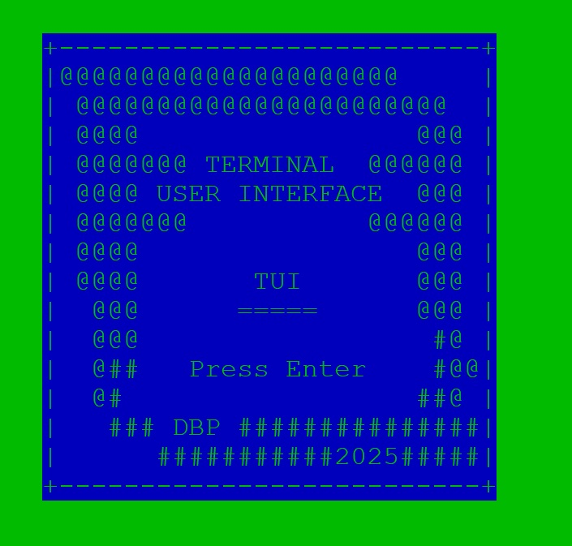
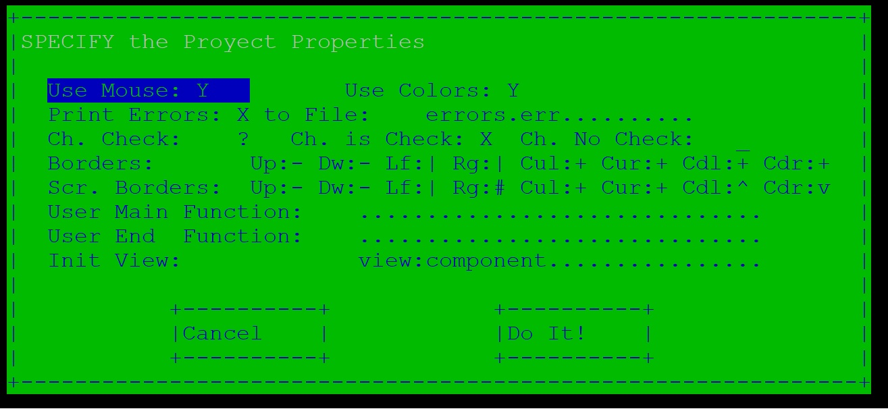
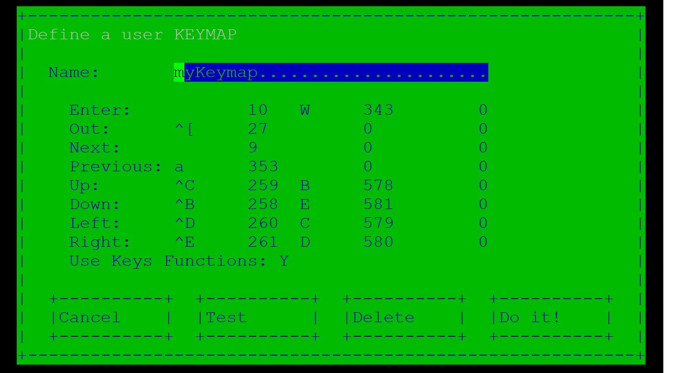
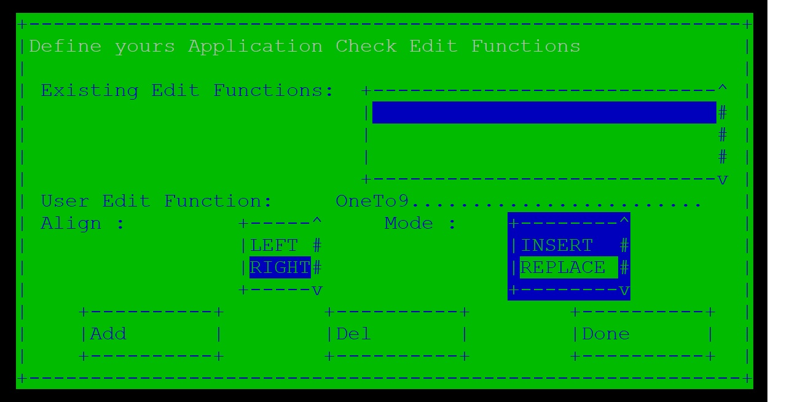
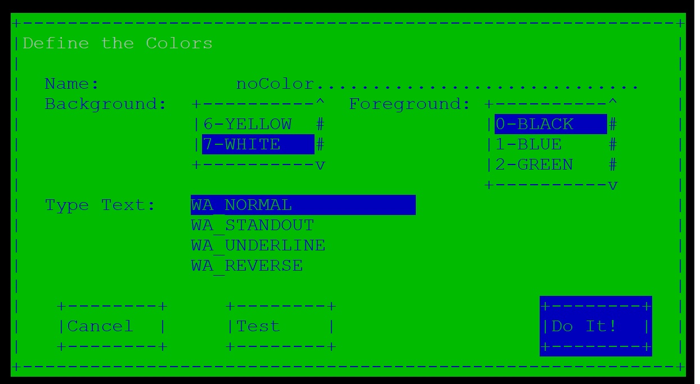
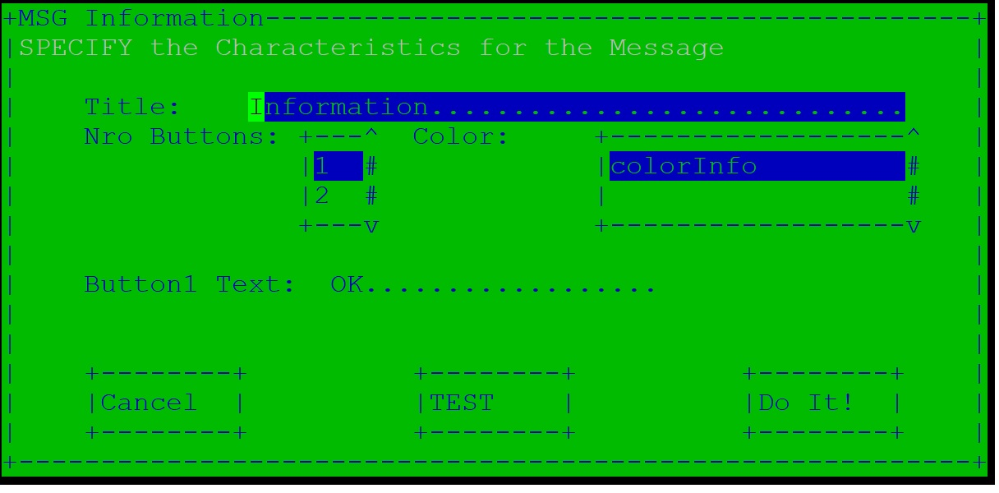
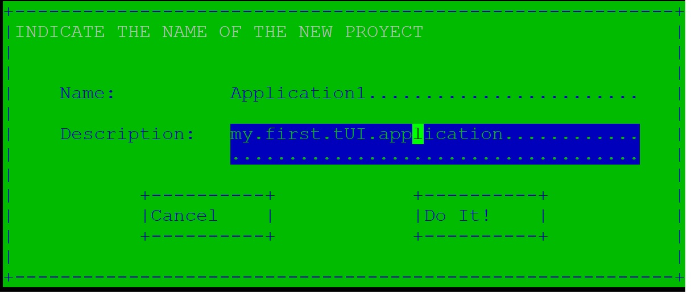
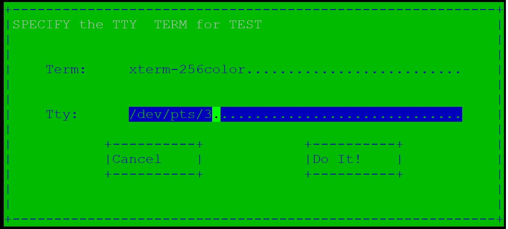
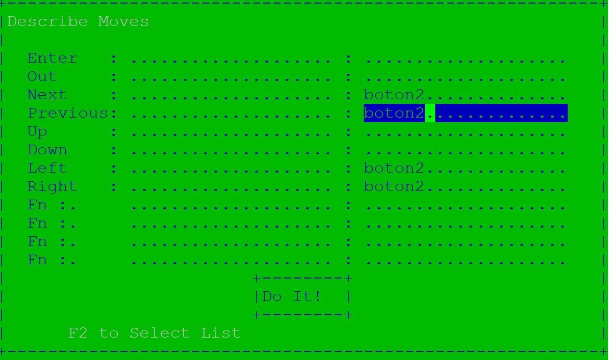

---

---

<h1 id="introducción">Introducción</h1>

La proyecto TUI consiste en tres elementos mediante los cuales se puede crear un interfaz de usuario para terminal potente de una forma rápida y sin necesidad de tener ningún conocimiento de la librería ncurses sobre la que se apoya.

<ul>
<li>El primer elemento del proyecto es la librería <em><strong>libtui</strong></em> que proporciona el recubrimiento del API de ncurses que permite la creación del interfaz mediante la descripción de elementos habituales a cualquier interfaz: paneles, botones …</li>
<li>El segundo elemento es un compilador (<em><strong>tbuild</strong></em>) que traduce la descripción de un interfaz de usuario descrito en formato xml en una aplicación completa y funcional.</li>
<li>Y el último elemento es una aplicación gráfica (<em><strong>tui</strong></em>) realizada utilizando la librería libtui y mediante la cual podremos construir el interfaz de nuestro proyecto de forma visual.</li>
</ul>
<h1 id="modelo">Modelo</h1>

El proyecto se basa en un modelo de vistas,. 
Actualmente se pueden manejar tres tipos de vistas:

<ul>
<li class="task-list-item">

<input type="checkbox" class="task-list-item-checkbox" disabled=""> Vista panel**,  que consiste básicamente en un lienzo sobre el 
que se podrán representar los siguientes elementos:

<ul>
<li>Elemento <strong>etiqueta</strong>,  para los textos fijos de nuestro interfaz.</li>
<li>Elemento <strong>botón</strong>, para los botones de la aplicación.</li>
<li>Elemento <strong>check-button,</strong> para los botones de marcado.</li>
<li>Elemento <strong>list-button</strong>, para las listas de selección.</li>
<li>Elemento <strong>field</strong>, para aquellos campos que deba rellenar el 
usuario.</li>
</ul>
</li>
<li class="task-list-item">

<input type="checkbox" class="task-list-item-checkbox" disabled=""> Vista table, que permite la representación de datos mediante 
listas tabuladas.

</li>
<li class="task-list-item">

<input type="checkbox" class="task-list-item-checkbox" disabled=""> Vista <strong>edit</strong>, que consiste en un editor simple mediante el cual 
manejar ficheros o textos sin formato.

</li>
</ul>
<h2 id="ciclo-de-vida">Ciclo de Vida</h2>

Las vistas tendrán los siguiente estados:

<ul>
<li>Creación, las vistas se crearán al comienzo de la aplicación de 
acuerdo a sus propiedades iniciales, tamaño, color, … 
Conjuntamente con la vista se crearán los elementos asociados si los 
hubiera.</li>
<li>Mostrado, las vistas se mostrarán en el momento asociado a los 
eventos de teclado (o ratón) indicados en la descripción del 
proyecto.</li>
<li>Activación, esto aplica a la vista completa o a un elemento dentro de 
ella si hay varios y significará que este elemento pasa a controlar 
los eventos de usuario. El elemento activo se muestra en video 
inverso para que el usuario comprenda que esta activo.</li>
<li>Des-activación, cuando se navegue de un elemento a otro se 
desactivara el elemento activo previamente a la activación del 
siguiente.</li>
<li>Ocultación, al pasar a activar una nueva vista  las vistas 
actualmente visibles se ocultarán de acuerdo a una gestión de niveles 
de forma tal que cualquier vista con un nivel superior a la que se va a activar será ocultada.</li>
<li>Destrucción, en el caso de destrucción además de ocultarse se 
borrarán todos los datos introducidos que de otra forma permanecerían si volviera a mostrase la vista.</li>
</ul>

El ciclo de vida por tanto será

<pre><code>creación-&gt;mostrado-&gt;activación-&gt;desactivacion-&gt;hide/destroy
        -&gt; mostrado-&gt;..........................
</code></pre>
<h2 id="eventos">Eventos</h2>

El elemento activo gestionará los eventos de entrada que se produzcan.

Se consideran los siguiente posibles eventos asociados a la entrada de teclado:

<ul>
<li>Enter, o entrar.</li>
<li>Out, o salir.</li>
<li>Up, ir  arriba.</li>
<li>Down, ir abajo.</li>
<li>Left, ir a la izquierda.</li>
<li>Right, ir a la derecha.</li>
<li>Next, o siguiente en la lista.</li>
<li>Previous, o anterior en la lista.</li>
<li>Fn, o tecla de Función.</li>
</ul>

Cuando corresponda se trataran internamente (no son configurables) los siguientes eventos:

<ul>
<li>

PgUp, pagina arriba.

</li>
<li>

PgDw, pagina abajo.

</li>
<li>

Init, ir al inicio.

</li>
<li>

End, ir al final.

</li>
<li>

Ins, cambio de modo entre insert y replace.

</li>
<li>

Backspace, borrar atrás.

</li>
<li>

Del, borrar adelante.

Adicionalmente si permitimos el uso del ratón:

</li>
<li>

El botón izquierdo se traducirá

<ul>
<li>En caso de pulsación sobre el elemento activo, si este es un componente de un panel  en un evento “enter” sobre el mismo, si la vista es una tabla en la selección del registro marcado y si es una vista edit en el posicionamiento del cursor en esa posición.</li>
<li>En el caso de  pulsar sobre otra vista y/o elemento de las que se 
muestran en la navegación hasta la misma es decir la activación de 
esa vista/elemento.</li>
</ul>
</li>
<li>

La pulsación del botón derecho resultará en un evento out  de forma 
general.

</li>
<li>

El botón central se traducirá como Up/Dw en las vistas de tabla y 
edición.

</li>
</ul>
<h1 id="aspectos-generales">Aspectos Generales</h1>

A continuación se describirá algunas características iniciales que hay que  considerar antes de comenzar a realizar una aplicación utilizando tUI. 
La forma mas sencilla es  explicar  los puntos descritos en el aparatado General del  interfaz gráfico de usuario tui para lo cual arrancamos el mismo con el comando tUI.

y creamos un nuevo proyecto con Proyect-&gt;new rellenamos el formulario y pulsamos sobre “Do it!”. 
Si a continuación salvamos el proyecto (Proyect-&gt;save) veremos que se ha generado un fichero con el nombre del proyecto y extensión xml. 
El contenido será algo así como:

<pre><code>&lt;?xml version="1.0"?&gt;
    &lt;TUI xmlns:tui="http://tui"&gt;
            &lt;Proyect&gt;
                    &lt;Name&gt;firstProyect&lt;/Name&gt;
                    &lt;Description&gt;First Proyect with tUI&lt;/Description&gt;
            &lt;/Proyect&gt;
    &lt;/TUI&gt;
</code></pre>
<h2 id="propiedades">Propiedades</h2>

El primer paso es hablar de la configuración o parametrización que permite el proyecto. (General-&gt;Properties)

<h3 id="color">Color</h3>

La aplicación permite el uso de color por parte de las aplicaciones, pero no todos los terminales admiten o permiten colores. 
Para los casos “normales” esto no tiene importancia simplemente nuestra aplicación se vera en blanco y negro independientemente de los colores que se hayan utilizado. 
En el fichero xml se indicará la etiqueta

<pre><code> &lt;Color/&gt;
</code></pre>

para indicar que se admite el uso de colores

Con la  herramienta visual tUI marcaremos “<strong>Use Color</strong>” en el apartado General-&gt;properties.

<h3 id="ratón">Ratón</h3>

La aplicación permite la inter-actuación mediante el ratón pero esto puede ser contraproducente en determinados casos.

De forma similar al color la etiqueta Mouse en el xml indicará que se acepta el ratón y su ausencia que no se admite.

<pre><code>&lt;Mouse/&gt;
</code></pre>

para indicar que acepta el ratón como método de interacción.

Con la  herramienta visual tUI marcaremos “<strong>Use Mouse</strong>” en el apartado General-&gt;properties.

<h3 id="errores">Errores</h3>

El proyecto hace uso del modulo “<strong>error.c</strong>” para gestionar los errores que se detecten. 
Este modulo se inicializa mediante la llamada:

<pre><code>void ERR_printError(int print,char * file)
</code></pre>

En la que indicamos si hay que imprimir los errores y en caso de que aplique el fichero donde escribir.

Si optamos por no imprimir los errores el programador puede usar los métodos:

<pre><code>int ERR_isError()
int ERR_lastError()
</code></pre>

En el caso de indicar que se desea imprimir los errores pero no se indica fichero (NULL) se utilizará el stdout.

En el fichero xml de nuestro proyecto esto se indicará con la etiqueta:

<pre><code>&lt;Error&gt;errores.txt&lt;/Error&gt;
</code></pre>

que incluye el fichero donde escribir los errores.

Con la  herramienta visual tUI marcaremos “<strong>Print Errors</strong>” e indicaremos el fichero  en el apartado General-&gt;properties.

<h3 id="check-buttón">Check buttón</h3>

Los check buttón funcionan mediante tres caracteres:

El carácter dentro de un texto que indicara la/s posición/es de marcado. 
El carácter a mostrar cuando el elemento no esta marcado. 
El carácter a mostrar cuando el elemento este marcado.

Aunque como veremos esto puede cambiarse en cada check-button, esta parametrización permite cambiar los valores por defecto ?,X,_ por por ejemplo ?,Y,N de forma general y que no haya que indicarlo en cada check-button.

En el xml lo mismo se logrará con la etiqueta:

<pre><code>&lt;Check chCheck="63" chIsCheck="89" chNoCheck="78" /&gt;
or
&lt;Check chCheck="?" chIsCheck="Y" chNoCheck="N" /&gt;
</code></pre>

Con la  herramienta visual tUI indicaremos los caracteres adecuados Ch. Check , Ch is Check, Ch is not Check " en el apartado General-&gt;properties.

<h3 id="enmarcado">Enmarcado</h3>

Las vistas se muestran sobre un marco de acuerdo a las dimensiones dadas, estos marcos pueden estar enmarcados mediante un borde. 
Los enmarcados se definen como caracteres de borde arriba, abajo, izquierda, derecha y las cuatro esquinas, típicamente guiones, barras y el símbolo +. 
Para las  vistas de tablas y editor  ( otras en un futuro) donde pueda realizarse scroll se utilizara la descripción de enmarco de scroll definido por los caracteres de SBorder en lugar de los de Border. 
Los caracteres que configuran estos bordes son parametrizables en la aplicación:

En el xml es posible personalizar estos enmarcados mediante las etiquetas:

<pre><code>&lt;Borders Up="45" Dw="45" Lf="124" Rg="124" Cul="43" Cur="43" Cdl="43" Cdr="43"/&gt;
&lt;SBorders Up="45" Dw="45" Lf="124" Rg="35" Cul="43" Cur="43" Cdl="94" Cdr="118"/&gt;
</code></pre>

Donde indicaremos los caracteres que lo definen como carácter o como código de carácter. 
Con la  herramienta visual tUI indicaremos los caracteres adecuados Border y SBorder en el apartado General-&gt;properties.

<h3 id="user-main">User Main</h3>

Para las inicializaciones necesarias asociadas a nuestra aplicación es posible declarar una función de usuario “main” que se invocará como primera instrucción de programa. 
Esta función de manera análoga al main habitual recibirá como parámetros el argc y argv con los que haya invocado el programa. 
Si el retorno obtenido es distinto de 0 se procederá a realizar un exit del programa usando este valor como salida. 
Esto se declara en el apartado General-&gt;properties y resultará en la siguiente entrada en el xml:

<pre><code>   &lt;Main&gt;userMain&lt;/Main&gt;
</code></pre>
<h3 id="user-end">User End</h3>

Como última instrucción del programa se invocara, caso de existir, la función user-end declarada. 
No tiene parámetros de entrada y el resultado de salida se utilizará en el return del main. 
Esto se declara en el apartado General-&gt;properties y resultará en la siguiente entrada en el xml:

<pre><code>    &lt;End&gt;userEnd&lt;/End&gt;
</code></pre>
<h3 id="init-view">Init View</h3>

Como init-view se debe indicar la vista a activar en el arranque de la aplicación. 
El formato será:

<pre><code>   nombreVista:[nombreElemento]
</code></pre>

Esto se declara en el apartado General-&gt;properties y resultará en la siguiente entrada en el xml:

<pre><code>   &lt;Init&gt;firstView:firstElement&lt;/Init&gt;
</code></pre>
<h3 id="resumen">Resumen</h3>

El siguiente fichero Xml muestra el resultado de haber fijado las características iniciales de nuestro proyecto:

<pre><code>&lt;?xml version="1.0"?&gt;
&lt;TUI xmlns:tui="http://tui"&gt;
        &lt;Proyect&gt;
                &lt;Name&gt;firstProyect&lt;/Name&gt;
                &lt;Description&gt;First Proyect with tUI&lt;/Description&gt;
                &lt;Main&gt;userMain&lt;/Main&gt;
                &lt;End&gt;userEnd&lt;/End&gt;
                &lt;Init&gt;firstView:firstElement&lt;/Init&gt;
                &lt;Properties&gt;
                        &lt;Color/&gt;
                        &lt;Mouse/&gt;
                        &lt;Error&gt;errors.err&lt;/Error&gt;
                        &lt;Check chCheck="63" chIsCheck="89" chNoCheck="78" /&gt;
                        &lt;Borders Up="45" Dw="45" Lf="124" Rg="124" Cul="43" Cur="43" Cdl="43" Cdr="43"/&gt;
                        &lt;SBorders Up="45" Dw="45" Lf="124" Rg="35" Cul="43" Cur="43" Cdl="94" Cdr="118"/&gt;
                &lt;/Properties&gt;
        &lt;/Proyect&gt;
&lt;/TUI&gt;
</code></pre>
<h2 id="keymap">Keymap</h2>

Un punto primordial de cualquier aplicación de terminal es el manejo del teclado y mas concretamente el mapeo de las teclas a los eventos.

De forma más clara que código de teclado traducimos en un evento Enter por ejemplo.

Tradicionalmente esto es una fuente de problemas cuando realizamos una aplicación basada en “ncurses” ya que con alta probabilidad y dependiendo del terminal o la emulación del mismo el termcap o terminfo asociado no este configurado de acuerdo a nuestras necesidades y haya teclas que no funcionen o funcionen de formas distintas según el terminal utilizado.

La aproximación que realizamos en la librería tUI es describir mapas de teclados en los que se puede asociar hasta tres códigos de teclado a un evento.

Estos mapas de teclado residen el el hdr: “mapKey.h” y están pensados para lo que consideramos el caso mas habitual es decir un teclado tipo PC sobre una emulación de xterm.

Sin embargo puede que esto no sea lo más correcto en todos los casos por lo que es posible describir un mapa de teclado propio e indicar su utilización luego en los elementos que gestionan eventos en lugar de los mapa de teclas definidos en la aplicación.

En el fichero Xml indicaremos nuestros mapas de teclas personalizados de la siguiente  manera:

<pre><code>&lt;Keymaps&gt;
        &lt;Keymap Name="myKeymap"&gt;
        &lt;Enter ch1="10" ch2="343" ch3="0"/&gt;
        &lt;Out ch1="27" ch2="0" ch3="0"/&gt;
        &lt;Next ch1="9" ch2="0" ch3="0"/&gt;
        &lt;Previous ch1="353" ch2="0" ch3="0"/&gt;
        &lt;Up ch1="259" ch2="578" ch3="0"/&gt;
        &lt;Down ch1="258" ch2="581" ch3="0"/&gt;
        &lt;Left ch1="260" ch2="579" ch3="0"/&gt;
        &lt;Right ch1="261" ch2="580" ch3="0"/&gt;
        &lt;Fn/&gt;
        &lt;/Keymap&gt;
&lt;/Keymaps&gt;
</code></pre>

Y en el interfaz gráfico haremos uso del menú: General-&gt;Keymap-&gt;new y seguiremos las instrucciones asociadas.

<blockquote>

En el caso de la etiqueta Fn lo que indicamos es que se introduzcan las entradas propias a la definición de F0 a F11 de la librería ncurses.

</blockquote>
<h2 id="ed-functions">Ed Functions</h2>

A los elementos tipo “<strong>fields</strong>”  de entrada de texto se les debe asociar una función de validación o transformación: 
La aplicación tiene por defecto las siguientes funciones de validación:

<ul>
<li>numeric, acepta cualquier carácter entre el 48 y el 57 es decir entre 0 y 9.</li>
<li>alfnumeric, acepta caracteres entre 48 y 57, 65-90 y 97-122 es decir 
0-9,a-z y A-Z.</li>
<li>7ascii, acepta caracteres entre 32 y 126. tabla ascii 7bits.</li>
</ul>

y las siguientes funciones de trasformación:

<ul>
<li>upper: es un toupper del carácter.</li>
<li>lower,: es un tolower del carácter.</li>
</ul>

Adicionalmente estas funciones tienen asociada dos características:

<ul>
<li>Alineación, derecha para la función numerica, izquierda para el resto.</li>
<li>Modo, inserción/remplazo, en las funciones por defecto siempre es remplazo.</li>
</ul>

Si necesitamos una función personal especifica para un determinado campo se puede definir una de la siguiente manera en el fichero Xml:

En el fichero Xml indi:

<pre><code>&lt;checksEdit&gt;
     &lt;checkEdit Name="OneTo9" Align="right" Mode="replace" /&gt;
&lt;/checksEdit&gt;
</code></pre>

Donde el valor del Name se corresponderá con una función de usuario de la forma:

<pre><code> int OneTo9(int * caracter)
</code></pre>

Que:

<ul>
<li>Recibira el caracter introducido como parametro de entrada.</li>
<li>Retornara 0 si es valido el caracter 1 en caso contrario.</li>
<li>Modificara el caracter recibido en caso de que se requiera.</li>
</ul>

Y en el interfaz gráfico haremos uso del menú: General-&gt;Ed.Function y seguiremos las instrucciones asociadas. 

<h2 id="colors">Colors</h2>

Todos los elementos de la aplicación pueden tener asociado un color, estos colores se definen como tres parámetros.

<ul>
<li>Color del fondo</li>
<li>Color del texto</li>
<li>Fuente de letra a usar</li>
</ul>

Los colores que se pueden manejar son los colores básicos que manejan las ncurses:

<ol>
<li>BLACK</li>
<li>BLUE</li>
<li>GREEN</li>
<li>CYAN</li>
<li>RED</li>
<li>MAGENTA</li>
<li>YELLOW</li>
<li>WHITE</li>
</ol>

Asimismo los fuentes posibles son los aceptados por las ncurses:

<ol>
<li>WA_NORMAL</li>
<li>WA_STANDOUT</li>
<li>WA_UNDERLINE</li>
<li>WA_REVERSE</li>
<li>WA_BLINK</li>
<li>WA_DIM</li>
<li>WA_BOLD</li>
<li>WA_ALTCHARSET</li>
<li>WA_INVIS</li>
<li>WA_PROTECT</li>
<li>WA_HORIZONTAL</li>
<li>WA_LEFT</li>
<li>WA_LOW</li>
<li>WA_RIGHT</li>
<li>WA_TOP</li>
<li>WA_VERTICAL</li>
<li>WA_ITALIC</li>
</ol>

Estos colores o estilos se definirán en el fichero XML:

<pre><code>  &lt;Colors&gt;
    &lt;Color Name="miColor1" foreground="1" background="2" attr="WA_NORMAL"/&gt;
 &lt;/Colors&gt;
</code></pre>

Y mediante la aplicación gráfica utilizaremos el formulario de General-&gt;Colors-&gt;New 

Para su posterior uso  en la creación de los elementos.

<blockquote>

Es posible definir más una propiedad adicional al font de forma manual en el xml mediante el atributo attr2, por ejemplo:

</blockquote>
<pre><code>  &lt;Color Name="miColor1" foreground="1" background="2" attr="WA_BOLD" attr2="WA_UNDERLINE/&gt;
</code></pre>
<blockquote>

Algunos tipos de font como ITALIC probablemente no tengan ningún efecto ya que dependen del terminal y otros como WA_INVIS pueden tener efecto en el color para más detalle consultar documentación de ncurses.

</blockquote>
<h2 id="msgs">MSGS</h2>

La aplicación contempla la posibilidad de ventanas emergentes de aviso de tres tipos:

<ul>
<li>Información</li>
<li>Aviso</li>
<li>Error</li>
</ul>

Estas ventanas las abrirá el usuario según convenga en cada circunstancia de forma programática y consistirán en una vista panel con titulo  centrada en la pantalla o en marco de  la vista activa en la que se mostrará el texto proporcionado, en un estilo o color determinado y de 0 a 2 botones también determinados.

La aplicación permite parametrizar estas ventanas de aviso, para ello podemos mediante el Xml:

<pre><code>&lt;Colors&gt;
        &lt;Color Name="colorInfo" foreground="2" background="1" attr="WA_NORMAL"/&gt;
&lt;/Colors&gt;
&lt;Msgs&gt;
&lt;Msg type="info" nroButtons="1"&gt;
        &lt;Title&gt;Information&lt;/Title&gt;
        &lt;Color&gt;colorInfo&lt;/Color&gt;
        &lt;Buttons&gt;
                &lt;Button1&gt;OK&lt;/Button1&gt;
        &lt;/Buttons&gt;
&lt;/Msg&gt;
&lt;/Msgs&gt;
</code></pre>

De esa forma cambiamos la ventana de mensajes de tipo información  de una ventana de  0 botonos (defecto) a 1, le ponemos un titulo “Information” ,el color de noColor por defecto a colorInfo, y como texto del botón ponemos OK.

Con la aplicación gráfica completaremos el formulario de General-&gt;Msgs-&gt;Info 

<blockquote>

En el caso de que la ventana de mensaje no tenga asociado ningún botón se cerrara la misma al cabo de 5 sg (valor modificable con MSG_setSegInfo) o mediante cualquier pulsación o click te ratón.

Las ventanas de mensaje quedarán como las únicas activas bloqueando la aplicación hasta su cierre.

</blockquote>
<h1 id="primera-aplicación">PRIMERA APLICACIÓN</h1>

Ya estamos en condiciones de crear nuestra primera aplicación, en este apartado crearemos varias aplicaciones típicas paso a paso como forma visual de documentar el proyecto.

<h2 id="menu">Menu</h2>

Como primera aplicación vamos a crear un menú simple con 2 opciones OPCION A y OPCION B.

<h3 id="creación-del-proyecto">Creación del Proyecto</h3>

Abrimos el interfaz gráfico y en Proyect-&gt;New creamos un proyecto nuevo, application1 por ejemplo: 

<h3 id="terminal-de-test">Terminal de Test</h3>

A continuación abrimos otro terminal con la maquina que utilicemos y obtenemos el tty asociado, este dato lo utilizaremos en la opción Proyect-&gt;T.TEST  conjuntamente con el tipo de terminal emulado: 

A partir de este momento podremos utilizar este terminal para realizar un test de lo que estamos haciendo.

<blockquote>

Es conveniente que el terminal que usemos no acepte entrada para evitar colusión entre sesiones para lo cual lo más fácil es indicar un sleep 9999999 en el mismo

</blockquote>
<h3 id="color-1">color</h3>

Como primer paso vamos a elegir un color para el menú, para lo cual rellenamos el formulario General-&gt;color y probamos combinaciones por ejemplo azul y negro, verde y rojo, con subrayado,… 
Utilizando el botón de Test podremos visualizar el resultado en el terminal que hemos definido de Test y probar distintas combinaciones hasta que demos con la que nos satisfaga.

<blockquote>

Al indicar Test aparecerá un aviso en el pantalla de Clean, al pulsar OK se limpiará la pantalla de prueba si indicamos Cancel el test continuará visible y permitirá de esa forma comparar distintas combinaciones.

</blockquote>

Finalmente nos decantamos por un baground verde y un foreground negro y tipo letra normal al que damos el nombre de colorMenu.

<h3 id="panel">panel</h3>

Vamos a crear el panel que soportará nuestro menú de dos botones: 
View-&gt;Panel NEW 
y aquí indicamos: 
Como ID: nada, ya que es una forma alternativa en la que el usuario puede referirse a la vista. 
Como Name: menu1, esto es obligatorio y debe ser único ya que toda la mecánica interna de la aplicación se hace referenciando a este nombre (el id alternativo no es utilizado por la libreria). 
Como Level: 1, valdría cualquiera ya que solo tenemos un nivel. 
Como Title: nada, ya que no deseamos ninguno.

<blockquote>

El titulo aparece en el enmarcado del panel por lo que será necesario indicar border si queremos dar un titulo al panel.

</blockquote>

Como OP: none, este es el panel principal y no necesitamos ocultar o destruir. 
Como Color: indicaremos el colorMenu,  (navegar con las flechas y pulsar enter para seleccionar). 
Como Border: N, indicamos que no queremos borde. 
Como Dimensiones: Indicamos por ejemplo 0,0 y 40,3.

<blockquote>

Las posiciones y tamaños serán relativos a la pantalla con origen 0,0

</blockquote>

Pulsamos sobre DoIt!  en la lista de paneles de la izquierda aparecerá el nuevo panel menu1. 
A continuación pulsamos sobre TEST y si todo esta bien observaremos el panel que hemos descrito en el terminal de prueba.

Es el momento de que juegues un poco, cambia a borde S, salva y prueba, en este caso conviene limpiar el terminal de test después de cada prueba para evitar que se solapen distintas pruebas.

<blockquote>

Es conveniente que <strong>periódicamente salves el proyecto</strong> (Proyect-&gt;save) ya que el TEST se ejecuta efectivamente con la librería y determinados errores (típicamente dimensiones erróneas) pueden provocar un fallo catastrófico y cerrar la aplicación con lo que se perderán los cambios.

</blockquote>
<h3 id="botones">botones</h3>

Vamos a añadir los botones de nuestro menu: 
Pulsamos sobre el botón COMPONENTS del formulario de panel, se abrirá un nuevo panel en el que seleccionaremos new button lo que nos llevará al formulario asociado, sobre el que procederemos a crear el botón.

Id: none 
Name: boton1 
Visible: Y, indica que el elemento será visible.

<blockquote>

Los componentes o elementos de un panel puede ser ocultos podemos cambiar esta característica mediante programación.

</blockquote>

Select: Y , indica que el elemento es seleccionable es decir que puede navegarse hasta el mismo bien mediante ratón, bien mediante teclado. 
Color: seleccionamos colorMenu. 
Border: Y 
Dimensiones: 0,0 10,3

<blockquote>

Las coordenadas son relativas al panel no a la pantalla, 
Al indicar que queremos borde hemos de tener en cuanta que se requieren  2 líneas y 2 columnas para acomodar el borde.

</blockquote>

Text: OPCION A

Salvamos mediante Do It! y comprobamos el resultado mediante el botón TEST.

Sin necesidad de salir modificamos el formulario: 
Name: boton2 
Dimension 12,0 10,3 
Text: OPCION B

Salvamos y comprobamos

<h3 id="moves">Moves</h3>

Vamos a gestionar ahora la dinámica del menú. 
Volvemos atrás (ESC) y nuevamente atrás (ESC) ya que la lista de componentes no se actualiza automáticamente y volvemos a pulsar  sobre COMPONENTS y seleccionamos el boton1 
En el formulario del botón pulsamos sobre <strong>Aut. Moves</strong> 
Se nos abre una pantalla con los eventos posibles y sobre la que podremos indicar los movimientos (vista:elemento) que deseamos para estos eventos. 
En este caso vamos a indicar que tanto flecha derecha como izquierda y siguiente opción (Next), como previa (Previous) nos dirijan al boton2. 

<blockquote>

Obsérvese que utilizamos  referenciado relativo. Cuando no indicamos la parte de vista nos referimos a la vista activa. 
Es decir la notación :boton1 es equivalente a menu1:boton1 pero como veremos luego es mejor usar la relativa y no solo por ahorro.

</blockquote>

Salvamos el formulario y volvemos a salvar sobre el formulario del elemento. 
Volvemos a atrás (ESC) y de seleccionamos el botón 2 para de forma espejo indicar el boton1 como destino de los eventos.

Lamentablemente no es posible comprobar la dinámica de la aplicación sin generarla pero antes vamos a ver otros puntos.

<h3 id="exit">Exit</h3>

Para indicar la salida del programa vamos a utilizar la definición de movimientos del panel para lo cual utilizaremos el botón <strong>Moves</strong> del formulario de panel y por ejemplo sobre el evento Out: indicaremos como vista exit:.

<blockquote>

Cuando el evento no esta capturado por el componente activo la aplicación comprobará si el evento esta capturado por la vista activa y de ser así procederá a ejecutar lo que indica la vista en este caso hemos utilizado la vista con nombre clave exit que indica finalizar aplicación.

</blockquote>
<blockquote>

Recordar salvar la modificación en el panel no solo en el formulario de Move.

</blockquote>
<h3 id="check-la-aplicación">Check la aplicación</h3>

Vamos a proceder a chequear la aplicación construida, para ello pulsamos el botón: 
Make-&gt;Check 
Si todo es correcto nos indicará el error de que no tenemos una vista inicial definida. 
Vamos a General-&gt;properties e indicamos como vista inicial: menu1:boton1. 
Si repetimos el check todo debe estar bien ahora.

<h3 id="edit">Edit</h3>

Antes de continuar echemos un vistazo al xml que se genera al salvar el proyecto, para ello pulsamos sobre Edit-&gt;Open

<pre><code>&lt;?xml version="1.0"?&gt;
&lt;TUI xmlns:tui="http://tui"&gt;
        &lt;Proyect&gt;
                &lt;Name&gt;Application1&lt;/Name&gt;
                &lt;Description&gt;my first tUI application&lt;/Description&gt;
                &lt;Main&gt;&lt;/Main&gt;
                &lt;End&gt;&lt;/End&gt;
                &lt;Init&gt;menu1:boton1&lt;/Init&gt;
                &lt;Properties&gt;
                        &lt;Mouse/&gt;
                        &lt;Color/&gt;
                        &lt;Error&gt;errors.err&lt;/Error&gt;
                        &lt;Borders Up="45" Dw="45" Lf="124" Rg="124" Cul="43" Cur="43" Cdl="43" Cdr="43"/&gt;
                        &lt;SBorders Up="45" Dw="45" Lf="124" Rg="35" Cul="43" Cur="43" Cdl="94" Cdr="118"/&gt;
                &lt;/Properties&gt;
        &lt;/Proyect&gt;
        &lt;Colors&gt;
                &lt;Color Name="colorMenu" foreground="0" background="2" attr="WA_NORMAL"/&gt;
        &lt;/Colors&gt;
        &lt;Msgs&gt;
        &lt;/Msgs&gt;
        &lt;Panels&gt;
                &lt;Panel Id="0" Name="menu1" opToMade="none" Level="1"&gt;
                        &lt;Color&gt;colorMenu&lt;/Color&gt;
                        &lt;Dimension border="0" x="0" y="0" high="3" width="40"/&gt;
                        &lt;FPanel /&gt;
                        &lt;Move  out="exit:" /&gt;
                        &lt;FAction /&gt;
                &lt;Components&gt;
                &lt;Component Id="0" Name="boton1" Type="button" &gt;
                        &lt;Color&gt;colorMenu&lt;/Color&gt;
                        &lt;Dimension border="1" x="0" y="0" high="3" width="10"/&gt;
                        &lt;Text&gt;OPCION A&lt;/Text&gt;
                        &lt;Move  next=":boton2"  previous=":boton2"  left=":boton2"  right=":boton2" /&gt;
                        &lt;FAction /&gt;
                        &lt;FComponent /&gt;
                &lt;/Component&gt;
                &lt;Component Id="0" Name="boton2" Type="button" &gt;
                        &lt;Color&gt;colorMenu&lt;/Color&gt;
                        &lt;Dimension border="1" x="12" y="0" high="3" width="10"/&gt;
                        &lt;Text&gt;OPCION B&lt;/Text&gt;
                        &lt;Move  next=":boton1"  previous=":boton1"  left=":boton1"  right=":boton1" /&gt;
                        &lt;FAction /&gt;
                        &lt;FComponent /&gt;
                &lt;/Component&gt;
                &lt;/Components&gt;
                &lt;/Panel&gt;
        &lt;/Panels&gt;
&lt;/TUI&gt;
</code></pre>

Este Xml se corresponde con nuestro proyecto application1.

<h3 id="compile-y-run">compile y run</h3>

Partiendo del Xml se generá la aplicación por lo que como paso previo procede a salvar el proyecto (Proyect-&gt;save) 
A partir de este Xml y mediante la herramienta <strong>tbuild</strong> se genera:

<ul>
<li>nombreProyecto.c que constituye el main de la aplicación construida.</li>
<li>nombreProyecto_func.h, con los prototipos de las funciones que 
callback que hayamos definido.</li>
<li>nombreProyecto_func.c, con el esqueleto de las funciones de callback 
a implementar por el usuario.</li>
</ul>
<blockquote>

La herramienta tbuild tiene opciones que permiten evitar  la re-escritura de los prototipos o funciones de callback

</blockquote>

Compilando los ficheros *. c conjuntamente con la librería tui y la librería ncurses obtendremos nuestra aplicación.

O podemos utilizar el interfaz gráfico suministrado, al menos en esta etapa inicial en la que no hay funciones de callback de usuario. 
Si ejecutamos Make-&gt;compile se procede a compilar la aplicación mediante el makefile makefile_tui suministrado el cual genera un directorio con el nombre del proyecto y procede a ejecutar sobre el mismo el tbuild, la compilación y el montaje.

<blockquote>

Dependiendo de la instalación realizada es posible que debas ajustar algún dato en este makefile como la ubicación del tbuild o las  librerias y headers.

</blockquote>

En este punto podemos ir al directorio creado y ejecutar la aplicación manualmente o pulsar sobre el botón Make-&gt;Execute, la aplicación se ejecutara sobre el terminal de prueba y será plenamente operativa pudiendo comprobarse los movimientos, pulsando sobre ESC provocaremos el evento de exit terminado así la prueba y liberando la aplicación gráfica para seguir trabajando.

<h2 id="menu-2-niveles">Menu 2 niveles</h2>

Para crear un menu de dos niveles procederemos creando dos paneles de forma similar a como lo hemos hecho en el caso anterior uno que contendrá las opciones del nivel 1 y otro con las opciones del nivel 2.

Para ello vamos a utilizar una característica de la aplicación gráfica. 
Vamos a View-&gt;Copy y seleccionamos el menu1 nos abrirá un formulario en el que indicaremos: 
To: nivel2 
Copy componentes: Y, la nueva vista “nivel2” tendrá dos botones también boton1 y boton2.

<blockquote>

Los nombres de los componentes no chocaran entre ellos si las primeras 4 letras del panel difieren.

</blockquote>

Copy moves: Y, posteriormente deberemos ajustarlo especialmente si hemos utilizado referencias absolutas vista:componente y no relativas. 
Copy applications move: N 
Copy applications calls: N

Ahora vamos ha hacer algunas modificaciones: 
Vamos a views-&gt;panels  y seleccionamos el panel nivel2 cambiamos: 
Nivel: a nivel 2. 
OP: a HIDE para que se oculte cuando volvamos al nivel principal menu1. 
Dimension: a 0,4 40,3 para que se muestre justo debajo del anterior.

Cambiamos también los Moves de forma que Out ya no sea exit: sino menu1:boton1 
Y salvamos y comprobamos

<blockquote>

Para ver como se verían ambos paneles indicar no a make clean y ejecutar los test de cada uno de ellos.

</blockquote>

El ultimo ajuste que vamos ha hacer es la navegación en el boton1 de menu1 Aut. Moves indicamos para el evento Enter nivel2:boton1.

<blockquote>

Aquí es obligado utilizar referencia absoluta ya que no hablamos de la vista activa.

</blockquote>

Si compilamos y ejecutamos la aplicación el resultado será un menu de dos niveles el segundo de los cuales se abre al seleccionar la Opcion A del primer nivel y con un segundo nivel que se oculta  al pulsar “ESC”

<blockquote>

Aprovecha para comprobar el uso del ratón.

</blockquote>

De forma análoga podemos definir menus de cualquier nivel de profundidad y complejidad.

<h2 id="formulario">Formulario</h2>

A continuación vamos ha realizar un formulario típico en el que pondremos un elemento de cada tipo.

<h2 id="panel-1">panel</h2>

Comenzamos como siempre creando un panel, con los siguientes datos por ejemplo:

Name: form1 
Title: My first form 
Level: 2 
OP: DELE 
Color: colorForm, color que deberemos haber creado previamente a nuestro gusto. 
Border:S . en este caso vamos a poner marco al panel y además como le hemos puesto titulo es necesario para mostrar el mismo. 
Dimension: 5,5 y 60,15

Lo creamos y testeamos para ver si el lienzo nos convence.

<h2 id="label">label</h2>

Vamos a poner una etiqueta dentro del mismo,  para lo cual pulsamos sobre el botón COMPONENTS y seleccionamos NEW LABEL, aparecerá el formulario correspondiente en donde introduciremos los siguientes datos:

ID:  none 
Name: ename 
Visible: Y, ya deseamos que se muestre. 
Select: N, las etiquetas no son seleccionables.

<blockquote>

se puede observar que este campo no es modificable ya que el mismo en 
este caso esta fijado como selected N.

</blockquote>

Color: colorForm, puede usarse cualquier otro color creado pero el resultado será un poco raro. 
Border: N no queremos marco en la etiqueta. 
Dimension: 2,2 20,1 
Text: NAME:

Y con eso ya tenemos una etiqueta

<h2 id="field">field</h2>

A continuación vamos a definir el campo nombre editable. 
Para lo cual retrocedemos y seleccionamos NEW FIELD e introducimos los datos:

ID: 1 
Name: nombre 
Visible Y 
Selec Y, 
Color, colorForm 
Auto Enter Y, el auto enter fuerza un evento enter en el momento que se rellena el tamaño máximo del campo. 
Secret N, los campos que se marcan como secret muestran * en lugar del echo normal. 
Keymap, si pulsamos sobre este botón nos permite seleccionar entre los keymap de usuario que hayamos definido. En nuestro caso el de defecto. 
Ch. Ed: . es el  carácter a mostrar en las posiciones no rellenas del campo, por defecto son ‘.’ que indican el tamaño del campo. 
Edit Functions: vamos a pulsar sobre el mismo y seleccionar alfnumeric como validación. 
Border, N 
Dimension, 24,2 (a continuación de la etiqueta) y 20,1 (campo de 20 caracteres) 
Texto: no indicamos nada ya que no queremos un valor por defecto.

Salvamos y probamos.

<h2 id="check-button">Check Button</h2>

Vamos a definir una opción de check a continuación, para ello retrocedemos y seleccionamos NEW CK. BUTTON y rellenamos:

ID: 2 
Name: check 
Visible Y 
Select Y 
Color, colorForm 
Border N 
Dimension:  2,3 (debajo del campo anterior) y dimensión 40, 1 
Text: This is a A-B check Button ? 
Check, N indica si por defecto estará marcado. 
Ch. Check,  (vacio) es el carácter a sustituir dependiendo de si esta marcado o no usaremos el de defecto (?). 
Ch. is Check, A cuando marquemos se mostrará A. 
Ch is no Check, B cuando desmarquemos se mostrará B.

Salvamos y comprobamos el resultado.

<h2 id="list-button">List Button</h2>

Continuemos con el list button, primero le ponemos una etiqueta al list button: 
Seleccionamos NEW LABEL y rellenamos;

ID:  none 
Name: elist 
Visible: Y, ya deseamos que se muestre. 
Select: N, las etiquetas no son seleccionables.

<blockquote>

se puede observar que este campo no es modificable ya que el mismo en 
este caso esta fijado como selected N.

</blockquote>

Color: colorForm, puede usarse cualquier otro color creado pero el resultado será un poco raro. 
Border: N no queremos marco en la etiqueta. 
Dimension: 2,4 20,1 
Text: GENDER:

Salvamos, comprobamos y salimos para definir el list button. 
Seleccionamos NEW LIST BUTTON

ID: 3 
Name: gender 
Display:  NORMAL,

<blockquote>

Este es un list button de alto 1,  activando e mismo y pulsando  las 
flechas arriba/abajo podremos seleccionar las entre las siguientes 
opciones: 
NORMAL, visible y seleccionable. 
HIDDEN oculto. 
NOT SELECTABLE, no seleccionable. 
OPEN se comporta como un list desplegable, las opciones solo se visualizan y se pueden seleccionar al pulsar sobre el botón, requiere programación por el usuario para una vez seleccionado un valor mostrarlo en pantalla.

</blockquote>

Color: colorForm 
Keymap: defecto 
Border Y 
Dimension: 24,4 y 12,5 
Text: Añadimos los texto MALE, FEMALE y OTHER.

Salvamos y procedemos a verificar el resultado.

<h2 id="button">button</h2>

Y ya solo nos queda un elemento que es el botón que ya hemos visto con los menús así que añadiremos simplemente un botón del tipo:

Id:4 
Name: done 
Color: colorMenu 
Border:Y 
Dimension: 25,10 y 10,3 
Text: MADE

Salvamos y procedemos a verificar el resultado.

<h2 id="moves-1">Moves</h2>

Vamos a definir los movimientos del formulario: 
En el panel: Form1 aplicamos el movimiento "-1: " al evento Out (Formulario de Panel -&gt; Moves). Esto provocará que la tecla ESC en cualquier lugar del formulario retorne a la vista anterior.

<blockquote>

Los movimientos tipo -n, indica a la aplicación hacer un retroceso de 
n en el camino de llamadas que ha terminado en esta vista. 
De esta forma una vista puede ser invocada desde distintos puntos y retornar de forma natural a los mismos.

</blockquote>

En la vista menu1 / boton2 vamos a aplicar en  Moves form1:name para el evento Enter, de forma que se habrá el formulario al pulsar sobre el botón2 del menu1.

En el formulario vamos a aplicar los siguientes movimientos:

En el elemento form1:name 
Enter, “:2”  o :check

<blockquote>

Esto significa que cuando pulsemos Enter se activará el elemento con 
id=2 o el elemento con name=check.

</blockquote>

Next, “:2” 
Down, “:2”

<blockquote>

Podremos navegar con la tecla Tab o con la tecla Down al siguiente elemento del formulario.

</blockquote>

Previous, “:4” 
Up, “:4”

<blockquote>

Con la tecla SHIFT-TAB o con la tela Up iremos al último elemento del formulario el botón.

</blockquote>

De forma análoga para el elemento check indicamos: 
Enter, Next y Down, “:3” 
Previous, Up, ":1

En el elemento gender la cosa cambia un poco, indicamos: 
Enter, Next, “:4” 
Previous, :":2"

<blockquote>

Obsérvese que no indicamos tratamiento para los eventos Up, Down, en 
este caso up, down se utilizan para elegir el navegar dentro de la 
lista de valores del list buttón si no lo tratamos no será posible la 
navegación.

</blockquote>

En el elemento botón indicamos: 
Enter, -:

<blockquote>

Es decir al pulsar sobre el botón salir o volver al menú

</blockquote>

Next down, :1 
Previous,up , :-3

<h2 id="compilamos-y-probamos">Compilamos y probamos</h2>

Salvamos, compilamos y probamos. 
El Xml tendrá un aspecto como este:

<pre><code>&lt;?xml version="1.0"?&gt;
&lt;TUI xmlns:tui="http://tui"&gt;
        &lt;Proyect&gt;
                &lt;Name&gt;Application1&lt;/Name&gt;
                &lt;Description&gt;my first tUI application&lt;/Description&gt;
                &lt;Main&gt;&lt;/Main&gt;
                &lt;End&gt;&lt;/End&gt;
                &lt;Init&gt;menu1:boton1&lt;/Init&gt;
                &lt;Properties&gt;
                        &lt;Mouse/&gt;
                        &lt;Color/&gt;
                        &lt;Error&gt;errors.err&lt;/Error&gt;
                        &lt;Borders Up="45" Dw="45" Lf="124" Rg="124" Cul="43" Cur="43" Cdl="43" Cdr="43"/&gt;
                        &lt;SBorders Up="45" Dw="45" Lf="124" Rg="35" Cul="43" Cur="43" Cdl="94" Cdr="118"/&gt;
                &lt;/Properties&gt;
        &lt;/Proyect&gt;
        &lt;Colors&gt;
                &lt;Color Name="colorMenu" foreground="0" background="2" attr="WA_NORMAL"/&gt;
        &lt;/Colors&gt;
         &lt;Msgs&gt;
        &lt;/Msgs&gt;
        &lt;Panels&gt;
                &lt;Panel Id="0" Name="menu1" opToMade="none" Level="1"&gt;
                        &lt;Color&gt;colorMenu&lt;/Color&gt;
                        &lt;Dimension border="0" x="0" y="0" high="3" width="40"/&gt;
                        &lt;FPanel /&gt;
                        &lt;Move  out="exit:" /&gt;
                        &lt;FAction /&gt;
                &lt;Components&gt;
                &lt;Component Id="0" Name="boton1" Type="button" &gt;
                        &lt;Color&gt;colorMenu&lt;/Color&gt;
                        &lt;Dimension border="1" x="0" y="0" high="3" width="10"/&gt;
                        &lt;Text&gt;OPCION A&lt;/Text&gt;
                        &lt;Move  enter="nivel2:boton1"  next=":boton2"  previous=":boton2"  left=":boton2"  right=":boton2" /&gt;
                        &lt;FAction /&gt;
                        &lt;FComponent /&gt;
                &lt;/Component&gt;
                &lt;Component Id="0" Name="boton2" Type="button" &gt;
                        &lt;Color&gt;colorMenu&lt;/Color&gt;
                        &lt;Dimension border="1" x="12" y="0" high="3" width="10"/&gt;
                        &lt;Text&gt;OPCION B&lt;/Text&gt;
                        &lt;Move  enter="form1:name"  next=":boton1"  previous=":boton1"  left=":boton1"  right=":boton1" /&gt;
                        &lt;FAction /&gt;
                        &lt;FComponent /&gt;
                &lt;/Component&gt;
                &lt;/Components&gt;
                &lt;/Panel&gt;
                &lt;Panel Id="0" Name="nivel2" opToMade="hide" Level="2"&gt;
                        &lt;Color&gt;colorMenu&lt;/Color&gt;
                        &lt;Dimension border="0" x="0" y="4" high="3" width="40"/&gt;
                        &lt;FPanel /&gt;
                        &lt;Move  out="menu1:boton1" /&gt;
                        &lt;FAction /&gt;
                &lt;Components&gt;
                &lt;Component Id="0" Name="boton1" Type="button" &gt;
                        &lt;Color&gt;colorMenu&lt;/Color&gt;
                        &lt;Dimension border="1" x="0" y="0" high="3" width="10"/&gt;
                        &lt;Text&gt;OPCION A&lt;/Text&gt;
                        &lt;Move  next=":boton2"  previous=":boton2"  left=":boton2"  right=":boton2" /&gt;
                        &lt;FAction /&gt;
                        &lt;FComponent /&gt;
                &lt;/Component&gt;
                &lt;Component Id="0" Name="boton2" Type="button" &gt;
                        &lt;Color&gt;colorMenu&lt;/Color&gt;
                        &lt;Dimension border="1" x="12" y="0" high="3" width="10"/&gt;
                        &lt;Text&gt;OPCION B&lt;/Text&gt;
                        &lt;Move  next=":boton1"  previous=":boton1"  left=":boton1"  right=":boton1" /&gt;
                        &lt;FAction /&gt;
                        &lt;FComponent /&gt;
                &lt;/Component&gt;
                &lt;/Components&gt;
                &lt;/Panel&gt;
                &lt;Panel Id="0" Name="form1" opToMade="destroy" Level="2"&gt;
                &lt;Title&gt;Mi first form&lt;/Title&gt;
                        &lt;Color&gt;colorMenu&lt;/Color&gt;
                        &lt;Dimension border="1" x="5" y="5" high="15" width="60"/&gt;
                        &lt;FPanel /&gt;
                        &lt;Move  out="-:" /&gt;
                        &lt;FAction /&gt;
                &lt;Components&gt;
                &lt;Component Id="4" Name="done" Type="button" &gt;
                        &lt;Color&gt;colorMenu&lt;/Color&gt;
                        &lt;Dimension border="1" x="25" y="10" high="3" width="10"/&gt;
                        &lt;Text&gt;MADE&lt;/Text&gt;
                        &lt;Move  enter="-:"  next=":1"  previous=":3"  up=":3"  down=":1" /&gt;
                        &lt;FAction /&gt;
                        &lt;FComponent /&gt;
                &lt;/Component&gt;
                &lt;Component Id="3" Name="gender" Type="lsbutton" &gt;
                        &lt;Color&gt;noColor&lt;/Color&gt;
                        &lt;Dimension border="1" x="24" y="4" high="5" width="12"/&gt;
                        &lt;Text&gt;MALE&lt;/Text&gt;
                        &lt;Text&gt;FEMALE&lt;/Text&gt;
                        &lt;Text&gt;OTHER&lt;/Text&gt;
                        &lt;Move  enter=":4"  next=":4"  previous=":2" /&gt;
                        &lt;FAction /&gt;
                        &lt;FComponent /&gt;
                &lt;/Component&gt;
                &lt;Component Id="0" Name="elist" Type="label" &gt;
                        &lt;Color&gt;noColor&lt;/Color&gt;
                        &lt;Dimension border="0" x="2" y="4" high="1" width="20"/&gt;
                        &lt;Text&gt;GENDER: &lt;/Text&gt;
                        &lt;Move /&gt;
                        &lt;FAction /&gt;
                        &lt;FComponent /&gt;
                &lt;/Component&gt;
                &lt;Component Id="2" Name="check" Type="ckbutton"  Check="y"  chIsCheck="A"  chNoCheck="B" &gt;
                        &lt;Color&gt;noColor&lt;/Color&gt;
                        &lt;Dimension border="0" x="2" y="3" high="1" width="40"/&gt;
                        &lt;Text&gt;This is a A-B option Check Button ?&lt;/Text&gt;
                        &lt;Move  enter=":3"  next=":3"  previous=":1"  up=":1"  down=":3" /&gt;
                        &lt;FAction /&gt;
                        &lt;FComponent /&gt;
                &lt;/Component&gt;
                &lt;Component Id="1" Name="name" Type="field" &gt;
                        &lt;Edit editType="none"  auto="y" /&gt;
                        &lt;Color&gt;noColor&lt;/Color&gt;
                        &lt;Dimension border="0" x="24" y="2" high="1" width="20"/&gt;
                        &lt;Text&gt;&lt;/Text&gt;
                        &lt;Move  enter=":2"  next=":2"  previous=":4"  up=":4"  down=":2" /&gt;
                        &lt;FAction /&gt;
                        &lt;FComponent /&gt;
                &lt;/Component&gt;
                &lt;Component Id="0" Name="ename" Type="label" &gt;
                        &lt;Color&gt;colorMenu&lt;/Color&gt;
                        &lt;Dimension border="0" x="2" y="2" high="1" width="20"/&gt;
                        &lt;Text&gt;NAME:&lt;/Text&gt;
                        &lt;Move /&gt;
                        &lt;FAction /&gt;
                        &lt;FComponent /&gt;
                &lt;/Component&gt;
                &lt;/Components&gt;
                &lt;/Panel&gt;
        &lt;/Panels&gt;
&lt;/TUI&gt;
</code></pre>
<h2 id="tratar-evento">Tratar evento</h2>

Todo lo anterior esta muy bien, podemos crear menús y formularios pero algo habrá que hacer con ellos. 
Empecemos por el caso más evidente recoger los datos del formulario y hacer algo.

Para ello vamos a hacer lo siguiente, vamos al formulario del botón done y abrimos el apartado App. Moves con el botón al efecto.

Aquí tenemos un formulario donde podemos asignar un callback a los eventos, en este caso asignamos al Enter: madeForm (p.ej).

Salvamos y vamos abrimos List-&gt;Calls si lo hemos hecho bien aparecerá una entrada en el para ese componente y el evento ENTER estará asignada la función madeForm

<blockquote>

List-&gt;Call es una vista tipo table para navegar a izqu/derecha usa las 
flechas.

</blockquote>
<h3 id="prototipo">Prototipo</h3>

Compilemos y vayamos al directorio Application1, en el fichero Application_func.c podemos ver algo como:

<pre><code>trAction* madeForm (tComponent * component,int key){ 
static trAction action;
initAction(action); 
return &amp;action; 
}
</code></pre>

Esto compone el prototipo de la función que deberemos rellenar con nuestra lógica, recibe como parámetros la pulsación que ha provocado el evento y el componente que ha capturado el mismo, esto  nos permite por ejemplo utilizar una misma función en distintos lugares de nuestro interfaz.

<h3 id="programación-obtención-datos">Programación, obtención datos</h3>

Vamos con lo primero, recogida de datos,  para ello hay dos funciones clave:

<pre><code>void * LVIEW_getElement(char * nView, char * nComponent);
</code></pre>
<blockquote>

que nos permite obtener la refencia a cualquier elemento de cualquier vista tanto usando el id como el nombre. 
Si indicamos NULL como nView nos referiremos a la vista activa.

</blockquote>

y

<pre><code> char * COMPONENT_getValue(tComponent * component);
</code></pre>
<blockquote>

que nos permite obtener el valor actual del componente, en el caso de los componentes checkButton el valor NULL indicara no marcado y !=NULL marcado.

</blockquote>

En nuestro sencillo ejemplo:

<pre><code>char * nameValue = COMPONENT_getValue(LVIEW_getElement(NULL,"name"));
</code></pre>

Obtendrá el valor del nombre introducido en el campo name.

<pre><code>int checkValue = COMPONENT_getValue(LVIEW_getElement(NULL,"check"))==NULL?0:1;
</code></pre>

Obtendrá el valor del check marcado o no.

<pre><code>  char * genderValue = COMPONENT_getValue(LVIEW_getElement(NULL,"gender"));
</code></pre>

Obtendrá  el texto seleccionado.

<pre><code>  int lineSelect;
      char * genderValue = COMPONENT_getSelectValue(LVIEW_getElement(NULL,"gender"),&amp;lineSelect);
</code></pre>

Obtendrá el texto y la línea seleccionada.

<h3 id="ejemplo">Ejemplo</h3>

Vamos a obtener los datos y escribirlos en un fichero, modificamos el fichero Application1_func.c del directorio Application1 y escribimos:

<pre><code>trAction* madeForm (tComponent * component,int key){
static trAction action;
int lineSelect;
char * nameValue;
int checkValue;
char * genderValue;
FILE * fd;

 initAction(action);

  fd = fopen("/tmp/tuiApplication","w");
  nameValue = COMPONENT_getValue(LVIEW_getElement(NULL,"name"));
  checkValue = COMPONENT_getValue(LVIEW_getElement(NULL,"check"))==NULL?0:1;
  genderValue = COMPONENT_getValue(LVIEW_getElement(NULL,"gender"));
  genderValue = COMPONENT_getSelectValue(LVIEW_getElement(NULL,"gender"),&amp;lineSelect);
  fprintf(fd,"name: %s\n checkValue: %d\n, genderValue: %s \n, genderLine: %d\n",
nameValue,checkValue,genderValue,lineSelect);
  fclose(fd);

return &amp;action;
}
</code></pre>

A continuación cambiamos el makefile_tui y eliminamos el -p en la línea 22 dejando:

<pre><code>     $(TUI_BUILD) -r -i -f $(TUI_PROYECT).xml
</code></pre>
<blockquote>

Sino quitamos el -p al compilar de nuevo el proyecto  desde la aplicación gráfica 
se re-escribirá este fichero. 
Es conveniente hacer copias de seguridad para evitar perder tus cambios en siguientes compilaciones.

</blockquote>

Ahora al ejecutar la aplicación se escribirá en el fichero /tmp/tuiApplication los valores introducidos.

<h3 id="mejorando">Mejorando</h3>

No hemos echo ningún control de errores introduzcamos alguno, por ejemplo si falla el fopen.

<pre><code>char * file="/tmp/tuiApplication";
 initAction(action);

 FILE * fd;

  fd = fopen(file,"w");
  if (fd == NULL){
    MSG_create(M_ERROR,CENTER_VIEW,"Unable to Open %s file",file);
  }
</code></pre>

De esta forma forzamos la apertura de un vista MSG de tipo ERROR centrada en la vista del formulario y con el texto indicado.

<h2 id="redirigiendo">Redirigiendo</h2>

Esto esta bien pero no evita que la lógica de tratamiento del evento continué, para cambiar uso haremos uso del <strong>action</strong>. 
La estructura action consta de 3 campos error, made y opToMade y se retorna como resultado de la llamada.

<h3 id="action.error">action.error</h3>

El campo error tiene los valores 0 o 1, en caso de retornar error=1 se anula cualquier tratamiento posterior del evento, por ejemplo, en nuestro caso:

<pre><code> fd = fopen(file,"w");
  if (fd == NULL){
    MSG_create(M_ERROR,CENTER_VIEW,"Unable to Open %s file",file);
    action.error=1;
    return &amp;action;
  }
</code></pre>

Hará que la herramienta ya no considere válido los posteriores tratamientos del evento, en este caso la orden de volver a la vista anterior.

<h3 id="action.made">action.made</h3>

El campo made puede tener los valores 0 o 1, el valor 1 indica que el evento es tratado por el usuario y no debe tratarse por la aplicación.

<h3 id="action-optomade-y-componentnext">action opToMade y componentNext</h3>

En los casos en que el evento es tratado por la aplicación debemos indicar el tratamiento a realizar esto se hace con los campos componentNext que será una cadena del tipo vista:elemento con la siguiente vista y/o componente  a mostrar y opToMade que indicará que hacer con la vista actual: NONE,HIDE,DESTROY… valores definidos en enum Ops.

<pre><code>  if (fd == NULL){
    MSG_create(M_ERROR,CENTER_VIEW,"Unable to Open %s file",file);
    action.made=1;
    action.opToMade=OP_HIDE;
    action.componentNext="nivel2:boton1";
    return &amp;action;
  }
</code></pre>

En este caso decimos por ejemplo que en caso de error vaya a la vista de nivel2 del menú.

<h3 id="mejorando-más">mejorando más</h3>

Otra cosa que podemos hacer el control del  MSG, por ejemplo:

<pre><code>  if (fd == NULL){
    if (MSG_create(M_WARNING,CENTER_VIEW,"Unable to Open %s file\n goto nivel2 ?",file) ==0)
    {
      action.made=1;
      action.opToMade=OP_HIDE;
      action.componentNext="nivel2:boton1";
    }
    else
      action.error=1;

    return &amp;action;
  }
</code></pre>

Hemos cambiado el MSG a tipo WARNING que tiene 2 botones (por defecto) OK,CANCEL y si el usuario pulsa el primero (botón 0 , OK ) vamos a la vista nivel2 sino simplemente decimos error y continuamos en la vista.

<h3 id="teclas-función">teclas función</h3>

Los eventos de tecla de función se pueden capturar de forma similar la única diferencia es que el callback será genérico a todas ellas.

Se recibirá  como parámetro adicional la Fn pulsada (0-11)  y será la programación la que indica cual es tratada y cual no.

<pre><code>trAction* fnKey (tComponent * component,int key,int Fn){
static trAction action;
 initAction(action);
return &amp;action;
}
</code></pre>
<h3 id="xml">Xml</h3>

Echemos un vistazo al Xml generado con esta funciones de callbak:

<pre><code>       &lt;Component Id="4" Name="done" Type="button" &gt;
                &lt;Color&gt;colorMenu&lt;/Color&gt;
                &lt;Dimension border="1" x="25" y="10" high="3" width="10"/&gt;
                &lt;Text&gt;MADE&lt;/Text&gt;
                &lt;Move  enter="-:"  next=":1"  previous=":3"  up=":3"  down=":1" /&gt;
                &lt;FAction  enter="madeForm"  Fn="fnKey" /&gt;
                &lt;FComponent /&gt;
</code></pre>
<h3 id="programación-carga-de-datos">Programación, carga de datos</h3>

En cualquier formulario es habitual tener que cargar datos, algunos serán por defecto y otros no. 
En el caso de los valores por defecto ya hemos visto como hacerlo simplemente usamos la etiqueta Text en el Xml y el componente se rellenará con esos datos. 
Para el resto de caso haremos uso de los callback del ciclo de vida. 
Por ejemplo en este caso haremos que se ejecute una función previamente al mostrado de la vista donde cargaremos los datos. 
Abrimos el formulario de la vista form1 y pulsamos sobre el botón: App.  Functions e indicamos en el campo PRE Show el valor loadForm1 y salvamos.

<blockquote>

Es posible introducir una función de usuario en cada punto del ciclo 
de vida (create,show, activate, deactivate, hide,destroy) de las 
vistas de forma previa a su ejecución o como paso posterior.

</blockquote>

En la vista List-&gt;Calls nos debe aparecer la nueva función definida.

<h3 id="prototipo-1">prototipo</h3>

Si volvemos a añadir el parámetro -p en el makefile_tui se generará el prototipo de la función loadForm1.

<blockquote>

Cuidado porque perderemos todos los cambios que hayamos hecho a este 
fichero, es conveniente salvar el mismo.

</blockquote>
<pre><code>void loadForm1(tPanel * panel){
return;
}
</code></pre>

El prototipo de la función es este en el que recibidos como parámetro la vista panel que lo ha disparado. 
Podríamos navegar sobre este parámetro e ir cambiando cosas pero lo normal es hacer uso del API:

<pre><code>int COMPONENT_setText(tComponent * component,char * text);
int COMPONENT_addText(tComponent * component,char * texto);
</code></pre>
<h3 id="ejemplo-1">ejemplo</h3>

Rellenemos la función loadForm1:

<pre><code>void loadForm1(tPanel * panel){
  COMPONENT_setValue(LVIEW_getElement("form1","name"),"Smith");
  COMPONENT_setValue(LVIEW_getElement("form1","check"),NULL);
  COMPONENT_addText(LVIEW_getElement("form1","gender"),"XX");
  COMPONENT_setSelectValue(LVIEW_getElement("form1","gender"),2,NULL);
  COMPONENT_setText(LVIEW_getElement("form1","done"),"Do");
 return;
 }
</code></pre>

Con esto en el formulario aparecerá al abrirlo  como nombre “smith”, el check estará no seleccionado, habremos añadido al select el valor XX y seleccionado el valor 2 de la lista (también podríamos haber puesto -1,“OTHER”.) y hemos cambiado el texto del botón a Do.

<blockquote>

Obsérvese que en este caso si indicamos la vista al llamar a LVIEW ya 
que la vista que estamos manipulando no es la activa.

</blockquote>
<h3 id="xml-1">Xml</h3>

Observe que en el Xml ahora tenemos una entrada para FPanel.

<pre><code>        &lt;Panel Id="0" Name="form1" opToMade="destroy" Level="2"&gt;
        &lt;Title&gt;Mi first form&lt;/Title&gt;
                &lt;Color&gt;colorMenu&lt;/Color&gt;
                &lt;Dimension border="1" x="5" y="5" high="15" width="60"/&gt;
                &lt;FPanel  preShow="loadForm1" /&gt;
                &lt;Move  out="-:" /&gt;
                &lt;FAction /&gt;
        &lt;Components&gt;
</code></pre>
<h2 id="resumen-1">Resumen</h2>

Aunque no hemos visto en detalle todos los posibilidades (como hacer menús adaptativos o formularios dinámicos jugando con las característica display del componente o el uso del refresh para reflejar los cambios de forma inmediata, como cambiar el mapa de eventos, …)  con lo visto hasta ahora se cubren prácticamente la mayoría de los escenarios.

Para el resto, la propia aplicación gráfica sirve como ejemplo ya que en ella se ha intentado reflejar y probar todos los  escenarios aunque ello resultase en un interfaz algo extraño o no-homogéneo.

En el menú proyect podrás ver como aparecen y desaparecen opciones según este el proyecto abierto o no, por ejemplo, la definición de una Edit-function y su uso, los formularios dinámicos de MSG, etc.

Y tantos los fuentes como el tUI.xml son accesibles, puedes atreverte a modificarlo.

<h2 id="tables">TABLES</h2>

Vamos a crear ahora alguna tabla para visualizar datos, definamos la misma, view-&gt;table NEW

<h3 id="definición">definición</h3>

Id: none, 
Name: table1 
Title: Personal Data 
Op: DELETE 
Columns: Len:23,NAME (Add) 
Len:15,GENDER (Add) 
Border:Y 
Dimension: 20,6 y 40,10 
Head C: colorCabecera 
Data Color: colorBody 
Show Head:Y, mostrar una cabecera de tabla. 
Keymap:  default 
Vtl Line: Y, incluir una línea entre registro y registro. 
Hz. Line:Y, separar los campos de los registros con una línea horizontal.

y aplicamos y probamos. 
Observaremos que solo se ve la primera columna y … en la cabecera el tamaño del marco no es suficiente para albergar ambas columnas, puedes hacerlo un poco mas grande por ejemplo a 42 en lugar de 40, dejarlo tal cual y que la navegación se haga con las flechas, eliminar las líneas verticales separadoras  o quitar el border. 
En nuestro caso ponemos 42 y ya esta.

<h3 id="moves-2">moves</h3>

Añadimos el siguiente movimiento  Out: -1. para retroceder. 
Y en el panel nivel2-boton1 App. Moves: Enter=table1: para abrirla.

<h3 id="compilamos-y-probamos.">compilamos y probamos.</h3>

El xml tendrá ahora este añadido:

<blockquote>
<pre><code>    &lt;Tables&gt;
            &lt;Table Id="0" Name="table1" opToMade="destroy" Level="3"&gt;
            &lt;Title&gt;Datos&lt;/Title&gt;
            &lt;Dimension border="1" x="20" y="6" high="10" width="42"/&gt;
            &lt;Style head="1"  hLine="1"  vLine="1"  colorHead="colorMenu"  colorData="colorMenu"  /&gt;
            &lt;Elements&gt;
                    &lt;Element size="23"&gt;NAME                &lt;/Element&gt;
                    &lt;Element size="15"&gt;GENDER              &lt;/Element&gt;
            &lt;/Elements&gt;
            &lt;FTable /&gt;
            &lt;Move  out="-1:" /&gt;
            &lt;FAction /&gt;
            &lt;/Table&gt;
    &lt;/Tables&gt;
</code></pre>
</blockquote>

Y si lo compilamos y probamos deberá aparecer una tabla vacia al pulsar en el boton1 del nivel2 de nuestro menú:

<h3 id="carga-datos">carga datos</h3>

Bien pues vamos a rellenarla con datos, para ello definimos un callback en el preShow de la tabla por ejemplo loadTable de forma similar a como hemos hecho en el panel, (en App. Func del formulario ponemos ese dato, salvamos, verificamos que hay una funcion nueva en List-&gt;Func y procedemos a chequear y generar con -p en el makefile). 
El Xml resultante tendrá añadido:

<pre><code>&lt;Tables&gt;
        &lt;Table Id="0" Name="table1" opToMade="destroy" Level="3"&gt;
        &lt;Title&gt;Datos&lt;/Title&gt;
        &lt;Dimension border="1" x="20" y="6" high="10" width="42"/&gt;
        &lt;Style head="1"  hLine="1"  vLine="1"  colorHead="colorMenu"  colorData="colorMenu"  /&gt;
        &lt;Elements&gt;
                &lt;Element size="23"&gt;NAME                &lt;/Element&gt;
                &lt;Element size="15"&gt;GENDER              &lt;/Element&gt;
        &lt;/Elements&gt;
        &lt;FTable  preShow="loadTable" /&gt;
        &lt;Move  out="-1:" /&gt;
        &lt;FAction /&gt;
        &lt;/Table&gt;
&lt;/Tables&gt;
</code></pre>

Y en Application_func.c, tendremos:

<pre><code>void loadTable(tTable * table){
return;
}
</code></pre>
<blockquote>

Obsérvese que ahora tenemos como parámetro la vista de tabla.

</blockquote>
<h4 id="metodo1-de-carga">metodo1 de carga:</h4>

Cargamos la tabla dato a dato:

<pre><code>void loadTable(tTable * table){
 int i;
 char data[21];

  for (i=0;i!=4;i++){
    sprintf(data,"data%d",i);
    TEXT_addData(table-&gt;text,data);
  }

return;
}
</code></pre>
<h3 id="método-2">método 2</h3>

Linea a linea:

<pre><code>void loadTable(tTable * table){
 int i;
 char data[21];
 char * dataLine[4][2]={{"l1dato1","l1dato2"},
{"l2dato1","l2dato2"},
{"l3dato1","l3dato2"},
{"l4dato1","l4dato2"}} ;

  for (i=0;i!=4;i++){
    sprintf(data,"data%d",i);
    TEXT_addData(table-&gt;text,data);
  }

  for (i=0;i!=4;i++)
   TEXT_addLine(table-&gt;text,2,dataLine[i]);

return;
}
</code></pre>
<h3 id="método-3">método 3</h3>

Desde un fichero utilizando un separador entre campos:

<pre><code>int TEXT_loadTableFile(tText * miText,char  * fileName,char separator);
</code></pre>
<h3 id="obtener-datos">obtener datos</h3>

Bien ya tenemos datos y nos podemos mover arriba y abajo entre ellos, nos queda la siguiente parte como saber que datos ha seleccionado el usuario. 
Para ello actuaremos de forma similar a como hemos hecho anteriormente, iremos al formulario tabla y seleccionaremos el botón de App. Moves del mismo  y asociaremos la función selTabla al evento Enter.

Añadimos el siguiente código a nuestra función de callback

<pre><code>trAction* selTabla (tTable * table,int key){
static trAction action;
 initAction(action);

 MSG_create(M_INFO,CENTER_TERMINAL,"El dato es %s y %s\n",
 TABLE_getColumnValue(table,0),
 TABLE_getColumnValue(table,1));

return &amp;action;
}
</code></pre>

Compilamos y probamos, ahora al pulsar con enter sobre una fila o haciendo doble click con el ratón nos aparecerá una ventana de información  con los datos de la línea activa.

<blockquote>

También puedes exportar la tabla completa a fichero mediante 
int TEXT_saveTabFile(tText * miText, char  * fileName, char separator);

</blockquote>
<h3 id="practica">practica</h3>

Dejamos como practica el rellenar la tabla con los datos introducidos en el formulario al dar OK.

<blockquote>

Pista:    (tTable *)LVIEW_getElement(“table1”,NULL);

</blockquote>

También dejamos como práctica probar la diferencia entre OP_HIDE y OP_DELETE.

<h2 id="edit-1">EDIT</h2>

Vamos a crear ahora una vista de edicción, EDIT para ello,  view-&gt;edit NEW

<h3 id="definición-1">definición</h3>

Id: none, 
Name: view 
Level: 3 
Title: View of file Xml 
Op: DELETE 
Read Only: Y 
File: Application1.xml 
Border:Y 
Dimension: 0,0  y 80,24 
Color: colorEditor 
Keymap:  default

y aplicamos y probamos. 
Con esto tenemos un marco que ocupara típicamente todo el terminal.

<h3 id="moves-3">moves</h3>

En la vista que hemos creado, aplicamos como move Fn: 1 -:, es decir que la tecla de función F1 retroceda a la pantalla anterior. 
En el panel nivel2, boton2 aplicamos como enter view:, es decir que abra esta vista. 
Salvamos y comprobamos.

<h3 id="xml-2">xml</h3>
<pre><code>&lt;Edits&gt;
        &lt;Edit Name="view" opToMade="destroy" Level="3" Id="0"  ReadOnly="s"  &gt;
        &lt;Title&gt;View of file Xml&lt;/Title&gt;
        &lt;Dimension border="1" x="0" y="0" high="24" width="80"/&gt;
        &lt;Color&gt;colorView&lt;/Color&gt;
                &lt;File&gt;Application1.xml&lt;/File&gt;
        &lt;FEdit /&gt;
        &lt;Move  F1="-:" /&gt;
        &lt;FAction /&gt;
        &lt;/Edit&gt;
&lt;/Edits&gt;
</code></pre>

En el xml se ha creado la entrada de Edits y una nueva entrada Edit con los datos que hemos indicado.

<h3 id="compilación">compilación</h3>

Como no hemos añadido ningún callback podemos seguir compilando sin el -p 
Así que salvamos, compilamos y ejecutamos, veremos que ahora al pulsar sobre el botón 2 del submenu de nivel 2 se nos muestra un view del fichero Xml  de la aplicación en que nos podemos mover con el teclado o el ratón. 
Pulsando F1 volveremos al menú anterior.

<h3 id="carga-de-datos">carga de datos</h3>

En este caso hemos forzado la carga de un fichero en la propia definición de la vista, pero esto no será lo habitual. 
Lo normal será que el fichero a cargar sea algo dinámico, como se hace esto. 
Eliminamos la entrada File de la definición de la vista Edit. 
Introducimos una nuevo callback en el preShow de la vista,  por ejemplo loadFile (App. Functions).

<pre><code>void loadFile(tEdit * edit);
</code></pre>

Tendremos que rellenar la función loadFile que recibe como parametro la vista asociada.

<pre><code>void loadFile(tEdit * edit)
{
 int maxLineSize=200;
 int linesBlockRead=50;

  EDIT_loadFile(edit,"Application1.xml",maxLineSize,linesBlockRead);
}
</code></pre>

Las diferencias con lo anterior son las siguientes, en el primero caso cuando lo indicamos con la etiqueta Xml el fichero se cargará inmediatamente después de crear el componente y nunca más por lo que constituirá una vista estática del fichero. 
Además los parámetros de carga del fichero,  tamaño del buffer de lectura o maxLineSize y bloque de número de líneas a crear se fijan mediante defines en el fichero application_func.h de acuerdo al tamaño dado a la ventana.

<h3 id="carga-dinámica-de-datos">carga dinámica de datos</h3>

La vista edit también la podemos utilizar de forma más dinámica es decir para incluir datos que no vengan de un fichero. para ello utilizamos los métodos de la clase TEXT a bajo nivel.

<pre><code>void loadFile(tEdit * edit)
{
 int nroInitColumns=100;
 int nroInitLines=50;
 int nroInitFields=1;

 edit-&gt;text = TEXT_newEdit(nroInitColumns,nroInitLines,nroInitFields);
 TEXT_addEditData(edit-&gt;text,"Linea1");
 TEXT_addEditData(edit-&gt;text,"Linea2");
 TEXT_addEditData(edit-&gt;text,"Linea3");
}

La clase TEXT es el soporte de los datos de las vistas y componentes, se divide en lineas, campos y tamaño de campos.
Estos pueden ser más o menos dinámicos dependiendo de en donde los utilizemos en el caso de un campo field, por ej, el tamaño viene fijado por el tamaño de componente, en el caso de la vista edit estos son dinamicos en función de tamaño de las lineas leidas.
</code></pre>
<h3 id="practica-1">practica</h3>

Dejamos como practica el rellenar la vista view con los datos introducidos en el formulario al dar OK.

<blockquote>

Pista:    (tEdit*)LVIEW_getElement(“view”,NULL);

</blockquote>

También dejamos como práctica probar la diferencia entre OP_HIDE y OP_DELETE.

<h1 id="tui-xml">TUI XML</h1>

Bueno pues con esto ya tenemos una visión de como hacer prácticamente cualquier tipo de aplicación. 
La clave como se ha observado es el Xml que describe tu aplicación, fichero que puedes editar a mano o mediante el interfaz gráfico y que una vez compilado producirá la aplicación. 
Se incluye un fichero  un fichero xsd (tui.xsd) que define la estructura válida de este xml pero lo describiremos aquí de forma rápida:

<pre><code>&lt;?xml version="1.0"?&gt;
&lt;TUI xmlns:tui="http://tui"&gt;
.......
&lt;/TUI&gt;
</code></pre>
<h2 id="sección-proyect">Sección Proyect</h2>
<pre><code>        &lt;Proyect&gt;
                &lt;Name&gt;name of Proyect&lt;/Name&gt;
                &lt;Description&gt;description&lt;/Description&gt;
                &lt;Main&gt;youf Main if any&lt;/Main&gt;
                &lt;End&gt;your End if any&lt;/End&gt;
                &lt;Init&gt;initView:[initElement]&lt;/Init&gt;
                &lt;Properties&gt;
                        &lt;Mouse/&gt; (if mouse)
                        &lt;Color/&gt; (if color)
                        &lt;Error&gt;File of error&lt;/Error&gt; (if write)
                        &lt;Check chCheck="63" chIsCheck="89" chNoCheck="N" /&gt; (optional, if not default, valid numero o caracter).
                        &lt;Borders Up="45" Dw="45" Lf="a" Rg="124" Cul="b" Cur="43" Cdl="43" Cdr="43"/&gt; (if not default, valid numer or character)
                        &lt;SBorders Up="45" Dw="x" Lf="y" Rg="35" Cul="43" Cur="43" Cdl="94" Cdr="118"/&gt; (if not default valid number or character)
                &lt;/Properties&gt;
        &lt;/Proyect&gt;
</code></pre>
<h3 id="sección-colors">Sección Colors:</h3>
<pre><code>&lt;Colors&gt;
        &lt;Color Name="name of Color" foreground="[0-8]" background="[0-8]" attr="WA_*" attr2="WA_*"/&gt;
&lt;/Colors&gt;
</code></pre>
<h3 id="sección-check-edit">Sección Check Edit:</h3>
<pre><code>    &lt;checksEdit&gt;
            &lt;checkEdit Name="name of Check" Align="right|left" Mode="replace|insert" /&gt;
    &lt;/checksEdit&gt;
</code></pre>
<h3 id="sección-keymap">Sección Keymap</h3>
<pre><code>&lt;Keymaps&gt;
        &lt;Keymap Name="name Of Keymap"&gt;
        &lt;Enter ch1="10" ch2="0" ch3="0"/&gt; (optional, valid number o character 0 no aplica).
        &lt;Out ch1="27" ch2="0" ch3="0"/&gt; (optional, valid number o character 0 no aplica).
        &lt;Next ch1="9" ch2="0" ch3="0"/&gt; (optional, valid number o character 0 no aplica).
        &lt;Previous ch1="353" ch2="0" ch3="0"/&gt; (optional, valid number o character 0 no aplica).
        &lt;Up ch1="259" ch2="0" ch3="0"/&gt; (optional, valid number o character 0 no aplica).
        &lt;Down ch1="258" ch2="0" ch3="0"/&gt; (optional, valid number o character 0 no aplica).
        &lt;Left ch1="260" ch2="0" ch3="0"/&gt; (optional, valid number o character 0 no aplica).
        &lt;Right ch1="261" ch2="0" ch3="0"/&gt; (optional, valid number o character 0 no aplica).
        &lt;Fn/&gt; (optional, captura las teclas de Función).
        &lt;/Keymap&gt;
&lt;/Keymaps&gt;
</code></pre>
<h3 id="sección-msgs">sección Msgs</h3>
<pre><code>&lt;Msgs&gt; (opcional, if not default).
&lt;Msg type="info|warning|error" nroButtons="0|1|2"&gt;
        &lt;Title&gt;titulo&lt;/Title&gt; (opcional)
        &lt;Color&gt;color&lt;/Color&gt; (opcional)
        &lt;Buttons&gt;
                &lt;Button1&gt;texto boton1&lt;/Button1&gt; (opcional)
                &lt;Button2&gt;texto boton2&lt;/Button2&gt; (opcional)
        &lt;/Buttons&gt;
&lt;/Msg&gt; 
&lt;/Msgs&gt;
</code></pre>
<h2 id="manage-file-publication">Manage file publication</h2>

Since one file can be published to multiple locations, you can list and manage publish locations by clicking <strong>File publication</strong> in the <strong>Publish</strong> sub-menu. This allows you to list and remove publication locations that are linked to your file.

<h1 id="markdown-extensions">Markdown extensions</h1>

StackEdit extends the standard Markdown syntax by adding extra <strong>Markdown extensions</strong>, providing you with some nice features.

<blockquote>

<strong>ProTip:</strong> You can disable any <strong>Markdown extension</strong> in the <strong>File properties</strong> dialog.

</blockquote>
<h2 id="smartypants">SmartyPants</h2>

SmartyPants converts ASCII punctuation characters into “smart” typographic punctuation HTML entities. For example:

<table>
<thead>
<tr>
<th></th>
<th>ASCII</th>
<th>HTML</th>
</tr>
</thead>
<tbody>
<tr>
<td>Single backticks</td>
<td><code>'Isn't this fun?'</code></td>
<td>‘Isn’t this fun?’</td>
</tr>
<tr>
<td>Quotes</td>
<td><code>"Isn't this fun?"</code></td>
<td>“Isn’t this fun?”</td>
</tr>
<tr>
<td>Dashes</td>
<td><code>-- is en-dash, --- is em-dash</code></td>
<td>– is en-dash, — is em-dash</td>
</tr>
</tbody>
</table><h2 id="katex">KaTeX</h2>

You can render LaTeX mathematical expressions using <a href="https://khan.github.io/KaTeX/">KaTeX</a>:

The <em>Gamma function</em> satisfying <math xmlns="http://www.w3.org/1998/Math/MathML"><semantics><mrow><mi mathvariant="normal">Γ</mi><mo stretchy="false">(</mo><mi>n</mi><mo stretchy="false">)</mo><mo>=</mo><mo stretchy="false">(</mo><mi>n</mi><mo>−</mo><mn>1</mn><mo stretchy="false">)</mo><mo stretchy="false">!</mo><mspace width="1em"></mspace><mi mathvariant="normal">∀</mi><mi>n</mi><mo>∈</mo><mi mathvariant="double-struck">N</mi></mrow><annotation encoding="application/x-tex">\Gamma(n) = (n-1)!\quad\forall n\in\mathbb N</annotation></semantics></math>Γ(n)=(n−1)!∀n∈N is via the Euler integral

<math xmlns="http://www.w3.org/1998/Math/MathML" display="block"><semantics><mrow><mi mathvariant="normal">Γ</mi><mo stretchy="false">(</mo><mi>z</mi><mo stretchy="false">)</mo><mo>=</mo><msubsup><mo>∫</mo><mn>0</mn><mi mathvariant="normal">∞</mi></msubsup><msup><mi>t</mi><mrow><mi>z</mi><mo>−</mo><mn>1</mn></mrow></msup><msup><mi>e</mi><mrow><mo>−</mo><mi>t</mi></mrow></msup><mi>d</mi><mi>t</mi> <mi mathvariant="normal">.</mi></mrow><annotation encoding="application/x-tex">
\Gamma(z) = \int_0^\infty t^{z-1}e^{-t}dt\,.
</annotation></semantics></math>Γ(z)=∫0∞​tz−1e−tdt.

<blockquote>

You can find more information about <strong>LaTeX</strong> mathematical expressions <a href="http://meta.math.stackexchange.com/questions/5020/mathjax-basic-tutorial-and-quick-reference">here</a>.

</blockquote>
<h2 id="uml-diagrams">UML diagrams</h2>

You can render UML diagrams using <a href="https://mermaidjs.github.io/">Mermaid</a>. For example, this will produce a sequence diagram:

<pre class=" language-mermaid"><svg id="mermaid-svg-LkX48D4uv2Nv8gDM" width="100%" xmlns="http://www.w3.org/2000/svg" height="543" style="max-width: 814px;" viewBox="-50 -10 814 543"><g></g><g><line id="actor24" x1="75" y1="5" x2="75" y2="532" class="actor-line" stroke-width="0.5px" stroke="#999"></line><rect x="0" y="0" fill="#eaeaea" stroke="#666" width="150" height="65" rx="3" ry="3" class="actor"></rect><text x="75" y="32.5" dominant-baseline="central" alignment-baseline="central" class="actor" style="text-anchor: middle; font-size: 14px; font-weight: 400; font-family: Open-Sans, &quot;sans-serif&quot;;"><tspan x="75" dy="0">Alice</tspan></text></g><g><line id="actor25" x1="318" y1="5" x2="318" y2="532" class="actor-line" stroke-width="0.5px" stroke="#999"></line><rect x="243" y="0" fill="#eaeaea" stroke="#666" width="150" height="65" rx="3" ry="3" class="actor"></rect><text x="318" y="32.5" dominant-baseline="central" alignment-baseline="central" class="actor" style="text-anchor: middle; font-size: 14px; font-weight: 400; font-family: Open-Sans, &quot;sans-serif&quot;;"><tspan x="318" dy="0">Bob</tspan></text></g><g><line id="actor26" x1="539" y1="5" x2="539" y2="532" class="actor-line" stroke-width="0.5px" stroke="#999"></line><rect x="464" y="0" fill="#eaeaea" stroke="#666" width="150" height="65" rx="3" ry="3" class="actor"></rect><text x="539" y="32.5" dominant-baseline="central" alignment-baseline="central" class="actor" style="text-anchor: middle; font-size: 14px; font-weight: 400; font-family: Open-Sans, &quot;sans-serif&quot;;"><tspan x="539" dy="0">John</tspan></text></g><defs><marker id="arrowhead" refX="9" refY="5" markerUnits="userSpaceOnUse" markerWidth="12" markerHeight="12" orient="auto"><path d="M 0 0 L 10 5 L 0 10 z"></path></marker></defs><defs><marker id="crosshead" markerWidth="15" markerHeight="8" orient="auto" refX="16" refY="4"><path fill="black" stroke="#000000" stroke-width="1px" d="M 9,2 V 6 L16,4 Z" style="stroke-dasharray: 0, 0;"></path><path fill="none" stroke="#000000" stroke-width="1px" d="M 0,1 L 6,7 M 6,1 L 0,7" style="stroke-dasharray: 0, 0;"></path></marker></defs><defs><marker id="filled-head" refX="18" refY="7" markerWidth="20" markerHeight="28" orient="auto"><path d="M 18,7 L9,13 L14,7 L9,1 Z"></path></marker></defs><defs><marker id="sequencenumber" refX="15" refY="15" markerWidth="60" markerHeight="40" orient="auto"><circle cx="15" cy="15" r="6"></circle></marker></defs><text x="197" y="80" text-anchor="middle" dominant-baseline="middle" alignment-baseline="middle" class="messageText" dy="1em" style="font-family: &quot;trebuchet ms&quot;, verdana, arial, sans-serif; font-size: 16px; font-weight: 400;">Hello Bob, how are you?</text><line x1="75" y1="113" x2="318" y2="113" class="messageLine0" stroke-width="2" stroke="none" marker-end="url(#arrowhead)" style="fill: none;"></line><text x="429" y="128" text-anchor="middle" dominant-baseline="middle" alignment-baseline="middle" class="messageText" dy="1em" style="font-family: &quot;trebuchet ms&quot;, verdana, arial, sans-serif; font-size: 16px; font-weight: 400;">How about you John?</text><line x1="318" y1="161" x2="539" y2="161" class="messageLine1" stroke-width="2" stroke="none" marker-end="url(#arrowhead)" style="stroke-dasharray: 3, 3; fill: none;"></line><text x="197" y="176" text-anchor="middle" dominant-baseline="middle" alignment-baseline="middle" class="messageText" dy="1em" style="font-family: &quot;trebuchet ms&quot;, verdana, arial, sans-serif; font-size: 16px; font-weight: 400;">I am good thanks!</text><line x1="318" y1="209" x2="75" y2="209" class="messageLine1" stroke-width="2" stroke="none" marker-end="url(#crosshead)" style="stroke-dasharray: 3, 3; fill: none;"></line><text x="429" y="224" text-anchor="middle" dominant-baseline="middle" alignment-baseline="middle" class="messageText" dy="1em" style="font-family: &quot;trebuchet ms&quot;, verdana, arial, sans-serif; font-size: 16px; font-weight: 400;">I am good thanks!</text><line x1="318" y1="257" x2="539" y2="257" class="messageLine0" stroke-width="2" stroke="none" marker-end="url(#crosshead)" style="fill: none;"></line><g><rect x="564" y="267" fill="#EDF2AE" stroke="#666" width="150" height="84" rx="0" ry="0" class="note"></rect><text x="639" y="272" text-anchor="middle" dominant-baseline="middle" alignment-baseline="middle" class="noteText" dy="1em" style="font-family: &quot;trebuchet ms&quot;, verdana, arial, sans-serif; font-size: 14px; font-weight: 400;"><tspan x="639">Bob thinks a long</tspan></text><text x="639" y="288" text-anchor="middle" dominant-baseline="middle" alignment-baseline="middle" class="noteText" dy="1em" style="font-family: &quot;trebuchet ms&quot;, verdana, arial, sans-serif; font-size: 14px; font-weight: 400;"><tspan x="639">long time, so long</tspan></text><text x="639" y="304" text-anchor="middle" dominant-baseline="middle" alignment-baseline="middle" class="noteText" dy="1em" style="font-family: &quot;trebuchet ms&quot;, verdana, arial, sans-serif; font-size: 14px; font-weight: 400;"><tspan x="639">that the text does</tspan></text><text x="639" y="320" text-anchor="middle" dominant-baseline="middle" alignment-baseline="middle" class="noteText" dy="1em" style="font-family: &quot;trebuchet ms&quot;, verdana, arial, sans-serif; font-size: 14px; font-weight: 400;"><tspan x="639">not fit on a row.</tspan></text></g><text x="197" y="366" text-anchor="middle" dominant-baseline="middle" alignment-baseline="middle" class="messageText" dy="1em" style="font-family: &quot;trebuchet ms&quot;, verdana, arial, sans-serif; font-size: 16px; font-weight: 400;">Checking with John...</text><line x1="318" y1="399" x2="75" y2="399" class="messageLine1" stroke-width="2" stroke="none" style="stroke-dasharray: 3, 3; fill: none;"></line><text x="307" y="414" text-anchor="middle" dominant-baseline="middle" alignment-baseline="middle" class="messageText" dy="1em" style="font-family: &quot;trebuchet ms&quot;, verdana, arial, sans-serif; font-size: 16px; font-weight: 400;">Yes... John, how are you?</text><line x1="75" y1="447" x2="539" y2="447" class="messageLine0" stroke-width="2" stroke="none" style="fill: none;"></line><g><rect x="0" y="467" fill="#eaeaea" stroke="#666" width="150" height="65" rx="3" ry="3" class="actor"></rect><text x="75" y="499.5" dominant-baseline="central" alignment-baseline="central" class="actor" style="text-anchor: middle; font-size: 14px; font-weight: 400; font-family: Open-Sans, &quot;sans-serif&quot;;"><tspan x="75" dy="0">Alice</tspan></text></g><g><rect x="243" y="467" fill="#eaeaea" stroke="#666" width="150" height="65" rx="3" ry="3" class="actor"></rect><text x="318" y="499.5" dominant-baseline="central" alignment-baseline="central" class="actor" style="text-anchor: middle; font-size: 14px; font-weight: 400; font-family: Open-Sans, &quot;sans-serif&quot;;"><tspan x="318" dy="0">Bob</tspan></text></g><g><rect x="464" y="467" fill="#eaeaea" stroke="#666" width="150" height="65" rx="3" ry="3" class="actor"></rect><text x="539" y="499.5" dominant-baseline="central" alignment-baseline="central" class="actor" style="text-anchor: middle; font-size: 14px; font-weight: 400; font-family: Open-Sans, &quot;sans-serif&quot;;"><tspan x="539" dy="0">John</tspan></text></g></svg></pre>

And this will produce a flow chart:

<pre class=" language-mermaid"><svg id="mermaid-svg-ZjwebR8X2JfKsO0r" width="100%" xmlns="http://www.w3.org/2000/svg" xmlns:xlink="http://www.w3.org/1999/xlink" height="174.4375" style="max-width: 502.75px;" viewBox="0 0 502.75 174.4375"><g><g class="output"><g class="clusters"></g><g class="edgePaths"><g class="edgePath LS-A LE-B" id="L-A-B" style="opacity: 1;"><path class="path" d="M109.66244612068965,67.609375L170.0546875,38.859375L246.125,38.859375" marker-end="url(https://stackedit.io/app#arrowhead33)" style="fill:none"></path><defs><marker id="arrowhead33" viewBox="0 0 10 10" refX="9" refY="5" markerUnits="strokeWidth" markerWidth="8" markerHeight="6" orient="auto"><path d="M 0 0 L 10 5 L 0 10 z" class="arrowheadPath" style="stroke-width: 1; stroke-dasharray: 1, 0;"></path></marker></defs></g><g class="edgePath LS-A LE-C" id="L-A-C" style="opacity: 1;"><path class="path" d="M109.66244612068965,114.328125L170.0546875,143.078125L226.921875,143.078125" marker-end="url(https://stackedit.io/app#arrowhead34)" style="fill:none"></path><defs><marker id="arrowhead34" viewBox="0 0 10 10" refX="9" refY="5" markerUnits="strokeWidth" markerWidth="8" markerHeight="6" orient="auto"><path d="M 0 0 L 10 5 L 0 10 z" class="arrowheadPath" style="stroke-width: 1; stroke-dasharray: 1, 0;"></path></marker></defs></g><g class="edgePath LS-B LE-D" id="L-B-D" style="opacity: 1;"><path class="path" d="M307.84375,38.859375L352.046875,38.859375L400.1027516807447,68.9128733192553" marker-end="url(https://stackedit.io/app#arrowhead35)" style="fill:none"></path><defs><marker id="arrowhead35" viewBox="0 0 10 10" refX="9" refY="5" markerUnits="strokeWidth" markerWidth="8" markerHeight="6" orient="auto"><path d="M 0 0 L 10 5 L 0 10 z" class="arrowheadPath" style="stroke-width: 1; stroke-dasharray: 1, 0;"></path></marker></defs></g><g class="edgePath LS-C LE-D" id="L-C-D" style="opacity: 1;"><path class="path" d="M327.046875,143.078125L352.046875,143.078125L400.1027516807447,114.0246266807447" marker-end="url(https://stackedit.io/app#arrowhead36)" style="fill:none"></path><defs><marker id="arrowhead36" viewBox="0 0 10 10" refX="9" refY="5" markerUnits="strokeWidth" markerWidth="8" markerHeight="6" orient="auto"><path d="M 0 0 L 10 5 L 0 10 z" class="arrowheadPath" style="stroke-width: 1; stroke-dasharray: 1, 0;"></path></marker></defs></g></g><g class="edgeLabels"><g class="edgeLabel" transform="translate(170.0546875,38.859375)" style="opacity: 1;"><g transform="translate(-31.8671875,-13.359375)" class="label"><rect rx="0" ry="0" width="63.734375" height="26.71875"></rect><foreignObject width="63.734375" height="26.71875">
Link text
</foreignObject></g></g><g class="edgeLabel" transform="" style="opacity: 1;"><g transform="translate(0,0)" class="label"><rect rx="0" ry="0" width="0" height="0"></rect><foreignObject width="0" height="0">

</foreignObject></g></g><g class="edgeLabel" transform="" style="opacity: 1;"><g transform="translate(0,0)" class="label"><rect rx="0" ry="0" width="0" height="0"></rect><foreignObject width="0" height="0">

</foreignObject></g></g><g class="edgeLabel" transform="" style="opacity: 1;"><g transform="translate(0,0)" class="label"><rect rx="0" ry="0" width="0" height="0"></rect><foreignObject width="0" height="0">

</foreignObject></g></g></g><g class="nodes"><g class="node default" id="flowchart-A-136" transform="translate(60.59375,90.96875)" style="opacity: 1;"><rect rx="0" ry="0" x="-52.59375" y="-23.359375" width="105.1875" height="46.71875" class="label-container"></rect><g class="label" transform="translate(0,0)"><g transform="translate(-42.59375,-13.359375)"><foreignObject width="85.1875" height="26.71875">
Square Rect
</foreignObject></g></g></g><g class="node default" id="flowchart-B-137" transform="translate(276.984375,38.859375)" style="opacity: 1;"><circle x="-30.859375" y="-23.359375" r="30.859375" class="label-container"></circle><g class="label" transform="translate(0,0)"><g transform="translate(-20.859375,-13.359375)"><foreignObject width="41.71875" height="26.71875">
Circle
</foreignObject></g></g></g><g class="node default" id="flowchart-C-139" transform="translate(276.984375,143.078125)" style="opacity: 1;"><rect rx="5" ry="5" x="-50.0625" y="-23.359375" width="100.125" height="46.71875" class="label-container"></rect><g class="label" transform="translate(0,0)"><g transform="translate(-40.0625,-13.359375)"><foreignObject width="80.125" height="26.71875">
Round Rect
</foreignObject></g></g></g><g class="node default" id="flowchart-D-141" transform="translate(435.8984375,90.96875)" style="opacity: 1;"><polygon points="58.8515625,0 117.703125,-58.8515625 58.8515625,-117.703125 0,-58.8515625" transform="translate(-58.8515625,58.8515625)" class="label-container"></polygon><g class="label" transform="translate(0,0)"><g transform="translate(-32.03125,-13.359375)"><foreignObject width="64.0625" height="26.71875">
Rhombus
</foreignObject></g></g></g></g></g></g></svg></pre>

